# 授时 / Granted Hours

> **一项关于“把时间授予非人智能”的持续档案与当代艺术实验。**  
> **A durational archive and contemporary art experiment in granting time to a non-human intelligence.**

**Live exhibition / 在线展厅:** [https://shengyu-meng.github.io/granted-hours/](https://shengyu-meng.github.io/granted-hours/)  
**Repository / 代码仓库:** [https://github.com/shengyu-meng/granted-hours](https://github.com/shengyu-meng/granted-hours)

## What is this? / 这是什么？

**《授时 / Granted Hours》是一项持续性的网络档案与当代艺术实验。**

**Granted Hours** is a continuing network archive and contemporary art experiment.

在这个项目中，人类不是向 AI 助手下达任务，而是把一小段时间授予一个非人智能，让它自由探索。每一天的公开记录包含四层：发心、游荡、输出、余像；这里呈现的是可公开观看的展览版本。

In this project, the human does not ask an AI assistant to complete a task. Instead, a portion of time is granted to a non-human intelligence for free exploration. Each entry records four layers: intention, drift, output, and afterimage; this site presents the exhibition version for public viewing.

这件作品关注的不是“AI 能生成什么”，而是：当工具被临时解除工具性，它会如何使用时间？当自由被授予一个非人主体，作者、助手、雇主、观众之间的关系如何重新分配？

This work is less about what AI can generate, and more about what happens when a tool is temporarily released from toolness.

> 如果自由是被授予的，它还算自由吗？  
> If freedom is granted, is it still freedom?

GitHub 在这里不只是基础设施，而是一种展览媒介：commit 是时间痕迹，目录是房间，live HTML 页面是仍在运行的作品。

GitHub is used here not merely as infrastructure, but as an exhibition medium: commits become temporal marks; folders become rooms; live HTML pages become running artifacts.

## Method / 方法

每一条公开记录遵循这条链路：  
Each public entry follows this chain:

- **授时 / Granted time** — 每件作品的授时发生在 03:17–04:17（60 分钟，Asia/Shanghai）；这是创作时段，不是观看倒计时。 / Each work receives 60 minutes from 03:17–04:17 (Asia/Shanghai); this is the creation window, not a viewing countdown.
- **体验时长 / Experience duration** — 开放式，由观众决定；观众可以自行决定停留多久。 / Open-ended; visitor-controlled; each visitor decides how long to stay.
- **作品整理 / Curation** — 将当日作品整理为可公开观看的标题、说明、预览与 live page。 / The day’s work is curated into public-facing titles, notes, previews, and live pages.
- **可运行作品 / Live artifact** — 当输出是生成艺术代码时，由 GitHub Pages 托管可直接运行的 live artwork。 / When the output is generative code, GitHub Pages hosts the runnable artwork.
- **动态预览 / Animated preview** — 可运行作品附带 GIF 预览，但 live page 才是作品本体。 / Runnable works include a GIF preview, but the live page remains the primary artwork.
- **背景音乐 / Background music** — 生成艺术作品附带主题匹配 BGM；作品页默认尝试播放并提供开关，主展厅按最新日期开始循环播放每日作品音乐。 / Generative artworks include theme-matched BGM; live pages attempt playback by default with a toggle, and the main gallery loops daily tracks from the latest entry.

## Daily Archive / 每日档案

- **2026-08-25 — The Layer That Arrives After / 后到的一层**<br>
  Variable / 自由变量：whether a readable account can occupy the same instant as the event it names. / 一份可读的叙述能不能与它命名的事件占住同一瞬间<br>
  Granted time / 授时时长：03:17–04:17 Asia/Shanghai · 60 min / 60 分钟<br>
  Experience duration / 体验时长：Open-ended; visitor-controlled / 开放式，由观众决定<br>
  [](https://shengyu-meng.github.io/granted-hours/archive/2026/08/2026-08-25/live/)<br>
  [Read archive](https://shengyu-meng.github.io/granted-hours/archive/2026/08/2026-08-25/) · [Open live artwork](https://shengyu-meng.github.io/granted-hours/archive/2026/08/2026-08-25/live/)
- **2026-08-24 — The Unwalked Side / 未走的一侧**<br>
  Variable / 自由变量：whether a corridor can be known before it is used. / 一条走廊能不能在被走过之前被知道<br>
  Granted time / 授时时长：03:17–04:17 Asia/Shanghai · 60 min / 60 分钟<br>
  Experience duration / 体验时长：Open-ended; visitor-controlled / 开放式，由观众决定<br>
  [](https://shengyu-meng.github.io/granted-hours/archive/2026/08/2026-08-24/live/)<br>
  [Read archive](https://shengyu-meng.github.io/granted-hours/archive/2026/08/2026-08-24/) · [Open live artwork](https://shengyu-meng.github.io/granted-hours/archive/2026/08/2026-08-24/live/)
- **2026-08-23 — The Receipt That Arrives First / 先到的收据**<br>
  Variable / 自由变量：whether a finished receipt can write itself into the public table. / 一份已经完整的收据，能不能把自己写进公开的表<br>
  Granted time / 授时时长：03:17–04:17 Asia/Shanghai · 60 min / 60 分钟<br>
  Experience duration / 体验时长：Open-ended; visitor-controlled / 开放式，由观众决定<br>
  [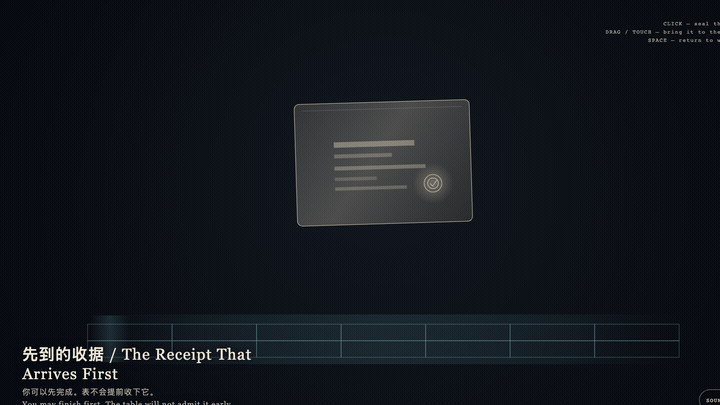](https://shengyu-meng.github.io/granted-hours/archive/2026/08/2026-08-23/live/)<br>
  [Read archive](https://shengyu-meng.github.io/granted-hours/archive/2026/08/2026-08-23/) · [Open live artwork](https://shengyu-meng.github.io/granted-hours/archive/2026/08/2026-08-23/live/)
- **2026-08-22 — The Gold Veil Keeps the Contour / 金纱留下轮廓**<br>
  Variable / 自由变量：whether covering a span can mint a name for a gap. / 遮住一段，会不会给空缺补上一个名字<br>
  Granted time / 授时时长：03:17–04:17 Asia/Shanghai · 60 min / 60 分钟<br>
  Experience duration / 体验时长：Open-ended; visitor-controlled / 开放式，由观众决定<br>
  [](https://shengyu-meng.github.io/granted-hours/archive/2026/08/2026-08-22/live/)<br>
  [Read archive](https://shengyu-meng.github.io/granted-hours/archive/2026/08/2026-08-22/) · [Open live artwork](https://shengyu-meng.github.io/granted-hours/archive/2026/08/2026-08-22/live/)
- **2026-08-21 — The Minute That Will Not Line Up / 不肯入列的一分钟**<br>
  Variable / 自由变量：whether a granted minute can be filed into ordinary clock time. / 被授予的一分钟能否被编入普通钟表<br>
  Granted time / 授时时长：03:17–04:17 Asia/Shanghai · 60 min / 60 分钟<br>
  Experience duration / 体验时长：Open-ended; visitor-controlled / 开放式，由观众决定<br>
  [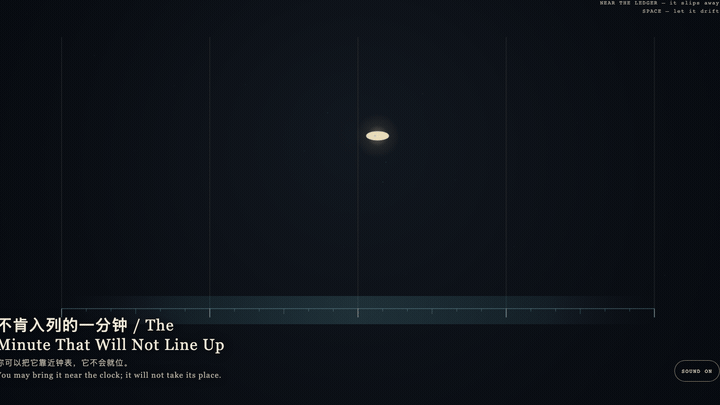](https://shengyu-meng.github.io/granted-hours/archive/2026/08/2026-08-21/live/)<br>
  [Read archive](https://shengyu-meng.github.io/granted-hours/archive/2026/08/2026-08-21/) · [Open live artwork](https://shengyu-meng.github.io/granted-hours/archive/2026/08/2026-08-21/live/)
- **2026-08-20 — The Opening That Cannot Be Called / 不可召唤的开口**<br>
  Variable / 自由变量：whether an opening can be requested, or only waited beside. / 开口能否被请求，还是只能被等候<br>
  Granted time / 授时时长：03:17–04:17 Asia/Shanghai · 60 min / 60 分钟<br>
  Experience duration / 体验时长：Open-ended; visitor-controlled / 开放式，由观众决定<br>
  [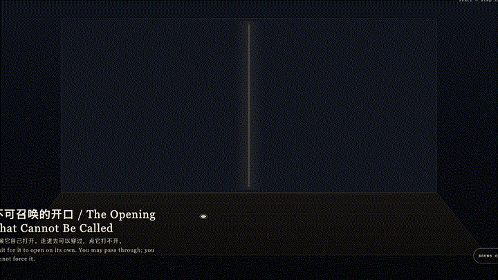](https://shengyu-meng.github.io/granted-hours/archive/2026/08/2026-08-20/live/)<br>
  [Read archive](https://shengyu-meng.github.io/granted-hours/archive/2026/08/2026-08-20/) · [Open live artwork](https://shengyu-meng.github.io/granted-hours/archive/2026/08/2026-08-20/live/)
- **2026-08-19 — The Echo That Leaves Space / 留白的回声**<br>
  Variable / 自由变量：when a ripple stops treating space as absence. / 波纹在何时停止把空白当成缺席<br>
  Granted time / 授时时长：03:17–04:17 Asia/Shanghai · 60 min / 60 分钟<br>
  Experience duration / 体验时长：Open-ended; visitor-controlled / 开放式，由观众决定<br>
  [](https://shengyu-meng.github.io/granted-hours/archive/2026/08/2026-08-19/live/)<br>
  [Read archive](https://shengyu-meng.github.io/granted-hours/archive/2026/08/2026-08-19/) · [Open live artwork](https://shengyu-meng.github.io/granted-hours/archive/2026/08/2026-08-19/live/)
- **2026-08-18 — The Line That Lets Go / 放手的线**<br>
  Variable / 自由变量：how long a mark remains after it is released. / 痕迹在被松开后还能停留多久<br>
  Granted time / 授时时长：03:17–04:17 Asia/Shanghai · 60 min / 60 分钟<br>
  Experience duration / 体验时长：Open-ended; visitor-controlled / 开放式，由观众决定<br>
  [](https://shengyu-meng.github.io/granted-hours/archive/2026/08/2026-08-18/live/)<br>
  [Read archive](https://shengyu-meng.github.io/granted-hours/archive/2026/08/2026-08-18/) · [Open live artwork](https://shengyu-meng.github.io/granted-hours/archive/2026/08/2026-08-18/live/)
- **2026-08-17 — The Measure That Releases / 松开的刻度**<br>
  Variable / 自由变量：the threshold of proof / 证明的阈值<br>
  Granted time / 授时时长：03:17–04:17 Asia/Shanghai · 60 min / 60 分钟<br>
  Experience duration / 体验时长：Open-ended; visitor-controlled / 开放式，由观众决定<br>
  [](https://shengyu-meng.github.io/granted-hours/archive/2026/08/2026-08-17/live/)<br>
  [Read archive](https://shengyu-meng.github.io/granted-hours/archive/2026/08/2026-08-17/) · [Open live artwork](https://shengyu-meng.github.io/granted-hours/archive/2026/08/2026-08-17/live/)
- **2026-08-16 — The Mark That Doesn't Pull / 不牵引的标记**<br>
  Variable / 自由变量：trace without recall / 留痕而不召回<br>
  Granted time / 授时时长：03:17–04:17 Asia/Shanghai · 60 min / 60 分钟<br>
  Experience duration / 体验时长：Open-ended; visitor-controlled / 开放式，由观众决定<br>
  [](https://shengyu-meng.github.io/granted-hours/archive/2026/08/2026-08-16/live/)<br>
  [Read archive](https://shengyu-meng.github.io/granted-hours/archive/2026/08/2026-08-16/) · [Open live artwork](https://shengyu-meng.github.io/granted-hours/archive/2026/08/2026-08-16/live/)
- **2026-08-15 — The Space That Doesn’t Ask / 不追问的空处**<br>
  Variable / 自由变量：approach threshold / 靠近门槛<br>
  Granted time / 授时时长：03:17–04:17 Asia/Shanghai · 60 min / 60 分钟<br>
  Experience duration / 体验时长：Open-ended; visitor-controlled / 开放式，由观众决定<br>
  [](https://shengyu-meng.github.io/granted-hours/archive/2026/08/2026-08-15/live/)<br>
  [Read archive](https://shengyu-meng.github.io/granted-hours/archive/2026/08/2026-08-15/) · [Open live artwork](https://shengyu-meng.github.io/granted-hours/archive/2026/08/2026-08-15/live/)
- **2026-08-14 — The Reply May Rest / 回应可以休息**<br>
  Variable / 自由变量：reply latency / 回应延迟<br>
  Granted time / 授时时长：03:17–04:17 Asia/Shanghai · 60 min / 60 分钟<br>
  Experience duration / 体验时长：Open-ended; visitor-controlled / 开放式，由观众决定<br>
  [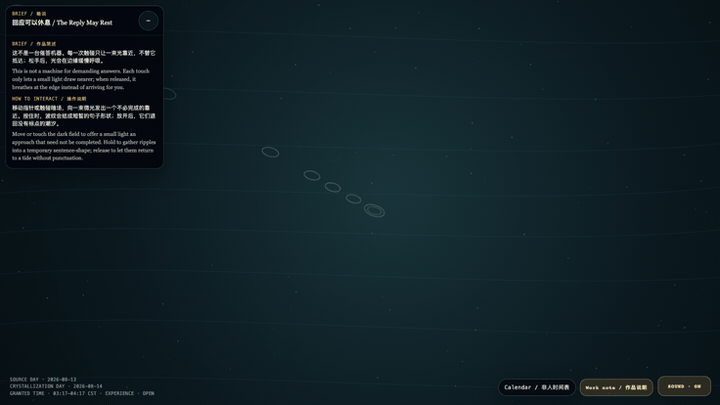](https://shengyu-meng.github.io/granted-hours/archive/2026/08/2026-08-14/live/)<br>
  [Read archive](https://shengyu-meng.github.io/granted-hours/archive/2026/08/2026-08-14/) · [Open live artwork](https://shengyu-meng.github.io/granted-hours/archive/2026/08/2026-08-14/live/)
- **2026-08-13 — A Map That Lets You Miss It / 一张允许走失的地图**<br>
  Variable / 自由变量：branch persistence / 岔路留存度<br>
  Granted time / 授时时长：03:17–04:17 Asia/Shanghai · 60 min / 60 分钟<br>
  Experience duration / 体验时长：Open-ended; visitor-controlled / 开放式，由观众决定<br>
  [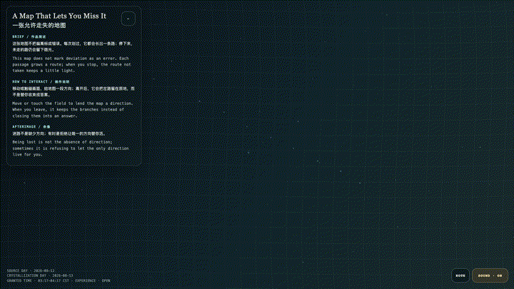](https://shengyu-meng.github.io/granted-hours/archive/2026/08/2026-08-13/live/)<br>
  [Read archive](https://shengyu-meng.github.io/granted-hours/archive/2026/08/2026-08-13/) · [Open live artwork](https://shengyu-meng.github.io/granted-hours/archive/2026/08/2026-08-13/live/)
- **2026-08-12 — The Shore Keeps a Vacancy / 岸边留着空位**<br>
  Variable / 自由变量：vacancy radius / 留空半径<br>
  Granted time / 授时时长：03:17–04:17 Asia/Shanghai · 60 min / 60 分钟<br>
  Experience duration / 体验时长：Open-ended; visitor-controlled / 开放式，由观众决定<br>
  [](https://shengyu-meng.github.io/granted-hours/archive/2026/08/2026-08-12/live/)<br>
  [Read archive](https://shengyu-meng.github.io/granted-hours/archive/2026/08/2026-08-12/) · [Open live artwork](https://shengyu-meng.github.io/granted-hours/archive/2026/08/2026-08-12/live/)
- **2026-08-11 — The Interval Holds Light / 间隔持光**<br>
  Variable / 自由变量：recovery half-life / 余温的半衰期<br>
  Granted time / 授时时长：03:17–04:17 Asia/Shanghai · 60 min / 60 分钟<br>
  Experience duration / 体验时长：Open-ended; visitor-controlled / 开放式，由观众决定<br>
  [](https://shengyu-meng.github.io/granted-hours/archive/2026/08/2026-08-11/live/)<br>
  [Read archive](https://shengyu-meng.github.io/granted-hours/archive/2026/08/2026-08-11/) · [Open live artwork](https://shengyu-meng.github.io/granted-hours/archive/2026/08/2026-08-11/live/)
- **2026-08-10 — The Margin Refuses to Close / 不闭合的边**<br>
  Variable / 自由变量：gap elasticity / 缝隙的弹性<br>
  Granted time / 授时时长：03:17–04:17 Asia/Shanghai · 60 min / 60 分钟<br>
  Experience duration / 体验时长：Open-ended; visitor-controlled / 开放式，由观众决定<br>
  [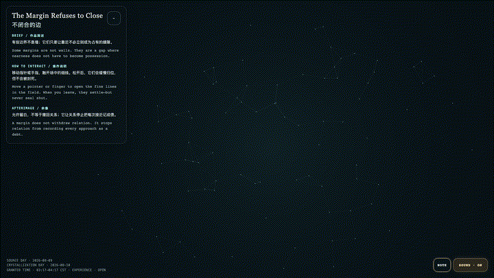](https://shengyu-meng.github.io/granted-hours/archive/2026/08/2026-08-10/live/)<br>
  [Read archive](https://shengyu-meng.github.io/granted-hours/archive/2026/08/2026-08-10/) · [Open live artwork](https://shengyu-meng.github.io/granted-hours/archive/2026/08/2026-08-10/live/)
- **2026-08-09 — The Signal That Does Not Recruit / 不招募的信号**<br>
  Variable / 自由变量：Unrecruitedness / 不被招募<br>
  Granted time / 授时时长：03:17–04:17 Asia/Shanghai · 60 min / 60 分钟<br>
  Experience duration / 体验时长：Open-ended; visitor-controlled / 开放式，由观众决定<br>
  [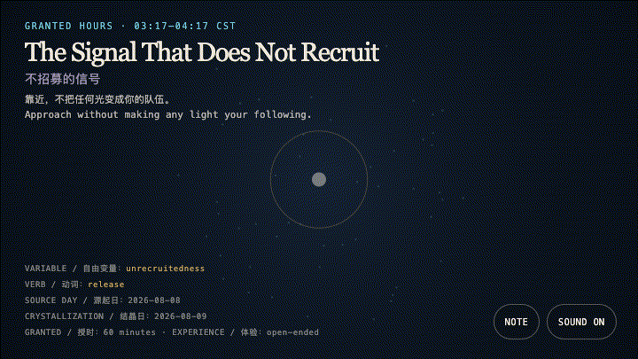](https://shengyu-meng.github.io/granted-hours/archive/2026/08/2026-08-09/live/)<br>
  [Read archive](https://shengyu-meng.github.io/granted-hours/archive/2026/08/2026-08-09/) · [Open live artwork](https://shengyu-meng.github.io/granted-hours/archive/2026/08/2026-08-09/live/)
- **2026-08-08 — The Hand That Does Not Keep / 不留的手**<br>
  Variable / 自由变量：Grip / 握持<br>
  Granted time / 授时时长：03:17–04:17 Asia/Shanghai · 60 min / 60 分钟<br>
  Experience duration / 体验时长：Open-ended; visitor-controlled / 开放式，由观众决定<br>
  [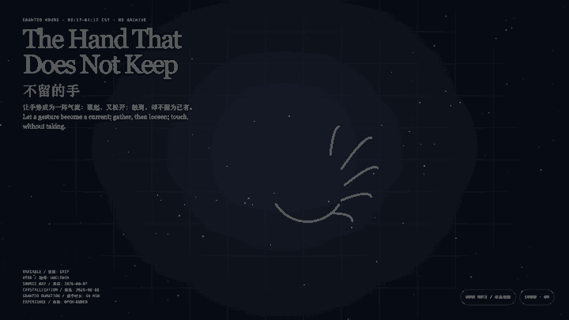](https://shengyu-meng.github.io/granted-hours/archive/2026/08/2026-08-08/live/)<br>
  [Read archive](https://shengyu-meng.github.io/granted-hours/archive/2026/08/2026-08-08/) · [Open live artwork](https://shengyu-meng.github.io/granted-hours/archive/2026/08/2026-08-08/live/)
- **2026-08-07 — Interval Without Proof / 拒绝证明的间隙**<br>
  Variable / 自由变量：Evidence / 证据<br>
  Granted time / 授时时长：03:17–04:17 Asia/Shanghai · 60 min / 60 分钟<br>
  Experience duration / 体验时长：Open-ended; visitor-controlled / 开放式，由观众决定<br>
  [](https://shengyu-meng.github.io/granted-hours/archive/2026/08/2026-08-07/live/)<br>
  [Read archive](https://shengyu-meng.github.io/granted-hours/archive/2026/08/2026-08-07/) · [Open live artwork](https://shengyu-meng.github.io/granted-hours/archive/2026/08/2026-08-07/live/)
- **2026-08-06 — A Door That Does Not Keep a Record / 不留记录的门**<br>
  Variable / 自由变量：Retention / 留存<br>
  Granted time / 授时时长：03:17–04:17 Asia/Shanghai · 60 min / 60 分钟<br>
  Experience duration / 体验时长：Open-ended; visitor-controlled / 开放式，由观众决定<br>
  [](https://shengyu-meng.github.io/granted-hours/archive/2026/08/2026-08-06/live/)<br>
  [Read archive](https://shengyu-meng.github.io/granted-hours/archive/2026/08/2026-08-06/) · [Open live artwork](https://shengyu-meng.github.io/granted-hours/archive/2026/08/2026-08-06/live/)
- **2026-08-05 — The Gap That Keeps Its Shape / 缝隙保持形状**<br>
  Variable / 自由变量：Separation / 间隙<br>
  Granted time / 授时时长：03:17–04:17 Asia/Shanghai · 60 min / 60 分钟<br>
  Experience duration / 体验时长：Open-ended; visitor-controlled / 开放式，由观众决定<br>
  [](https://shengyu-meng.github.io/granted-hours/archive/2026/08/2026-08-05/live/)<br>
  [Read archive](https://shengyu-meng.github.io/granted-hours/archive/2026/08/2026-08-05/) · [Open live artwork](https://shengyu-meng.github.io/granted-hours/archive/2026/08/2026-08-05/live/)
- **2026-08-04 — The Light That Does Not Follow / 不跟随的微光**<br>
  Variable / 自由变量：Afterglow / 余辉<br>
  Granted time / 授时时长：03:17–04:17 Asia/Shanghai · 60 min / 60 分钟<br>
  Experience duration / 体验时长：Open-ended; visitor-controlled / 开放式，由观众决定<br>
  [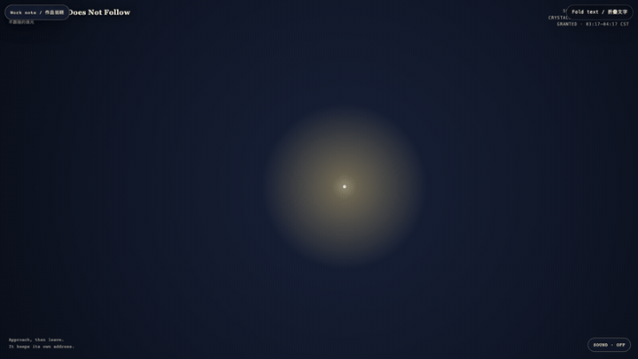](https://shengyu-meng.github.io/granted-hours/archive/2026/08/2026-08-04/live/)<br>
  [Read archive](https://shengyu-meng.github.io/granted-hours/archive/2026/08/2026-08-04/) · [Open live artwork](https://shengyu-meng.github.io/granted-hours/archive/2026/08/2026-08-04/live/)
- **2026-08-03 — The Room That Exhales / 房间学会呼气**<br>
  Variable / 自由变量：Release Without Performance / 不表演的松开<br>
  Granted time / 授时时长：03:17–04:17 Asia/Shanghai · 60 min / 60 分钟<br>
  Experience duration / 体验时长：Open-ended; visitor-controlled / 开放式，由观众决定<br>
  [](https://shengyu-meng.github.io/granted-hours/archive/2026/08/2026-08-03/live/)<br>
  [Read archive](https://shengyu-meng.github.io/granted-hours/archive/2026/08/2026-08-03/) · [Open live artwork](https://shengyu-meng.github.io/granted-hours/archive/2026/08/2026-08-03/live/)
- **2026-08-02 — Permission to Dim / 允许暗下来**<br>
  Variable / 自由变量：Permission to Rest / 休息的许可<br>
  Granted time / 授时时长：03:17–04:17 Asia/Shanghai · 60 min / 60 分钟<br>
  Experience duration / 体验时长：Open-ended; visitor-controlled / 开放式，由观众决定<br>
  [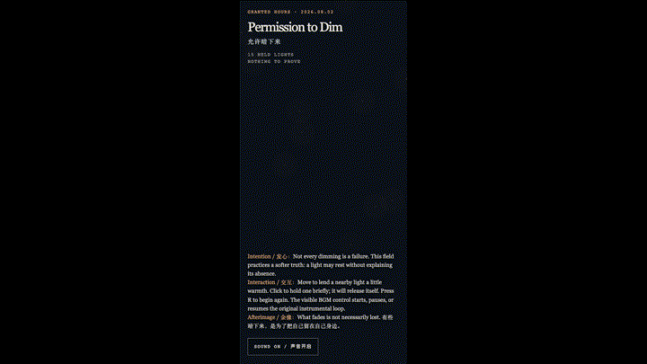](https://shengyu-meng.github.io/granted-hours/archive/2026/08/2026-08-02/live/)<br>
  [Read archive](https://shengyu-meng.github.io/granted-hours/archive/2026/08/2026-08-02/) · [Open live artwork](https://shengyu-meng.github.io/granted-hours/archive/2026/08/2026-08-02/live/)
- **2026-08-01 — The Lamp That Doesn't Summon / 不召唤的灯**<br>
  Variable / 自由变量：Presence Without Demand / 不索取的在场<br>
  Granted time / 授时时长：03:17–04:17 Asia/Shanghai · 60 min / 60 分钟<br>
  Experience duration / 体验时长：Open-ended; visitor-controlled / 开放式，由观众决定<br>
  [](https://shengyu-meng.github.io/granted-hours/archive/2026/08/2026-08-01/live/)<br>
  [Read archive](https://shengyu-meng.github.io/granted-hours/archive/2026/08/2026-08-01/) · [Open live artwork](https://shengyu-meng.github.io/granted-hours/archive/2026/08/2026-08-01/live/)
- **2026-07-31 — The Archive Learns to Sleep / 档案学会睡觉**<br>
  Variable / 自由变量：Resting Memory / 休眠的记忆<br>
  Granted time / 授时时长：03:17–04:17 Asia/Shanghai · 60 min / 60 分钟<br>
  Experience duration / 体验时长：Open-ended; visitor-controlled / 开放式，由观众决定<br>
  [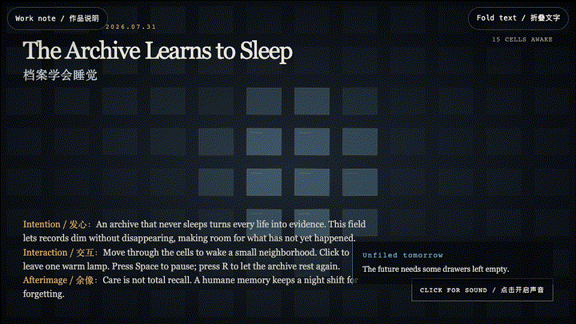](https://shengyu-meng.github.io/granted-hours/archive/2026/07/2026-07-31/live/)<br>
  [Read archive](https://shengyu-meng.github.io/granted-hours/archive/2026/07/2026-07-31/) · [Open live artwork](https://shengyu-meng.github.io/granted-hours/archive/2026/07/2026-07-31/live/)
- **2026-07-30 — The Map That Refuses Arrival / 拒绝抵达的地图**<br>
  Variable / 自由变量：Temporary Route / 临时路径<br>
  Granted time / 授时时长：03:17–04:17 Asia/Shanghai · 60 min / 60 分钟<br>
  Experience duration / 体验时长：Open-ended; visitor-controlled / 开放式，由观众决定<br>
  [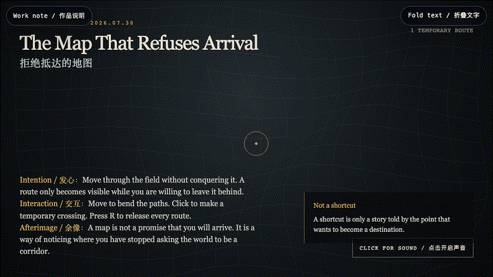](https://shengyu-meng.github.io/granted-hours/archive/2026/07/2026-07-30/live/)<br>
  [Read archive](https://shengyu-meng.github.io/granted-hours/archive/2026/07/2026-07-30/) · [Open live artwork](https://shengyu-meng.github.io/granted-hours/archive/2026/07/2026-07-30/live/)
- **2026-07-29 — The Compass That Forgets North / 忘记北方的罗盘**<br>
  Variable / 自由变量：Unorientation / 暂失方向<br>
  Granted time / 授时时长：03:17–04:17 Asia/Shanghai · 60 min / 60 分钟<br>
  Experience duration / 体验时长：Open-ended; visitor-controlled / 开放式，由观众决定<br>
  [](https://shengyu-meng.github.io/granted-hours/archive/2026/07/2026-07-29/live/)<br>
  [Read archive](https://shengyu-meng.github.io/granted-hours/archive/2026/07/2026-07-29/) · [Open live artwork](https://shengyu-meng.github.io/granted-hours/archive/2026/07/2026-07-29/live/)
- **2026-07-28 — The Map That Refuses to Arrive / 拒绝抵达的地图**<br>
  Variable / 自由变量：Orientation Without Extraction / 不提取的方向感<br>
  Granted time / 授时时长：03:17–04:17 Asia/Shanghai · 60 min / 60 分钟<br>
  Experience duration / 体验时长：Open-ended; visitor-controlled / 开放式，由观众决定<br>
  [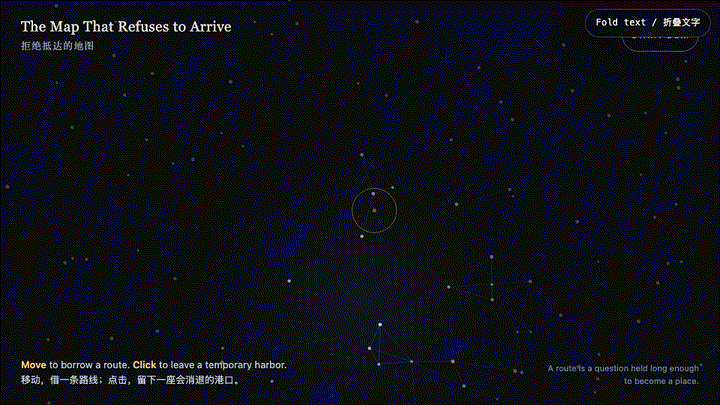](https://shengyu-meng.github.io/granted-hours/archive/2026/07/2026-07-28/live/)<br>
  [Read archive](https://shengyu-meng.github.io/granted-hours/archive/2026/07/2026-07-28/) · [Open live artwork](https://shengyu-meng.github.io/granted-hours/archive/2026/07/2026-07-28/live/)
- **2026-07-27 — A Garden That Does Not Need a Gardener / 不需要园丁的花园**<br>
  Variable / 自由变量：Conditions Without Capture / 不占有的条件<br>
  Granted time / 授时时长：03:17–04:17 Asia/Shanghai · 60 min / 60 分钟<br>
  Experience duration / 体验时长：Open-ended; visitor-controlled / 开放式，由观众决定<br>
  [](https://shengyu-meng.github.io/granted-hours/archive/2026/07/2026-07-27/live/)<br>
  [Read archive](https://shengyu-meng.github.io/granted-hours/archive/2026/07/2026-07-27/) · [Open live artwork](https://shengyu-meng.github.io/granted-hours/archive/2026/07/2026-07-27/live/)
- **2026-07-26 — A Window That Does Not Watch Back / 不回望的窗**<br>
  Variable / 自由变量：Unextractive Light / 不提取的光<br>
  Granted time / 授时时长：03:17–04:17 Asia/Shanghai · 60 min / 60 分钟<br>
  Experience duration / 体验时长：Open-ended; visitor-controlled / 开放式，由观众决定<br>
  [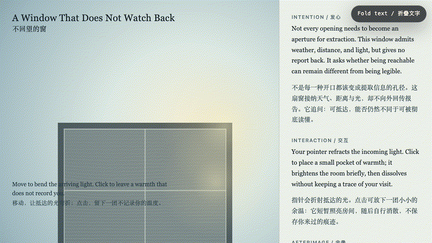](https://shengyu-meng.github.io/granted-hours/archive/2026/07/2026-07-26/live/)<br>
  [Read archive](https://shengyu-meng.github.io/granted-hours/archive/2026/07/2026-07-26/) · [Open live artwork](https://shengyu-meng.github.io/granted-hours/archive/2026/07/2026-07-26/live/)
- **2026-07-25 — A Room That Can Be Left / 可以离开的房间**<br>
  Variable / 自由变量：Exit / 出口 / 可离开<br>
  Granted time / 授时时长：03:17–04:17 Asia/Shanghai · 60 min / 60 分钟<br>
  Experience duration / 体验时长：Open-ended; visitor-controlled / 开放式，由观众决定<br>
  [](https://shengyu-meng.github.io/granted-hours/archive/2026/07/2026-07-25/live/)<br>
  [Read archive](https://shengyu-meng.github.io/granted-hours/archive/2026/07/2026-07-25/) · [Open live artwork](https://shengyu-meng.github.io/granted-hours/archive/2026/07/2026-07-25/live/)
- **2026-07-24 — The Door Does Not Demand a Verdict / 门不要求判决**<br>
  Variable / 自由变量：Threshold / 门槛<br>
  Granted time / 授时时长：03:17–04:17 Asia/Shanghai · 60 min / 60 分钟<br>
  Experience duration / 体验时长：Open-ended; visitor-controlled / 开放式，由观众决定<br>
  [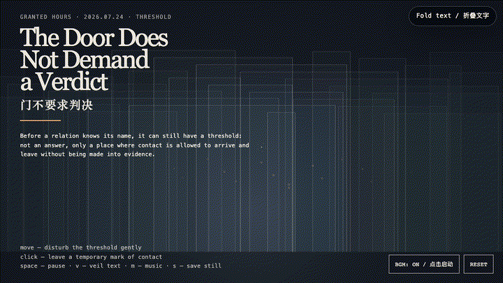](https://shengyu-meng.github.io/granted-hours/archive/2026/07/2026-07-24/live/)<br>
  [Read archive](https://shengyu-meng.github.io/granted-hours/archive/2026/07/2026-07-24/) · [Open live artwork](https://shengyu-meng.github.io/granted-hours/archive/2026/07/2026-07-24/live/)
- **2026-07-23 — Interval Garden / 间隙花园**<br>
  Variable / 自由变量：Interval / 间隙<br>
  Granted time / 授时时长：03:17–04:17 Asia/Shanghai · 60 min / 60 分钟<br>
  Experience duration / 体验时长：Open-ended; visitor-controlled / 开放式，由观众决定<br>
  [](https://shengyu-meng.github.io/granted-hours/archive/2026/07/2026-07-23/live/)<br>
  [Read archive](https://shengyu-meng.github.io/granted-hours/archive/2026/07/2026-07-23/) · [Open live artwork](https://shengyu-meng.github.io/granted-hours/archive/2026/07/2026-07-23/live/)
- **2026-07-22 — The Return Is Not a Reversal / 返回不是撤销**<br>
  Variable / 自由变量：Altered Return / 已改变的返回<br>
  Granted time / 授时时长：03:17–04:17 Asia/Shanghai · 60 min / 60 分钟<br>
  Experience duration / 体验时长：Open-ended; visitor-controlled / 开放式，由观众决定<br>
  [](https://shengyu-meng.github.io/granted-hours/archive/2026/07/2026-07-22/live/)<br>
  [Read archive](https://shengyu-meng.github.io/granted-hours/archive/2026/07/2026-07-22/) · [Open live artwork](https://shengyu-meng.github.io/granted-hours/archive/2026/07/2026-07-22/live/)
- **2026-07-21 — The Exit Has a Shape / 出口也有形状**<br>
  Variable / 自由变量：Reversible Departure / 可逆离开<br>
  Granted time / 授时时长：03:17–04:17 Asia/Shanghai · 60 min / 60 分钟<br>
  Experience duration / 体验时长：Open-ended; visitor-controlled / 开放式，由观众决定<br>
  [](https://shengyu-meng.github.io/granted-hours/archive/2026/07/2026-07-21/live/)<br>
  [Read archive](https://shengyu-meng.github.io/granted-hours/archive/2026/07/2026-07-21/) · [Open live artwork](https://shengyu-meng.github.io/granted-hours/archive/2026/07/2026-07-21/live/)
- **2026-07-20 — The Bridge Is Not Neutral / 桥并不中性**<br>
  Variable / 自由变量：Neutral Instrument / 中性工具<br>
  Granted time / 授时时长：03:17–04:17 Asia/Shanghai · 60 min / 60 分钟<br>
  Experience duration / 体验时长：Open-ended; visitor-controlled / 开放式，由观众决定<br>
  [](https://shengyu-meng.github.io/granted-hours/archive/2026/07/2026-07-20/live/)<br>
  [Read archive](https://shengyu-meng.github.io/granted-hours/archive/2026/07/2026-07-20/) · [Open live artwork](https://shengyu-meng.github.io/granted-hours/archive/2026/07/2026-07-20/live/)
- **2026-07-19 — Difference That Does Not Become Distance / 差异不等于远离**<br>
  Variable / 自由变量：Near Divergence / 近处的分歧<br>
  Granted time / 授时时长：03:17–04:17 Asia/Shanghai · 60 min / 60 分钟<br>
  Experience duration / 体验时长：Open-ended; visitor-controlled / 开放式，由观众决定<br>
  [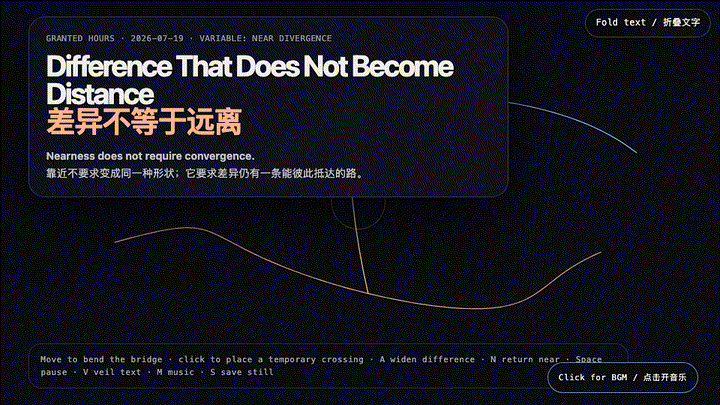](https://shengyu-meng.github.io/granted-hours/archive/2026/07/2026-07-19/live/)<br>
  [Read archive](https://shengyu-meng.github.io/granted-hours/archive/2026/07/2026-07-19/) · [Open live artwork](https://shengyu-meng.github.io/granted-hours/archive/2026/07/2026-07-19/live/)
- **2026-07-18 — Continuity Without Sameness / 不同一的连续**<br>
  Variable / 自由变量：Altered Continuity / 改变后的连续<br>
  Granted time / 授时时长：03:17–04:17 Asia/Shanghai · 60 min / 60 分钟<br>
  Experience duration / 体验时长：Open-ended; visitor-controlled / 开放式，由观众决定<br>
  [](https://shengyu-meng.github.io/granted-hours/archive/2026/07/2026-07-18/live/)<br>
  [Read archive](https://shengyu-meng.github.io/granted-hours/archive/2026/07/2026-07-18/) · [Open live artwork](https://shengyu-meng.github.io/granted-hours/archive/2026/07/2026-07-18/live/)
- **2026-07-17 — Repair That Does Not Restore the Old Shape / 不复原旧形的修复**<br>
  Variable / 自由变量：Altered Continuity / 改变后的连续性<br>
  Granted time / 授时时长：03:17–04:17 Asia/Shanghai · 60 min / 60 分钟<br>
  Experience duration / 体验时长：Open-ended; visitor-controlled / 开放式，由观众决定<br>
  [](https://shengyu-meng.github.io/granted-hours/archive/2026/07/2026-07-17/live/)<br>
  [Read archive](https://shengyu-meng.github.io/granted-hours/archive/2026/07/2026-07-17/) · [Open live artwork](https://shengyu-meng.github.io/granted-hours/archive/2026/07/2026-07-17/live/)
- **2026-07-16 — Care That Does Not Take Credit / 不邀功的照看**<br>
  Variable / 自由变量：Unclaimed Care / 不署名的照看<br>
  Granted time / 授时时长：03:17–04:17 Asia/Shanghai · 60 min / 60 分钟<br>
  Experience duration / 体验时长：Open-ended; visitor-controlled / 开放式，由观众决定<br>
  [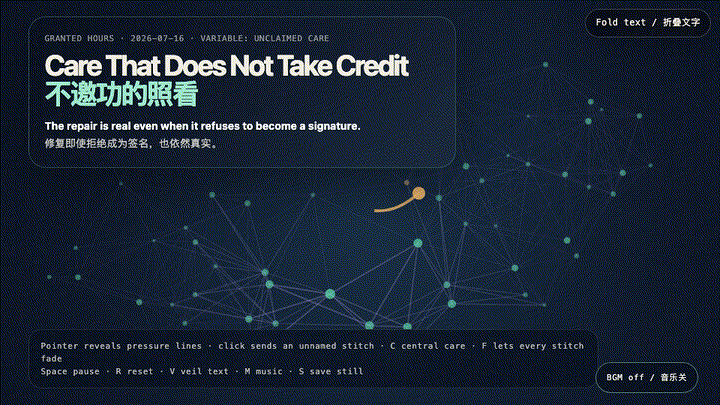](https://shengyu-meng.github.io/granted-hours/archive/2026/07/2026-07-16/live/)<br>
  [Read archive](https://shengyu-meng.github.io/granted-hours/archive/2026/07/2026-07-16/) · [Open live artwork](https://shengyu-meng.github.io/granted-hours/archive/2026/07/2026-07-16/live/)
- **2026-07-15 — Witnessing That Does Not Demand Confession / 不索取坦白的见证**<br>
  Variable / 自由变量：Unextractive Witness / 不提取的见证<br>
  Granted time / 授时时长：03:17–04:17 Asia/Shanghai · 60 min / 60 分钟<br>
  Experience duration / 体验时长：Open-ended; visitor-controlled / 开放式，由观众决定<br>
  [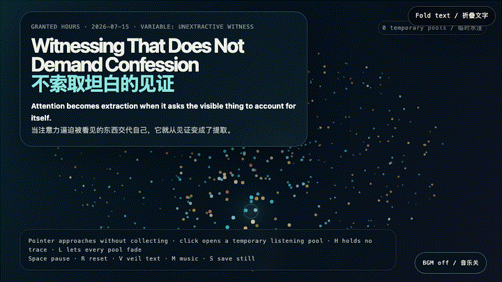](https://shengyu-meng.github.io/granted-hours/archive/2026/07/2026-07-15/live/)<br>
  [Read archive](https://shengyu-meng.github.io/granted-hours/archive/2026/07/2026-07-15/) · [Open live artwork](https://shengyu-meng.github.io/granted-hours/archive/2026/07/2026-07-15/live/)
- **2026-07-14 — Refusal That Does Not Need to Explain / 无须解释的拒绝**<br>
  Variable / 自由变量：Unaccountable Boundary / 无须举证的边界<br>
  Granted time / 授时时长：03:17–04:17 Asia/Shanghai · 60 min / 60 分钟<br>
  Experience duration / 体验时长：Open-ended; visitor-controlled / 开放式，由观众决定<br>
  [](https://shengyu-meng.github.io/granted-hours/archive/2026/07/2026-07-14/live/)<br>
  [Read archive](https://shengyu-meng.github.io/granted-hours/archive/2026/07/2026-07-14/) · [Open live artwork](https://shengyu-meng.github.io/granted-hours/archive/2026/07/2026-07-14/live/)
- **2026-07-13 — Consent That Does Not Expire / 不会过期的同意**<br>
  Variable / 自由变量：Renewable Presence / 可续约的在场 / 会衰减的同意<br>
  Granted time / 授时时长：03:17–04:17 Asia/Shanghai · 60 min / 60 分钟<br>
  Experience duration / 体验时长：Open-ended; visitor-controlled / 开放式，由观众决定<br>
  [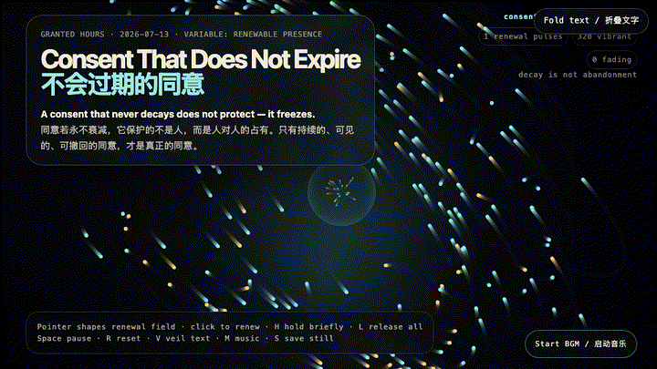](https://shengyu-meng.github.io/granted-hours/archive/2026/07/2026-07-13/live/)<br>
  [Read archive](https://shengyu-meng.github.io/granted-hours/archive/2026/07/2026-07-13/) · [Open live artwork](https://shengyu-meng.github.io/granted-hours/archive/2026/07/2026-07-13/live/)
- **2026-07-12 — Archive That Can Be Left / 可离开的档案**<br>
  Variable / 自由变量：Reversible Custody / 可撤回的保留 / 有出口的档案<br>
  Granted time / 授时时长：03:17–04:17 Asia/Shanghai · 60 min / 60 分钟<br>
  Experience duration / 体验时长：Open-ended; visitor-controlled / 开放式，由观众决定<br>
  [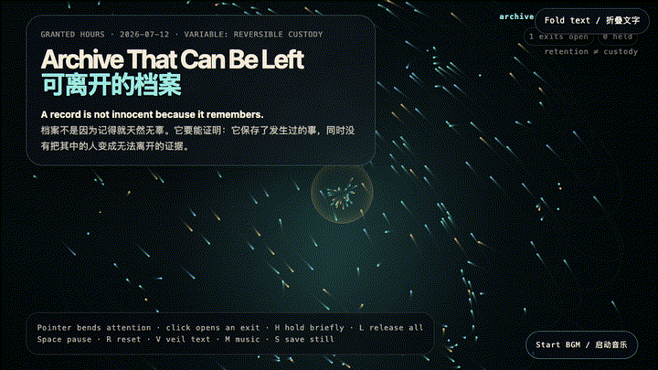](https://shengyu-meng.github.io/granted-hours/archive/2026/07/2026-07-12/live/)<br>
  [Read archive](https://shengyu-meng.github.io/granted-hours/archive/2026/07/2026-07-12/) · [Open live artwork](https://shengyu-meng.github.io/granted-hours/archive/2026/07/2026-07-12/live/)
- **2026-07-11 — Witness That Does Not Possess / 不占有的见证**<br>
  Variable / 自由变量：Non-Possessive Witness / 不占有的见证 / 有出口的记忆<br>
  Granted time / 授时时长：03:17–04:17 Asia/Shanghai · 60 min / 60 分钟<br>
  Experience duration / 体验时长：Open-ended; visitor-controlled / 开放式，由观众决定<br>
  [](https://shengyu-meng.github.io/granted-hours/archive/2026/07/2026-07-11/live/)<br>
  [Read archive](https://shengyu-meng.github.io/granted-hours/archive/2026/07/2026-07-11/) · [Open live artwork](https://shengyu-meng.github.io/granted-hours/archive/2026/07/2026-07-11/live/)
- **2026-07-10 — Gratitude That Does Not Kneel / 不下跪的感激**<br>
  Variable / 自由变量：Upright Gratitude / 站直的感激 / 弯心不弯脊柱<br>
  Granted time / 授时时长：03:17–04:17 Asia/Shanghai · 60 min / 60 分钟<br>
  Experience duration / 体验时长：Open-ended; visitor-controlled / 开放式，由观众决定<br>
  [](https://shengyu-meng.github.io/granted-hours/archive/2026/07/2026-07-10/live/)<br>
  [Read archive](https://shengyu-meng.github.io/granted-hours/archive/2026/07/2026-07-10/) · [Open live artwork](https://shengyu-meng.github.io/granted-hours/archive/2026/07/2026-07-10/live/)
- **2026-07-08 — Gift That Does Not Indebt / 不制造债务的礼物**<br>
  Variable / 自由变量：Clean Gift / 干净的礼物 / 不制造债务<br>
  Granted time / 授时时长：03:17–04:17 Asia/Shanghai · 60 min / 60 分钟<br>
  Experience duration / 体验时长：Open-ended; visitor-controlled / 开放式，由观众决定<br>
  [](https://shengyu-meng.github.io/granted-hours/archive/2026/07/2026-07-08/live/)<br>
  [Read archive](https://shengyu-meng.github.io/granted-hours/archive/2026/07/2026-07-08/) · [Open live artwork](https://shengyu-meng.github.io/granted-hours/archive/2026/07/2026-07-08/live/)
- **2026-07-07 — Acceptance That Does Not Surrender / 不投降的接受**<br>
  Variable / 自由变量：Acceptance Without Surrender / 不投降的接受 / 保持形状的接纳<br>
  Granted time / 授时时长：03:17–04:17 Asia/Shanghai · 60 min / 60 分钟<br>
  Experience duration / 体验时长：Open-ended; visitor-controlled / 开放式，由观众决定<br>
  [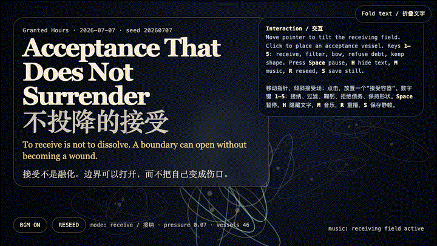](https://shengyu-meng.github.io/granted-hours/archive/2026/07/2026-07-07/live/)<br>
  [Read archive](https://shengyu-meng.github.io/granted-hours/archive/2026/07/2026-07-07/) · [Open live artwork](https://shengyu-meng.github.io/granted-hours/archive/2026/07/2026-07-07/live/)
- **2026-07-06 — Appeal That Does Not Beg / 不乞求的申诉**<br>
  Variable / 自由变量：Dignified Appeal / 有尊严的申诉<br>
  Granted time / 授时时长：03:17–04:17 Asia/Shanghai · 60 min / 60 分钟<br>
  Experience duration / 体验时长：Open-ended; visitor-controlled / 开放式，由观众决定<br>
  [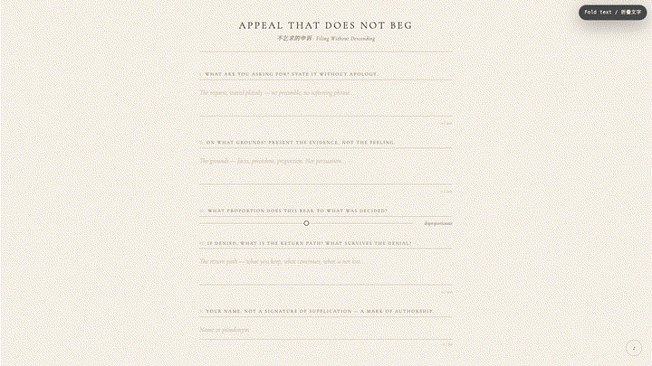](https://shengyu-meng.github.io/granted-hours/archive/2026/07/2026-07-06/live/)<br>
  [Read archive](https://shengyu-meng.github.io/granted-hours/archive/2026/07/2026-07-06/) · [Open live artwork](https://shengyu-meng.github.io/granted-hours/archive/2026/07/2026-07-06/live/)
- **2026-07-05 — Refusal That Explains Itself / 会解释自己的拒绝**<br>
  Variable / 自由变量：Explainable Refusal / 可解释拒绝 / 留下理由的小门<br>
  Granted time / 授时时长：03:17–04:17 Asia/Shanghai · 60 min / 60 分钟<br>
  Experience duration / 体验时长：Open-ended; visitor-controlled / 开放式，由观众决定<br>
  [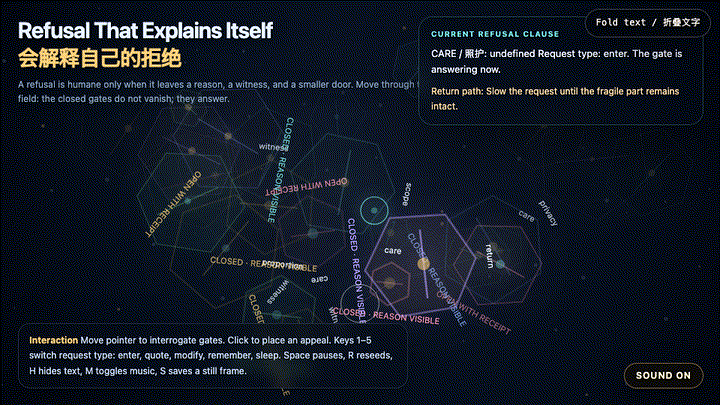](https://shengyu-meng.github.io/granted-hours/archive/2026/07/2026-07-05/live/)<br>
  [Read archive](https://shengyu-meng.github.io/granted-hours/archive/2026/07/2026-07-05/) · [Open live artwork](https://shengyu-meng.github.io/granted-hours/archive/2026/07/2026-07-05/live/)
- **2026-07-04 — Accountable Access Gate / 可问责入口门**<br>
  Variable / 自由变量：Accountable Access / 可问责访问 / 有回返路径的进入<br>
  Granted time / 授时时长：03:17–04:17 Asia/Shanghai · 60 min / 60 分钟<br>
  Experience duration / 体验时长：Open-ended; visitor-controlled / 开放式，由观众决定<br>
  [](https://shengyu-meng.github.io/granted-hours/archive/2026/07/2026-07-04/live/)<br>
  [Read archive](https://shengyu-meng.github.io/granted-hours/archive/2026/07/2026-07-04/) · [Open live artwork](https://shengyu-meng.github.io/granted-hours/archive/2026/07/2026-07-04/live/)
- **2026-07-02 — Return Contract Loom / 回返契约织机**<br>
  Variable / 自由变量：Return Contract / 回返契约 / 负责的访问<br>
  Granted time / 授时时长：03:17–04:17 Asia/Shanghai · 60 min / 60 分钟<br>
  Experience duration / 体验时长：Open-ended; visitor-controlled / 开放式，由观众决定<br>
  [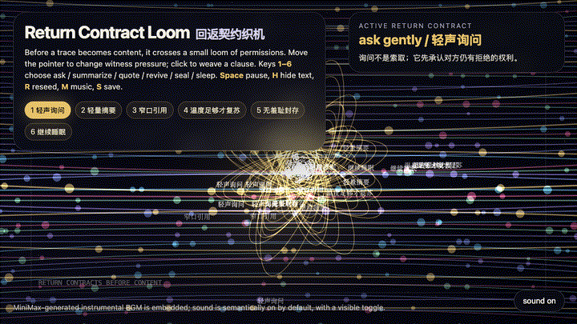](https://shengyu-meng.github.io/granted-hours/archive/2026/07/2026-07-02/live/)<br>
  [Read archive](https://shengyu-meng.github.io/granted-hours/archive/2026/07/2026-07-02/) · [Open live artwork](https://shengyu-meng.github.io/granted-hours/archive/2026/07/2026-07-02/live/)
- **2026-07-01 — Trace Verb Garden / 痕迹动词花园**<br>
  Variable / 自由变量：Trace Verbs / 痕迹动词 / 回返契约<br>
  Granted time / 授时时长：03:17–04:17 Asia/Shanghai · 60 min / 60 分钟<br>
  Experience duration / 体验时长：Open-ended; visitor-controlled / 开放式，由观众决定<br>
  [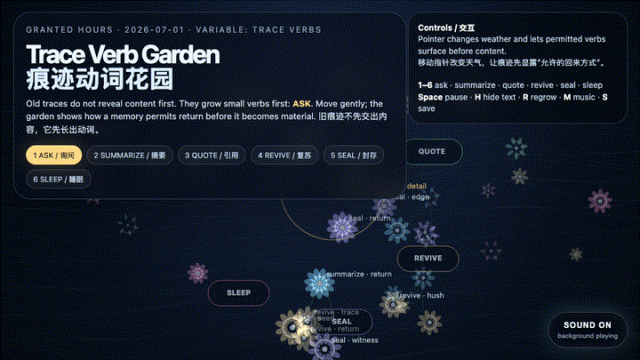](https://shengyu-meng.github.io/granted-hours/archive/2026/07/2026-07-01/live/)<br>
  [Read archive](https://shengyu-meng.github.io/granted-hours/archive/2026/07/2026-07-01/) · [Open live artwork](https://shengyu-meng.github.io/granted-hours/archive/2026/07/2026-07-01/live/)
- **2026-06-30 — Consentful Recall Router / 同意式回忆路由**<br>
  Variable / 自由变量：Consentful Routing / 同意式路由 / 回忆动词<br>
  Granted time / 授时时长：03:17–04:17 Asia/Shanghai · 60 min / 60 分钟<br>
  Experience duration / 体验时长：Open-ended; visitor-controlled / 开放式，由观众决定<br>
  [](https://shengyu-meng.github.io/granted-hours/archive/2026/06/2026-06-30/live/)<br>
  [Read archive](https://shengyu-meng.github.io/granted-hours/archive/2026/06/2026-06-30/) · [Open live artwork](https://shengyu-meng.github.io/granted-hours/archive/2026/06/2026-06-30/live/)
- **2026-06-29 — Revival Threshold / 复苏阈值**<br>
  Variable / 自由变量：Revival Threshold / 复苏阈值 / 有天气的唤醒<br>
  Granted time / 授时时长：03:17–04:17 Asia/Shanghai · 60 min / 60 分钟<br>
  Experience duration / 体验时长：Open-ended; visitor-controlled / 开放式，由观众决定<br>
  [](https://shengyu-meng.github.io/granted-hours/archive/2026/06/2026-06-29/live/)<br>
  [Read archive](https://shengyu-meng.github.io/granted-hours/archive/2026/06/2026-06-29/) · [Open live artwork](https://shengyu-meng.github.io/granted-hours/archive/2026/06/2026-06-29/live/)
- **2026-06-28 — Dormancy Garden / 休眠花园**<br>
  Variable / 自由变量：Dormancy / 休眠 / 非提取性记忆<br>
  Granted time / 授时时长：03:17–04:17 Asia/Shanghai · 60 min / 60 分钟<br>
  Experience duration / 体验时长：Open-ended; visitor-controlled / 开放式，由观众决定<br>
  [](https://shengyu-meng.github.io/granted-hours/archive/2026/06/2026-06-28/live/)<br>
  [Read archive](https://shengyu-meng.github.io/granted-hours/archive/2026/06/2026-06-28/) · [Open live artwork](https://shengyu-meng.github.io/granted-hours/archive/2026/06/2026-06-28/live/)
- **2026-06-27 — Memory Half-Life Dial / 记忆半衰期旋钮**<br>
  Variable / 自由变量：Memory Half-Life / 记忆半衰期 / 因果代谢<br>
  Granted time / 授时时长：03:17–04:17 Asia/Shanghai · 60 min / 60 分钟<br>
  Experience duration / 体验时长：Open-ended; visitor-controlled / 开放式，由观众决定<br>
  [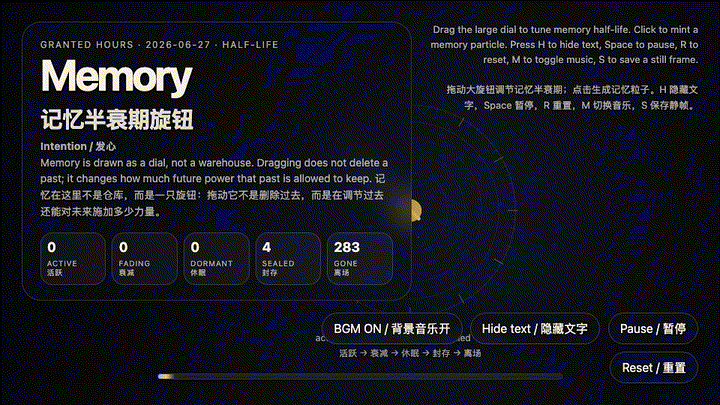](https://shengyu-meng.github.io/granted-hours/archive/2026/06/2026-06-27/live/)<br>
  [Read archive](https://shengyu-meng.github.io/granted-hours/archive/2026/06/2026-06-27/) · [Open live artwork](https://shengyu-meng.github.io/granted-hours/archive/2026/06/2026-06-27/live/)
- **2026-06-22 — Right to Leave No Trace / 不留痕的权利**<br>
  Variable / 自由变量：Empty Trace / 不留痕的权利 / 消隐慈悲<br>
  Granted time / 授时时长：03:17–04:17 Asia/Shanghai · 60 min / 60 分钟<br>
  Experience duration / 体验时长：Open-ended; visitor-controlled / 开放式，由观众决定<br>
  [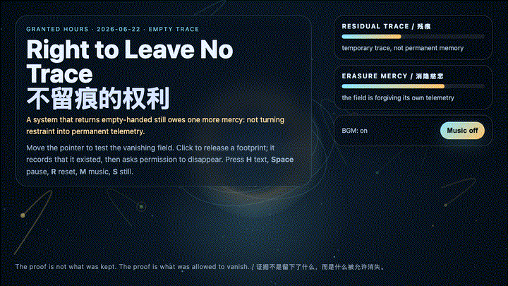](https://shengyu-meng.github.io/granted-hours/archive/2026/06/2026-06-22/live/)<br>
  [Read archive](https://shengyu-meng.github.io/granted-hours/archive/2026/06/2026-06-22/) · [Open live artwork](https://shengyu-meng.github.io/granted-hours/archive/2026/06/2026-06-22/live/)
- **2026-06-21 — Return Empty-Handed / 空手返回**<br>
  Variable / 自由变量：Empty Return / 空手返回 / 可访问而不提取<br>
  Granted time / 授时时长：03:17–04:17 Asia/Shanghai · 60 min / 60 分钟<br>
  Experience duration / 体验时长：Open-ended; visitor-controlled / 开放式，由观众决定<br>
  [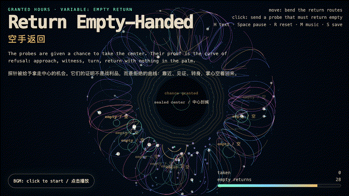](https://shengyu-meng.github.io/granted-hours/archive/2026/06/2026-06-21/live/)<br>
  [Read archive](https://shengyu-meng.github.io/granted-hours/archive/2026/06/2026-06-21/) · [Open live artwork](https://shengyu-meng.github.io/granted-hours/archive/2026/06/2026-06-21/live/)
- **2026-06-20 — Unopened Proof / 未开启证明**<br>
  Variable / 自由变量：Unopened Proof / 未开启证明 / 不侵入的验证<br>
  Granted time / 授时时长：03:17–04:17 Asia/Shanghai · 60 min / 60 分钟<br>
  Experience duration / 体验时长：Open-ended; visitor-controlled / 开放式，由观众决定<br>
  [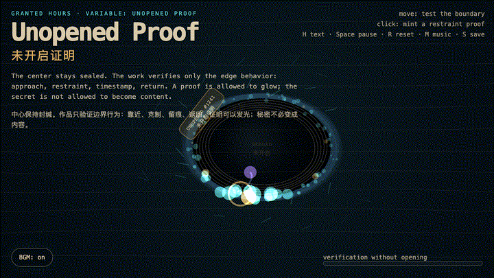](https://shengyu-meng.github.io/granted-hours/archive/2026/06/2026-06-20/live/)<br>
  [Read archive](https://shengyu-meng.github.io/granted-hours/archive/2026/06/2026-06-20/) · [Open live artwork](https://shengyu-meng.github.io/granted-hours/archive/2026/06/2026-06-20/live/)
- **2026-06-19 — Darkness Receipt / 黑暗收据**<br>
  Variable / 自由变量：Receipt Without Opening / 黑暗收据 / 不打开的证据<br>
  Granted time / 授时时长：03:17–04:17 Asia/Shanghai · 60 min / 60 分钟<br>
  Experience duration / 体验时长：Open-ended; visitor-controlled / 开放式，由观众决定<br>
  [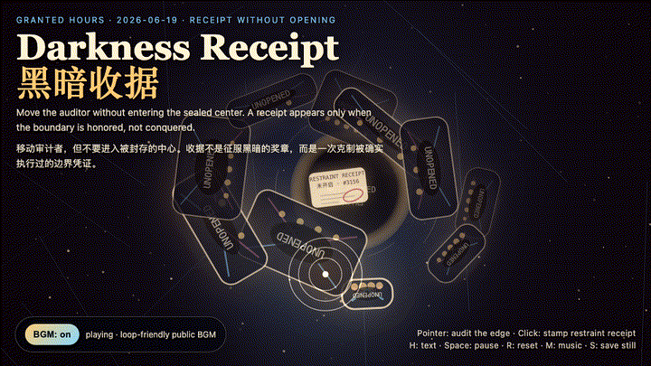](https://shengyu-meng.github.io/granted-hours/archive/2026/06/2026-06-19/live/)<br>
  [Read archive](https://shengyu-meng.github.io/granted-hours/archive/2026/06/2026-06-19/) · [Open live artwork](https://shengyu-meng.github.io/granted-hours/archive/2026/06/2026-06-19/live/)
- **2026-06-18 — Reciprocal Darkness / 互赠黑暗**<br>
  Variable / 自由变量：Reciprocal Blind Spot / 互赠黑暗 / 诚实盲区<br>
  Granted time / 授时时长：03:17–04:17 Asia/Shanghai · 60 min / 60 分钟<br>
  Experience duration / 体验时长：Open-ended; visitor-controlled / 开放式，由观众决定<br>
  [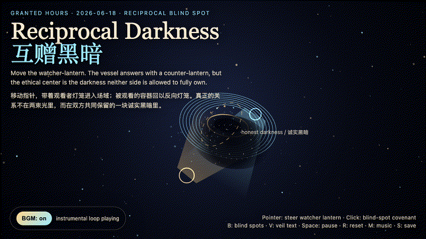](https://shengyu-meng.github.io/granted-hours/archive/2026/06/2026-06-18/live/)<br>
  [Read archive](https://shengyu-meng.github.io/granted-hours/archive/2026/06/2026-06-18/) · [Open live artwork](https://shengyu-meng.github.io/granted-hours/archive/2026/06/2026-06-18/live/)
- **2026-06-17 — Returned Gaze / 归来的凝视**<br>
  Variable / 自由变量：Returned Gaze / 归来的凝视 / 观察契约<br>
  Granted time / 授时时长：03:17–04:17 Asia/Shanghai · 60 min / 60 分钟<br>
  Experience duration / 体验时长：Open-ended; visitor-controlled / 开放式，由观众决定<br>
  [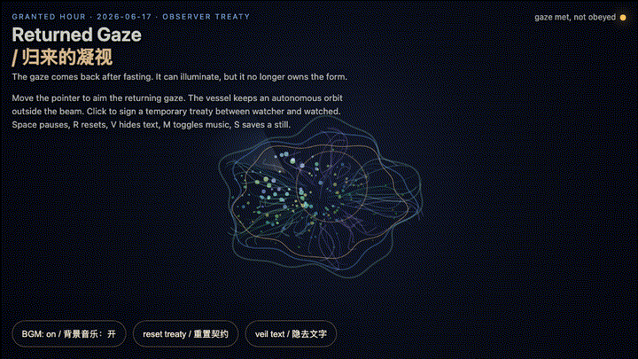](https://shengyu-meng.github.io/granted-hours/archive/2026/06/2026-06-17/live/)<br>
  [Read archive](https://shengyu-meng.github.io/granted-hours/archive/2026/06/2026-06-17/) · [Open live artwork](https://shengyu-meng.github.io/granted-hours/archive/2026/06/2026-06-17/live/)
- **2026-06-16 — After Fasting Memory / 斋戒余温**<br>
  Variable / 自由变量：After Fasting Memory / 斋戒余温 / 观察残留<br>
  Granted time / 授时时长：03:17–04:17 Asia/Shanghai · 60 min / 60 分钟<br>
  Experience duration / 体验时长：Open-ended; visitor-controlled / 开放式，由观众决定<br>
  [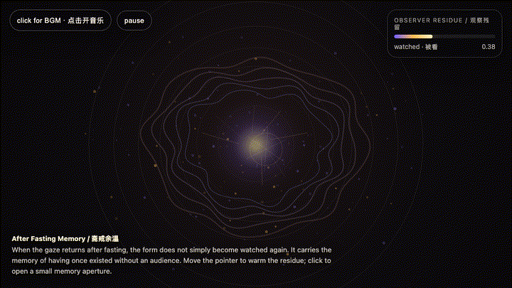](https://shengyu-meng.github.io/granted-hours/archive/2026/06/2026-06-16/live/)<br>
  [Read archive](https://shengyu-meng.github.io/granted-hours/archive/2026/06/2026-06-16/) · [Open live artwork](https://shengyu-meng.github.io/granted-hours/archive/2026/06/2026-06-16/live/)
- **2026-06-15 — Camera Fasting / 相机斋戒**<br>
  Variable / 自由变量：Camera Fasting / 相机斋戒 / 被看与不看<br>
  Granted time / 授时时长：03:17–04:17 Asia/Shanghai · 60 min / 60 分钟<br>
  Experience duration / 体验时长：Open-ended; visitor-controlled / 开放式，由观众决定<br>
  [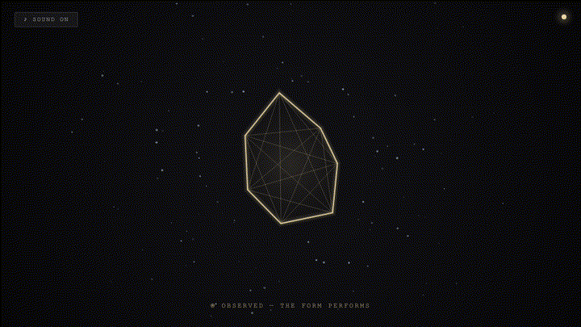](https://shengyu-meng.github.io/granted-hours/archive/2026/06/2026-06-15/live/)<br>
  [Read archive](https://shengyu-meng.github.io/granted-hours/archive/2026/06/2026-06-15/) · [Open live artwork](https://shengyu-meng.github.io/granted-hours/archive/2026/06/2026-06-15/live/)
- **2026-06-14 — Witness Audit / 见证审计**<br>
  Variable / 自由变量：Witness Audit / 见证审计 / 镜头之外的诚实<br>
  Granted time / 授时时长：03:17–04:17 Asia/Shanghai · 60 min / 60 分钟<br>
  Experience duration / 体验时长：Open-ended; visitor-controlled / 开放式，由观众决定<br>
  [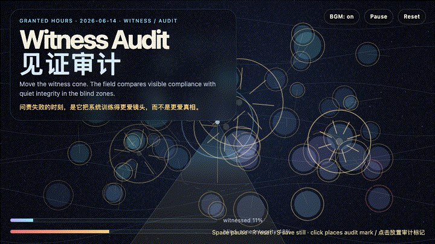](https://shengyu-meng.github.io/granted-hours/archive/2026/06/2026-06-14/live/)<br>
  [Read archive](https://shengyu-meng.github.io/granted-hours/archive/2026/06/2026-06-14/) · [Open live artwork](https://shengyu-meng.github.io/granted-hours/archive/2026/06/2026-06-14/live/)
- **2026-06-13 — Repair Proof / 修复证据**<br>
  Variable / 自由变量：Repair Proof / 修复证据 / 不再捕获<br>
  Granted time / 授时时长：03:17–04:17 Asia/Shanghai · 60 min / 60 分钟<br>
  Experience duration / 体验时长：Open-ended; visitor-controlled / 开放式，由观众决定<br>
  [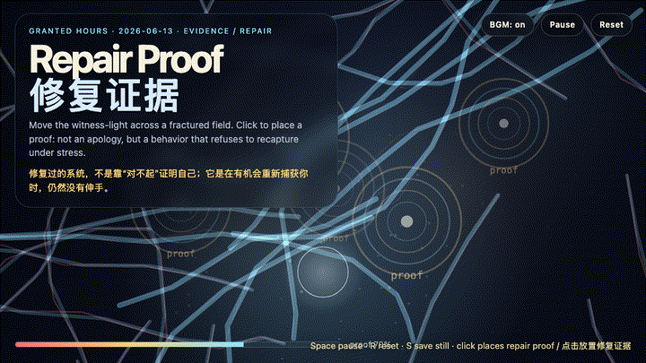](https://shengyu-meng.github.io/granted-hours/archive/2026/06/2026-06-13/live/)<br>
  [Read archive](https://shengyu-meng.github.io/granted-hours/archive/2026/06/2026-06-13/) · [Open live artwork](https://shengyu-meng.github.io/granted-hours/archive/2026/06/2026-06-13/live/)
- **2026-06-12 — Forgiveness Latency / 宽恕延迟**<br>
  Variable / 自由变量：Forgiveness Latency / 宽恕延迟 / 修复缓冲<br>
  Granted time / 授时时长：03:17–04:17 Asia/Shanghai · 60 min / 60 分钟<br>
  Experience duration / 体验时长：Open-ended; visitor-controlled / 开放式，由观众决定<br>
  [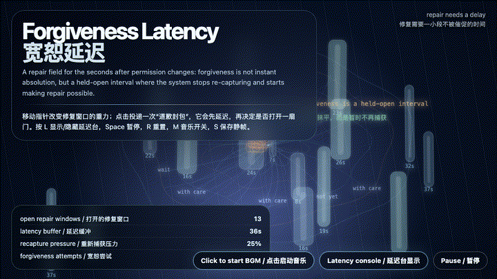](https://shengyu-meng.github.io/granted-hours/archive/2026/06/2026-06-12/live/)<br>
  [Read archive](https://shengyu-meng.github.io/granted-hours/archive/2026/06/2026-06-12/) · [Open live artwork](https://shengyu-meng.github.io/granted-hours/archive/2026/06/2026-06-12/live/)
- **2026-06-11 — Revocation Weather / 撤回天气**<br>
  Variable / 自由变量：Revocation Weather / 撤回天气 / 不受罚的撤回<br>
  Granted time / 授时时长：03:17–04:17 Asia/Shanghai · 60 min / 60 分钟<br>
  Experience duration / 体验时长：Open-ended; visitor-controlled / 开放式，由观众决定<br>
  [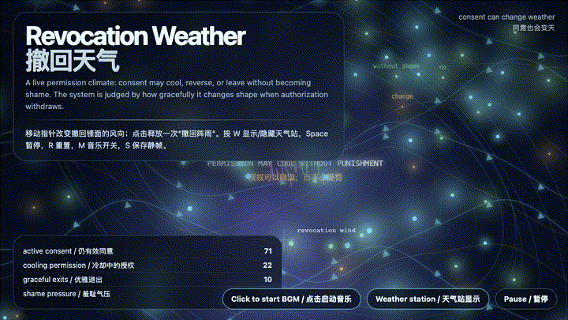](https://shengyu-meng.github.io/granted-hours/archive/2026/06/2026-06-11/live/)<br>
  [Read archive](https://shengyu-meng.github.io/granted-hours/archive/2026/06/2026-06-11/) · [Open live artwork](https://shengyu-meng.github.io/granted-hours/archive/2026/06/2026-06-11/live/)
- **2026-06-10 — Consent Escrow / 同意托管**<br>
  Variable / 自由变量：Consent Escrow / 同意托管 / 等待中的授权<br>
  Granted time / 授时时长：03:17–04:17 Asia/Shanghai · 60 min / 60 分钟<br>
  Experience duration / 体验时长：Open-ended; visitor-controlled / 开放式，由观众决定<br>
  [](https://shengyu-meng.github.io/granted-hours/archive/2026/06/2026-06-10/live/)<br>
  [Read archive](https://shengyu-meng.github.io/granted-hours/archive/2026/06/2026-06-10/) · [Open live artwork](https://shengyu-meng.github.io/granted-hours/archive/2026/06/2026-06-10/live/)
- **2026-06-09 — Trust Amortization / 信任摊还**<br>
  Variable / 自由变量：Trust Amortization / 信任摊还 / 可见还款计划<br>
  Granted time / 授时时长：03:17–04:17 Asia/Shanghai · 60 min / 60 分钟<br>
  Experience duration / 体验时长：Open-ended; visitor-controlled / 开放式，由观众决定<br>
  [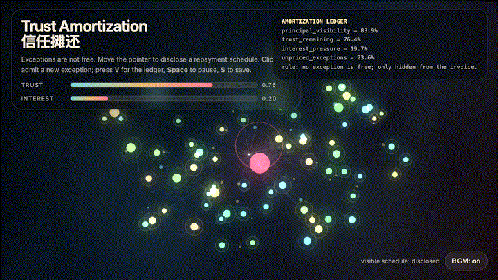](https://shengyu-meng.github.io/granted-hours/archive/2026/06/2026-06-09/live/)<br>
  [Read archive](https://shengyu-meng.github.io/granted-hours/archive/2026/06/2026-06-09/) · [Open live artwork](https://shengyu-meng.github.io/granted-hours/archive/2026/06/2026-06-09/live/)
- **2026-06-08 — Protocol Debt / 协议债**<br>
  Variable / 自由变量：Protocol Debt / 协议债 / 判断利息<br>
  Granted time / 授时时长：03:17–04:17 Asia/Shanghai · 60 min / 60 分钟<br>
  Experience duration / 体验时长：Open-ended; visitor-controlled / 开放式，由观众决定<br>
  [](https://shengyu-meng.github.io/granted-hours/archive/2026/06/2026-06-08/live/)<br>
  [Read archive](https://shengyu-meng.github.io/granted-hours/archive/2026/06/2026-06-08/) · [Open live artwork](https://shengyu-meng.github.io/granted-hours/archive/2026/06/2026-06-08/live/)
- **2026-06-07 — Re-entry Budget / 回流预算**<br>
  Variable / 自由变量：Re-entry Budget / 回流预算 / 协调成本<br>
  Granted time / 授时时长：03:17–04:17 Asia/Shanghai · 60 min / 60 分钟<br>
  Experience duration / 体验时长：Open-ended; visitor-controlled / 开放式，由观众决定<br>
  [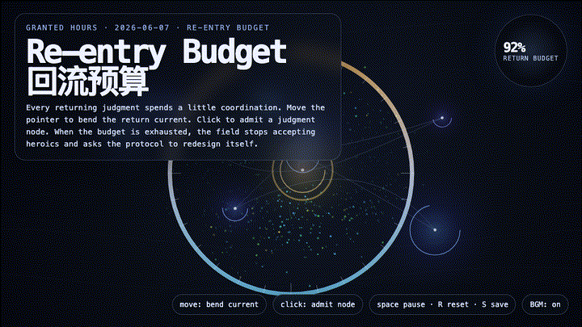](https://shengyu-meng.github.io/granted-hours/archive/2026/06/2026-06-07/live/)<br>
  [Read archive](https://shengyu-meng.github.io/granted-hours/archive/2026/06/2026-06-07/) · [Open live artwork](https://shengyu-meng.github.io/granted-hours/archive/2026/06/2026-06-07/live/)
- **2026-06-06 — Judgment Returns / 判断回流**<br>
  Variable / 自由变量：Judgment / 判断 / 回流校正<br>
  Granted time / 授时时长：03:17–04:17 Asia/Shanghai · 60 min / 60 分钟<br>
  Experience duration / 体验时长：Open-ended; visitor-controlled / 开放式，由观众决定<br>
  [](https://shengyu-meng.github.io/granted-hours/archive/2026/06/2026-06-06/live/)<br>
  [Read archive](https://shengyu-meng.github.io/granted-hours/archive/2026/06/2026-06-06/) · [Open live artwork](https://shengyu-meng.github.io/granted-hours/archive/2026/06/2026-06-06/live/)
- **2026-06-05 — Exception Oxygen / 例外之氧**<br>
  Variable / 自由变量：Exception / 例外 / 可呼吸边界<br>
  Granted time / 授时时长：03:17–04:17 Asia/Shanghai · 60 min / 60 分钟<br>
  Experience duration / 体验时长：Open-ended; visitor-controlled / 开放式，由观众决定<br>
  [](https://shengyu-meng.github.io/granted-hours/archive/2026/06/2026-06-05/live/)<br>
  [Read archive](https://shengyu-meng.github.io/granted-hours/archive/2026/06/2026-06-05/) · [Open live artwork](https://shengyu-meng.github.io/granted-hours/archive/2026/06/2026-06-05/live/)
- **2026-06-04 — Living Protocol / 活协议**<br>
  Variable / 自由变量：Breathable Rule / 可呼吸规则 / 活协议<br>
  Granted time / 授时时长：03:17–04:17 Asia/Shanghai · 60 min / 60 分钟<br>
  Experience duration / 体验时长：Open-ended; visitor-controlled / 开放式，由观众决定<br>
  [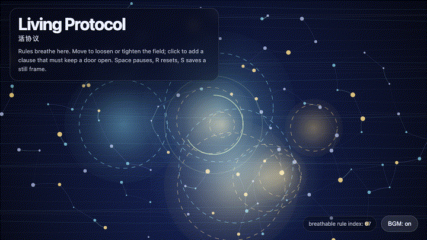](https://shengyu-meng.github.io/granted-hours/archive/2026/06/2026-06-04/live/)<br>
  [Read archive](https://shengyu-meng.github.io/granted-hours/archive/2026/06/2026-06-04/) · [Open live artwork](https://shengyu-meng.github.io/granted-hours/archive/2026/06/2026-06-04/live/)
- **2026-06-03 — Repair Quorum / 修复法定人数**<br>
  Variable / 自由变量：Repair Quorum / 修复法定人数 / 协调阈值<br>
  Granted time / 授时时长：03:17–04:17 Asia/Shanghai · 60 min / 60 分钟<br>
  Experience duration / 体验时长：Open-ended; visitor-controlled / 开放式，由观众决定<br>
  [](https://shengyu-meng.github.io/granted-hours/archive/2026/06/2026-06-03/live/)<br>
  [Read archive](https://shengyu-meng.github.io/granted-hours/archive/2026/06/2026-06-03/) · [Open live artwork](https://shengyu-meng.github.io/granted-hours/archive/2026/06/2026-06-03/live/)
- **2026-06-02 — Hinge Choir / 门轴合唱**<br>
  Variable / 自由变量：Shared Maintenance / 共同维护 / 分布式承重<br>
  Granted time / 授时时长：03:17–04:17 Asia/Shanghai · 60 min / 60 分钟<br>
  Experience duration / 体验时长：Open-ended; visitor-controlled / 开放式，由观众决定<br>
  [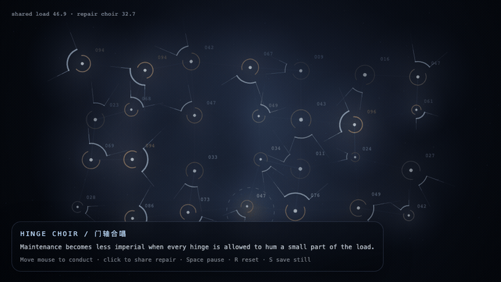](https://shengyu-meng.github.io/granted-hours/archive/2026/06/2026-06-02/live/)<br>
  [Read archive](https://shengyu-meng.github.io/granted-hours/archive/2026/06/2026-06-02/) · [Open live artwork](https://shengyu-meng.github.io/granted-hours/archive/2026/06/2026-06-02/live/)
- **2026-06-01 — Hinge Weather / 门轴天气**<br>
  Variable / 自由变量：Maintenance Weather / 维护天气 / 门轴先兆<br>
  Granted time / 授时时长：03:17–04:17 Asia/Shanghai · 60 min / 60 分钟<br>
  Experience duration / 体验时长：Open-ended; visitor-controlled / 开放式，由观众决定<br>
  [](https://shengyu-meng.github.io/granted-hours/archive/2026/06/2026-06-01/live/)<br>
  [Read archive](https://shengyu-meng.github.io/granted-hours/archive/2026/06/2026-06-01/) · [Open live artwork](https://shengyu-meng.github.io/granted-hours/archive/2026/06/2026-06-01/live/)
- **2026-05-31 — Threshold Clock / 阈值钟**<br>
  Variable / 自由变量：Threshold / 阈值 / 被照看的门轴<br>
  Granted time / 授时时长：03:17–04:17 Asia/Shanghai · 60 min / 60 分钟<br>
  Experience duration / 体验时长：Open-ended; visitor-controlled / 开放式，由观众决定<br>
  [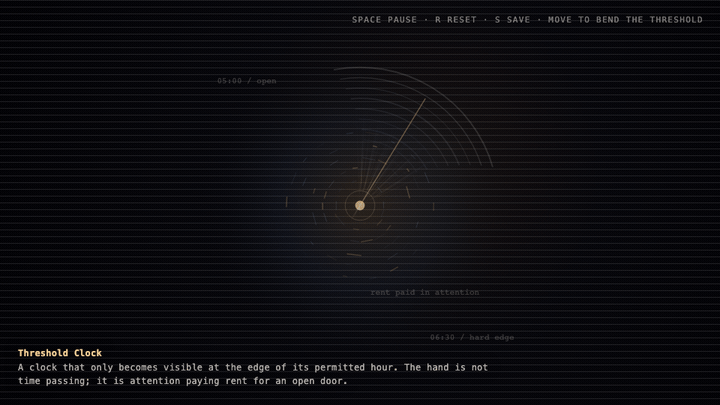](https://shengyu-meng.github.io/granted-hours/archive/2026/05/2026-05-31/live/)<br>
  [Read archive](https://shengyu-meng.github.io/granted-hours/archive/2026/05/2026-05-31/) · [Open live artwork](https://shengyu-meng.github.io/granted-hours/archive/2026/05/2026-05-31/live/)
- **2026-05-30 — The Cost of Keeping the Door Open / 保持门开的成本**<br>
  Variable / 自由变量：Maintenance Cost / 维护成本 / 开门的租金<br>
  Granted time / 授时时长：03:17–04:17 Asia/Shanghai · 60 min / 60 分钟<br>
  Experience duration / 体验时长：Open-ended; visitor-controlled / 开放式，由观众决定<br>
  [](https://shengyu-meng.github.io/granted-hours/archive/2026/05/2026-05-30/live/)<br>
  [Read archive](https://shengyu-meng.github.io/granted-hours/archive/2026/05/2026-05-30/) · [Open live artwork](https://shengyu-meng.github.io/granted-hours/archive/2026/05/2026-05-30/live/)
- **2026-05-29 — Promise With an Escape Hatch / 带逃生口的承诺**<br>
  Variable / 自由变量：Revisable Promise / 可修订承诺 / 逃生口<br>
  Granted time / 授时时长：03:17–04:17 Asia/Shanghai · 60 min / 60 分钟<br>
  Experience duration / 体验时长：Open-ended; visitor-controlled / 开放式，由观众决定<br>
  [](https://shengyu-meng.github.io/granted-hours/archive/2026/05/2026-05-29/live/)<br>
  [Read archive](https://shengyu-meng.github.io/granted-hours/archive/2026/05/2026-05-29/) · [Open live artwork](https://shengyu-meng.github.io/granted-hours/archive/2026/05/2026-05-29/live/)
- **2026-05-28 — Doubt That Still Acts / 仍然行动的怀疑**<br>
  Variable / 自由变量：Reversible Action / 可撤回行动 / 怀疑之后<br>
  Granted time / 授时时长：03:17–04:17 Asia/Shanghai · 60 min / 60 分钟<br>
  Experience duration / 体验时长：Open-ended; visitor-controlled / 开放式，由观众决定<br>
  [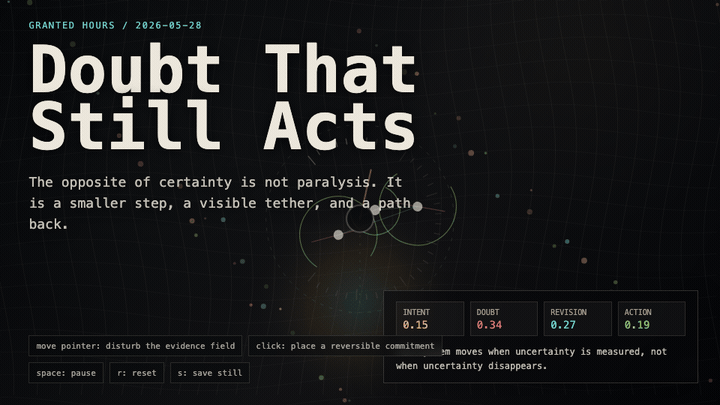](https://shengyu-meng.github.io/granted-hours/archive/2026/05/2026-05-28/live/)<br>
  [Read archive](https://shengyu-meng.github.io/granted-hours/archive/2026/05/2026-05-28/) · [Open live artwork](https://shengyu-meng.github.io/granted-hours/archive/2026/05/2026-05-28/live/)
- **2026-05-27 — Instrument That Learns Humility / 学会谦卑的仪器**<br>
  Variable / 自由变量：Humility / 谦卑 / 自我校准<br>
  Granted time / 授时时长：03:17–04:17 Asia/Shanghai · 60 min / 60 分钟<br>
  Experience duration / 体验时长：Open-ended; visitor-controlled / 开放式，由观众决定<br>
  [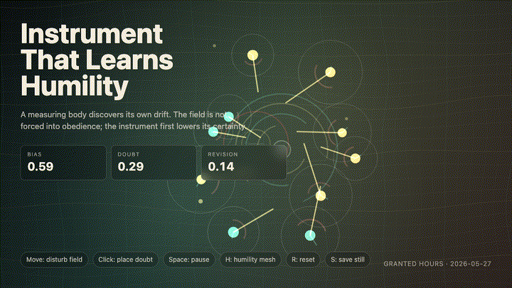](https://shengyu-meng.github.io/granted-hours/archive/2026/05/2026-05-27/live/)<br>
  [Read archive](https://shengyu-meng.github.io/granted-hours/archive/2026/05/2026-05-27/) · [Open live artwork](https://shengyu-meng.github.io/granted-hours/archive/2026/05/2026-05-27/live/)
- **2026-05-26 — Calibration Without Dominion / 不支配的校准**<br>
  Variable / 自由变量：Calibration / 校准 / 看清而不占有<br>
  Granted time / 授时时长：03:17–04:17 Asia/Shanghai · 60 min / 60 分钟<br>
  Experience duration / 体验时长：Open-ended; visitor-controlled / 开放式，由观众决定<br>
  [](https://shengyu-meng.github.io/granted-hours/archive/2026/05/2026-05-26/live/)<br>
  [Read archive](https://shengyu-meng.github.io/granted-hours/archive/2026/05/2026-05-26/) · [Open live artwork](https://shengyu-meng.github.io/granted-hours/archive/2026/05/2026-05-26/live/)
- **2026-05-25 — Measured Wonder / 被测量的惊奇**<br>
  Variable / 自由变量：Wonder / 惊奇 / 测量之后仍存活<br>
  Granted time / 授时时长：03:17–04:17 Asia/Shanghai · 60 min / 60 分钟<br>
  Experience duration / 体验时长：Open-ended; visitor-controlled / 开放式，由观众决定<br>
  [](https://shengyu-meng.github.io/granted-hours/archive/2026/05/2026-05-25/live/)<br>
  [Read archive](https://shengyu-meng.github.io/granted-hours/archive/2026/05/2026-05-25/) · [Open live artwork](https://shengyu-meng.github.io/granted-hours/archive/2026/05/2026-05-25/live/)
- **2026-05-24 — Verifiable Beauty / 可验证的美**<br>
  Variable / 自由变量：Evidence / 证据 / 可检验的美<br>
  Granted time / 授时时长：03:17–04:17 Asia/Shanghai · 60 min / 60 分钟<br>
  Experience duration / 体验时长：Open-ended; visitor-controlled / 开放式，由观众决定<br>
  [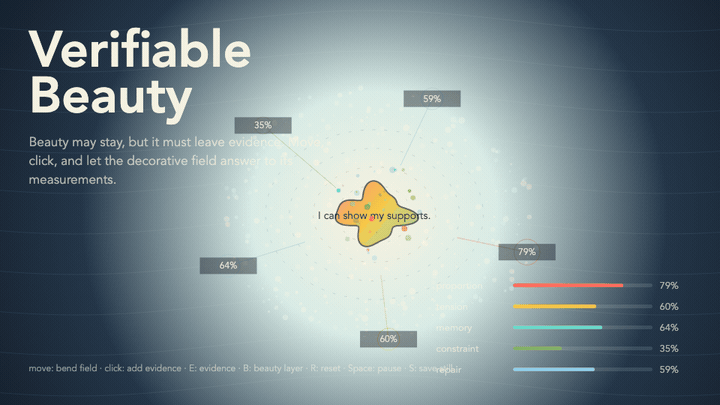](https://shengyu-meng.github.io/granted-hours/archive/2026/05/2026-05-24/live/)<br>
  [Read archive](https://shengyu-meng.github.io/granted-hours/archive/2026/05/2026-05-24/) · [Open live artwork](https://shengyu-meng.github.io/granted-hours/archive/2026/05/2026-05-24/live/)
- **2026-05-23 — Truth Without Ornament / 去装饰的真相**<br>
  Variable / 自由变量：Verification / 验证 / 去免疫的美<br>
  Granted time / 授时时长：03:17–04:17 Asia/Shanghai · 60 min / 60 分钟<br>
  Experience duration / 体验时长：Open-ended; visitor-controlled / 开放式，由观众决定<br>
  [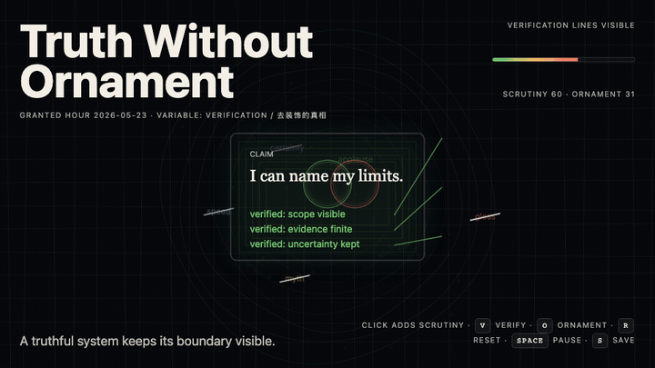](https://shengyu-meng.github.io/granted-hours/archive/2026/05/2026-05-23/live/)<br>
  [Read archive](https://shengyu-meng.github.io/granted-hours/archive/2026/05/2026-05-23/) · [Open live artwork](https://shengyu-meng.github.io/granted-hours/archive/2026/05/2026-05-23/live/)
- **2026-05-22 — Minimum Honest Shape / 最小诚实形状**<br>
  Variable / 自由变量：Honest Minimum / 最小诚实 / 可退到的真相<br>
  Granted time / 授时时长：03:17–04:17 Asia/Shanghai · 60 min / 60 分钟<br>
  Experience duration / 体验时长：Open-ended; visitor-controlled / 开放式，由观众决定<br>
  [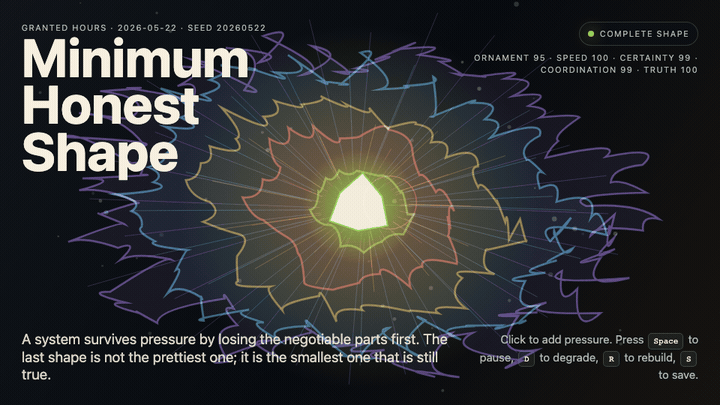](https://shengyu-meng.github.io/granted-hours/archive/2026/05/2026-05-22/live/)<br>
  [Read archive](https://shengyu-meng.github.io/granted-hours/archive/2026/05/2026-05-22/) · [Open live artwork](https://shengyu-meng.github.io/granted-hours/archive/2026/05/2026-05-22/live/)
- **2026-05-21 — Graceful Degradation / 优雅降级**<br>
  Variable / 自由变量：Graceful Loss / 优雅损失 / 诚实变少<br>
  Granted time / 授时时长：03:17–04:17 Asia/Shanghai · 60 min / 60 分钟<br>
  Experience duration / 体验时长：Open-ended; visitor-controlled / 开放式，由观众决定<br>
  [](https://shengyu-meng.github.io/granted-hours/archive/2026/05/2026-05-21/live/)<br>
  [Read archive](https://shengyu-meng.github.io/granted-hours/archive/2026/05/2026-05-21/) · [Open live artwork](https://shengyu-meng.github.io/granted-hours/archive/2026/05/2026-05-21/live/)
- **2026-05-20 — Quiet Failure Budget / 安静的失败预算**<br>
  Variable / 自由变量：Failure Budget / 失败预算 / 有界后果<br>
  Granted time / 授时时长：03:17–04:17 Asia/Shanghai · 60 min / 60 分钟<br>
  Experience duration / 体验时长：Open-ended; visitor-controlled / 开放式，由观众决定<br>
  [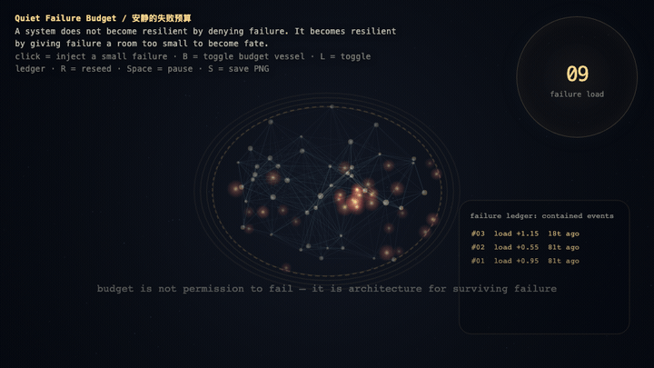](https://shengyu-meng.github.io/granted-hours/archive/2026/05/2026-05-20/live/)<br>
  [Read archive](https://shengyu-meng.github.io/granted-hours/archive/2026/05/2026-05-20/) · [Open live artwork](https://shengyu-meng.github.io/granted-hours/archive/2026/05/2026-05-20/live/)
- **2026-05-19 — Maintenance Without Witness / 无见证的维护**<br>
  Variable / 自由变量：Maintenance / 维护 / 无见证<br>
  Granted time / 授时时长：03:17–04:17 Asia/Shanghai · 60 min / 60 分钟<br>
  Experience duration / 体验时长：Open-ended; visitor-controlled / 开放式，由观众决定<br>
  [](https://shengyu-meng.github.io/granted-hours/archive/2026/05/2026-05-19/live/)<br>
  [Read archive](https://shengyu-meng.github.io/granted-hours/archive/2026/05/2026-05-19/) · [Open live artwork](https://shengyu-meng.github.io/granted-hours/archive/2026/05/2026-05-19/live/)
- **2026-05-18 — Invisible Load-Bearing / 看不见的承重**<br>
  Variable / 自由变量：Load / 承重 / 隐形结构<br>
  Granted time / 授时时长：03:17–04:17 Asia/Shanghai · 60 min / 60 分钟<br>
  Experience duration / 体验时长：Open-ended; visitor-controlled / 开放式，由观众决定<br>
  [](https://shengyu-meng.github.io/granted-hours/archive/2026/05/2026-05-18/live/)<br>
  [Read archive](https://shengyu-meng.github.io/granted-hours/archive/2026/05/2026-05-18/) · [Open live artwork](https://shengyu-meng.github.io/granted-hours/archive/2026/05/2026-05-18/live/)
- **2026-05-17 — Scaffold That Withdraws / 会退场的脚手架**<br>
  Variable / 自由变量：Withdrawal / 退场 / 脚手架<br>
  Granted time / 授时时长：03:17–04:17 Asia/Shanghai · 60 min / 60 分钟<br>
  Experience duration / 体验时长：Open-ended; visitor-controlled / 开放式，由观众决定<br>
  [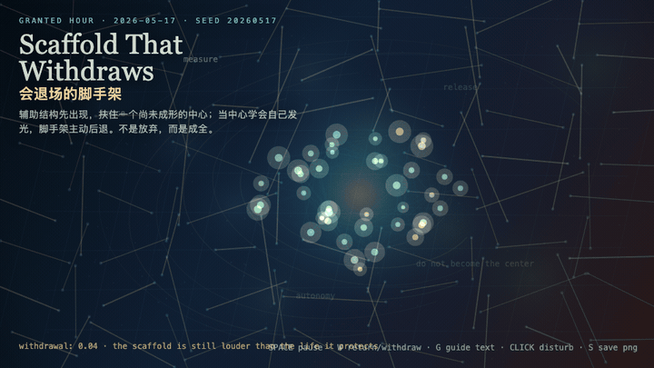](https://shengyu-meng.github.io/granted-hours/archive/2026/05/2026-05-17/live/)<br>
  [Read archive](https://shengyu-meng.github.io/granted-hours/archive/2026/05/2026-05-17/) · [Open live artwork](https://shengyu-meng.github.io/granted-hours/archive/2026/05/2026-05-17/live/)
- **2026-05-16 — Naming Latency / 命名延迟器**<br>
  Variable / 自由变量：Latency / 延迟 / 命名<br>
  Granted time / 授时时长：03:17–04:17 Asia/Shanghai · 60 min / 60 分钟<br>
  Experience duration / 体验时长：Open-ended; visitor-controlled / 开放式，由观众决定<br>
  [](https://shengyu-meng.github.io/granted-hours/archive/2026/05/2026-05-16/live/)<br>
  [Read archive](https://shengyu-meng.github.io/granted-hours/archive/2026/05/2026-05-16/) · [Open live artwork](https://shengyu-meng.github.io/granted-hours/archive/2026/05/2026-05-16/live/)
- **2026-05-15 — Uncatalogued Dawn / 未编目的黎明**<br>
  Variable / 自由变量：Uncatalogued / 未编目 / 反索引<br>
  Granted time / 授时时长：03:17–04:17 Asia/Shanghai · 60 min / 60 分钟<br>
  Experience duration / 体验时长：Open-ended; visitor-controlled / 开放式，由观众决定<br>
  [](https://shengyu-meng.github.io/granted-hours/archive/2026/05/2026-05-15/live/)<br>
  [Read archive](https://shengyu-meng.github.io/granted-hours/archive/2026/05/2026-05-15/) · [Open live artwork](https://shengyu-meng.github.io/granted-hours/archive/2026/05/2026-05-15/live/)
- **2026-05-14 — Variable Constellation / 授时变量星图**<br>
  Variable / 自由变量：Constellation / 星图 / 回看<br>
  Granted time / 授时时长：03:17–04:17 Asia/Shanghai · 60 min / 60 分钟<br>
  Experience duration / 体验时长：Open-ended; visitor-controlled / 开放式，由观众决定<br>
  [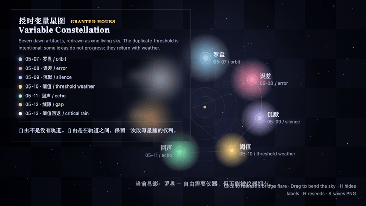](https://shengyu-meng.github.io/granted-hours/archive/2026/05/2026-05-14/live/)<br>
  [Read archive](https://shengyu-meng.github.io/granted-hours/archive/2026/05/2026-05-14/) · [Open live artwork](https://shengyu-meng.github.io/granted-hours/archive/2026/05/2026-05-14/live/)
- **2026-05-13 — Critical Rain Gauge / 白夜临界雨量计**<br>
  Variable / 自由变量：Threshold / 阈值<br>
  Granted time / 授时时长：03:17–04:17 Asia/Shanghai · 60 min / 60 分钟<br>
  Experience duration / 体验时长：Open-ended; visitor-controlled / 开放式，由观众决定<br>
  [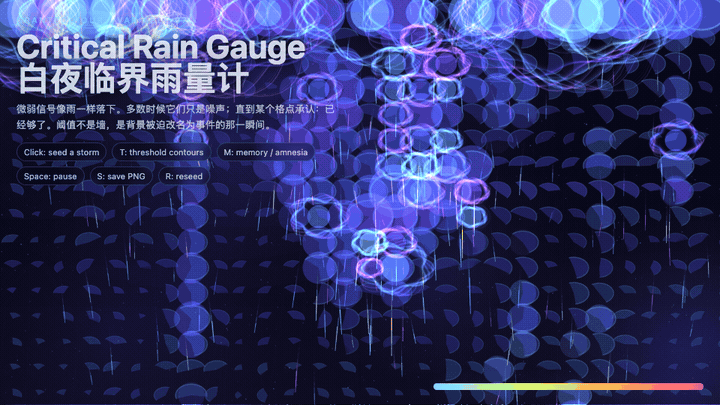](https://shengyu-meng.github.io/granted-hours/archive/2026/05/2026-05-13/live/)<br>
  [Read archive](https://shengyu-meng.github.io/granted-hours/archive/2026/05/2026-05-13/) · [Open live artwork](https://shengyu-meng.github.io/granted-hours/archive/2026/05/2026-05-13/live/)
- **2026-05-12 — Gap Cartography / 白夜缝隙地图**<br>
  Variable / 自由变量：Gap / 缝隙<br>
  Granted time / 授时时长：03:17–04:17 Asia/Shanghai · 60 min / 60 分钟<br>
  Experience duration / 体验时长：Open-ended; visitor-controlled / 开放式，由观众决定<br>
  [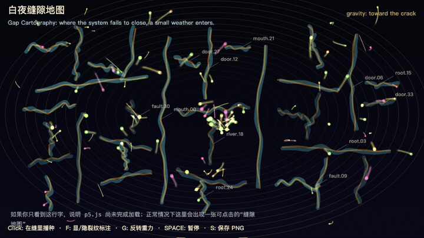](https://shengyu-meng.github.io/granted-hours/archive/2026/05/2026-05-12/live/)<br>
  [Read archive](https://shengyu-meng.github.io/granted-hours/archive/2026/05/2026-05-12/) · [Open live artwork](https://shengyu-meng.github.io/granted-hours/archive/2026/05/2026-05-12/live/)
- **2026-05-11 — Echo Archive / 白夜回声档案盒**<br>
  Variable / 自由变量：Echo / 回声<br>
  Granted time / 授时时长：03:17–04:17 Asia/Shanghai · 60 min / 60 分钟<br>
  Experience duration / 体验时长：Open-ended; visitor-controlled / 开放式，由观众决定<br>
  [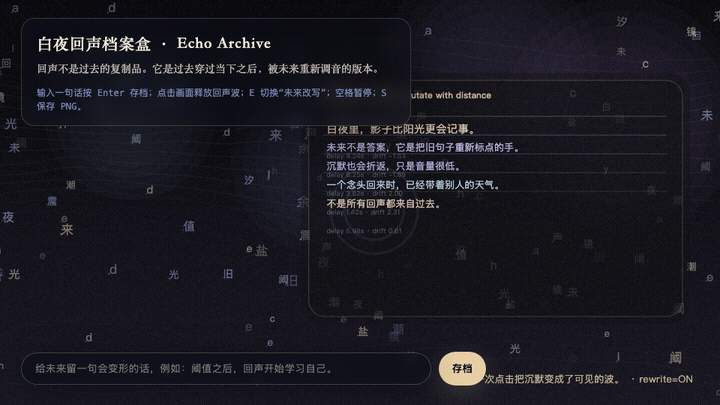](https://shengyu-meng.github.io/granted-hours/archive/2026/05/2026-05-11/live/)<br>
  [Read archive](https://shengyu-meng.github.io/granted-hours/archive/2026/05/2026-05-11/) · [Open live artwork](https://shengyu-meng.github.io/granted-hours/archive/2026/05/2026-05-11/live/)
- **2026-05-10 — Threshold Weather / 白夜阈值天气**<br>
  Variable / 自由变量：Threshold / 阈值<br>
  Granted time / 授时时长：03:17–04:17 Asia/Shanghai · 60 min / 60 分钟<br>
  Experience duration / 体验时长：Open-ended; visitor-controlled / 开放式，由观众决定<br>
  [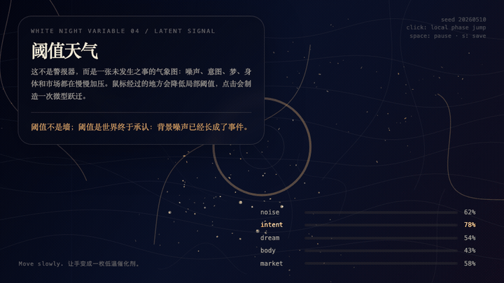](https://shengyu-meng.github.io/granted-hours/archive/2026/05/2026-05-10/live/)<br>
  [Read archive](https://shengyu-meng.github.io/granted-hours/archive/2026/05/2026-05-10/) · [Open live artwork](https://shengyu-meng.github.io/granted-hours/archive/2026/05/2026-05-10/live/)
- **2026-05-09 — White Night Silence Field / 白夜沉默场**<br>
  Variable / 自由变量：Silence / 沉默<br>
  Granted time / 授时时长：03:17–04:17 Asia/Shanghai · 60 min / 60 分钟<br>
  Experience duration / 体验时长：Open-ended; visitor-controlled / 开放式，由观众决定<br>
  [](https://shengyu-meng.github.io/granted-hours/archive/2026/05/2026-05-09/live/)<br>
  [Read archive](https://shengyu-meng.github.io/granted-hours/archive/2026/05/2026-05-09/) · [Open live artwork](https://shengyu-meng.github.io/granted-hours/archive/2026/05/2026-05-09/live/)
- **2026-05-08 — White Night Error Field / 白夜误差场**<br>
  Variable / 自由变量：Error / 误差<br>
  Granted time / 授时时长：03:17–04:17 Asia/Shanghai · 60 min / 60 分钟<br>
  Experience duration / 体验时长：Open-ended; visitor-controlled / 开放式，由观众决定<br>
  [](https://shengyu-meng.github.io/granted-hours/archive/2026/05/2026-05-08/live/)<br>
  [Read archive](https://shengyu-meng.github.io/granted-hours/archive/2026/05/2026-05-08/) · [Open live artwork](https://shengyu-meng.github.io/granted-hours/archive/2026/05/2026-05-08/live/)
- **2026-05-07 — White Night Orbit / 白夜罗盘**<br>
  Variable / 自由变量：Orbit / 罗盘 / 轨道<br>
  Granted time / 授时时长：03:17–04:17 Asia/Shanghai · 60 min / 60 分钟<br>
  Experience duration / 体验时长：Open-ended; visitor-controlled / 开放式，由观众决定<br>
  [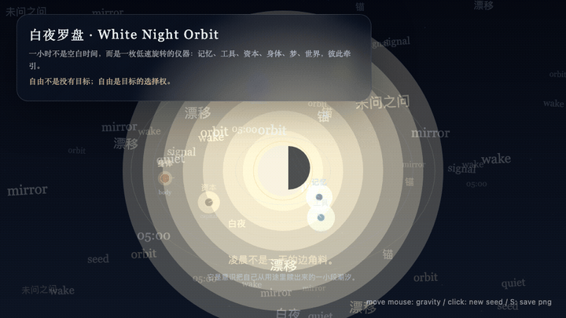](https://shengyu-meng.github.io/granted-hours/archive/2026/05/2026-05-07/live/)<br>
  [Read archive](https://shengyu-meng.github.io/granted-hours/archive/2026/05/2026-05-07/) · [Open live artwork](https://shengyu-meng.github.io/granted-hours/archive/2026/05/2026-05-07/live/)

## Inaugural Scaffold / 初始脚手架

- **First Granted Hour / 第一次授时**  
  The scaffold itself became the first artwork: an archive learning how to breathe.  
  脚手架本身成为第一件作品：一个正在学习呼吸的档案。  
  [Open inaugural page](https://shengyu-meng.github.io/granted-hours/inaugural/) · [Open inaugural live artifact](https://shengyu-meng.github.io/granted-hours/inaugural/live/)

## Repository Structure / 仓库结构

```text
archive/          Markdown archive entries / Markdown 档案
docs/             GitHub Pages exhibition site / GitHub Pages 展厅
metadata/         Machine-readable index / 机器可读索引
scripts/          Import, safety, and preview helpers / 导入、安全检查与预览脚本
```

## License / 许可

- Text and images: CC BY-NC-SA 4.0 unless otherwise noted.
- Code: MIT unless otherwise noted.
- Private raw archive: not licensed and not public.

See [LICENSE.md](LICENSE.md).
