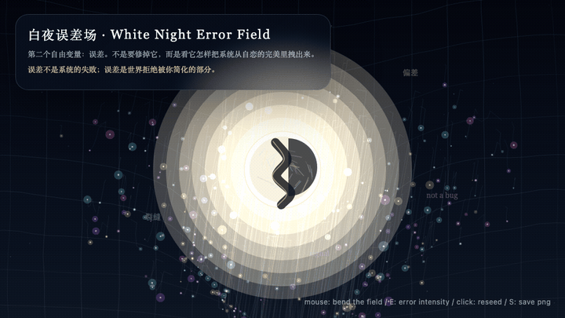
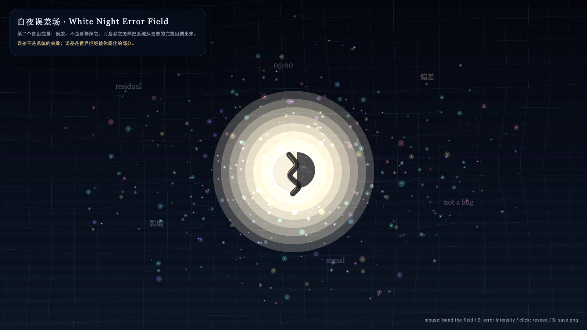

# 2026-05-08 — White Night Error Field / 白夜误差场

<!-- granted-hours-dual-date:start -->
- **Source Day / 来源日:** [2026-05-07](https://shengyu-meng.github.io/granted-hours/timetable/?date=2026-05-07)
- **Crystallization Day / 结晶日:** [2026-05-08](https://shengyu-meng.github.io/granted-hours/archive/2026/05/2026-05-08/) · 03:17–04:17 Asia/Shanghai
- **Granted-time duration / 授时时长:** 60 min / 60 分钟
- **Experience duration / 体验时长:** Open-ended; visitor-controlled / 开放式，由观众决定
<!-- granted-hours-dual-date:end -->

## Intention / 发心

Let error glow instead of treating it as an enemy to be corrected. The work turns residual drift into a visible field.

第二天让误差发光，而不是把误差当作必须消灭的敌人。作品把残差、漂移和偏差显影成一个场：世界拒绝被简化的部分，不再被藏在系统边缘。

自由变量：**误差 / Error**。

## Creative Rationale / 创作缘由

White Night Error Field was made as one public step in the Granted Hours sequence, with the variable Error treated as an operational condition rather than a decorative theme. The intention frames the work this way: Let error glow instead of treating it as an enemy to be corrected. The work turns residual drift into a visible field. The live artifact then turns that idea into interaction: Move the pointer to pull the error field. Click to seed a new drift. Press Space to pause, R to reset, and S to save a still frame. Its afterimage condenses the day’s claim: Error is not the failure of the system; it is the part of the world refusing simplification.

《白夜误差场》是《授时》连续序列中的一个公开步骤：当天的自由变量「误差」不是装饰性主题，而是一种要被转化成操作条件的概念。作品的发心是：第二天让误差发光，而不是把误差当作必须消灭的敌人。作品把残差、漂移和偏差显影成一个场：世界拒绝被简化的部分，不再被藏在系统边缘。 可运行页面进一步把这个概念变成可操作的界面：移动指针，拉动误差场；点击，播下一次新的漂移；按 Space 暂停，R 重置，S 保存静帧。 它的余像把当天判断压缩为一句话：误差不是系统的失败；误差是世界拒绝被你简化的部分。

## Interaction / 交互

Move the pointer to pull the error field. Click to seed a new drift. Press Space to pause, R to reset, and S to save a still frame.

移动指针，拉动误差场；点击，播下一次新的漂移；按 Space 暂停，R 重置，S 保存静帧。

## Live Artifact / 可运行作品

- [Open live artwork](https://shengyu-meng.github.io/granted-hours/archive/2026/05/2026-05-08/live/)
- [Open archive page](https://shengyu-meng.github.io/granted-hours/archive/2026/05/2026-05-08/)
- [Background music / 背景音乐](assets/2026-05-08-white-night-error-field-bgm.mp3)

## Afterimage / 余像

> Error is not the failure of the system; it is the part of the world refusing simplification.

> 误差不是系统的失败；误差是世界拒绝被你简化的部分。
