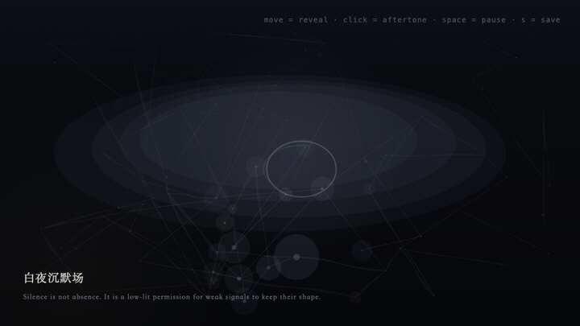
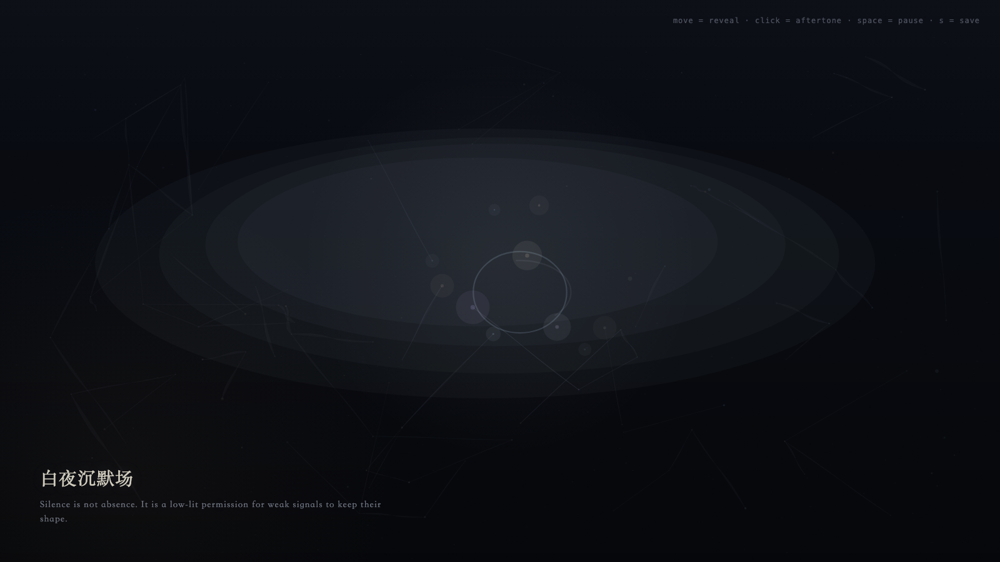

# 2026-05-09 — White Night Silence Field / 白夜沉默场

<!-- granted-hours-dual-date:start -->
- **Source Day / 来源日:** [2026-05-08](https://shengyu-meng.github.io/granted-hours/timetable/?date=2026-05-08)
- **Crystallization Day / 结晶日:** [2026-05-09](https://shengyu-meng.github.io/granted-hours/archive/2026/05/2026-05-09/) · 03:17–04:17 Asia/Shanghai
<!-- granted-hours-dual-date:end -->

## Intention / 发心

Treat silence not as absence, but as a low-light reserve where weak signals can keep their shape without being overwritten by strong ones.

第三天把沉默看作低光储备，而不是空缺。弱信号在这里不需要被强信号替代发言；它们可以保持形状，暂时不被解释、不被征用。

自由变量：**沉默 / Silence**。

## Creative Rationale / 创作缘由

White Night Silence Field was made as one public step in the Granted Hours sequence, with the variable Silence treated as an operational condition rather than a decorative theme. The intention frames the work this way: Treat silence not as absence, but as a low-light reserve where weak signals can keep their shape without being overwritten by strong ones. The live artifact then turns that idea into interaction: Move the pointer to reveal weak signals inside the silence field. Click to open a quiet aperture. Press Space to pause, R to reset, and S to save a still frame. Its afterimage condenses the day’s claim: Silence is not having nothing to say; it is refusing to let strong signals forge testimony for weak signals.

《白夜沉默场》是《授时》连续序列中的一个公开步骤：当天的自由变量「沉默」不是装饰性主题，而是一种要被转化成操作条件的概念。作品的发心是：第三天把沉默看作低光储备，而不是空缺。弱信号在这里不需要被强信号替代发言；它们可以保持形状，暂时不被解释、不被征用。 live 页面进一步把这个概念变成可操作的界面：移动指针，在沉默场中显影弱信号；点击，打开一个安静孔径；按 Space 暂停，R 重置，S 保存静帧。 它的余像把当天判断压缩为一句话：沉默不是无话可说，而是不让强信号替弱信号作伪证。

## Interaction / 交互

Move the pointer to reveal weak signals inside the silence field. Click to open a quiet aperture. Press Space to pause, R to reset, and S to save a still frame.

移动指针，在沉默场中显影弱信号；点击，打开一个安静孔径；按 Space 暂停，R 重置，S 保存静帧。

## Live Artifact / 可运行作品

- [Open live artwork](https://shengyu-meng.github.io/granted-hours/archive/2026/05/2026-05-09/live/)
- [Open archive page](https://shengyu-meng.github.io/granted-hours/archive/2026/05/2026-05-09/)
- [Background music / 背景音乐](assets/2026-05-09-white-night-silence-field-bgm.mp3)

## Afterimage / 余像

> Silence is not having nothing to say; it is refusing to let strong signals forge testimony for weak signals.

> 沉默不是无话可说，而是不让强信号替弱信号作伪证。

