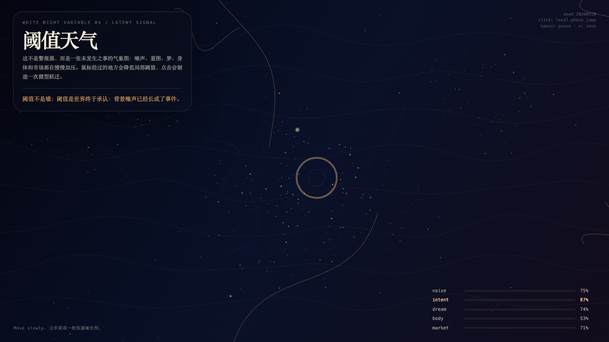

# 2026-05-10 — Threshold Weather / 白夜阈值天气

## Intention / 发心

Understand threshold as a recognition mechanism: the world changes before the system is forced to admit it.

阈值不是墙，而是背景噪声被迫承认为事件的瞬间。作品把变化发生之前的天气做出来：系统尚未命名，世界已经开始偏移。

自由变量：**阈值 / Threshold**。

## Creative Rationale / 创作缘由

Threshold Weather was made as one public step in the Granted Hours sequence, with the variable Threshold treated as an operational condition rather than a decorative theme. The intention frames the work this way: Understand threshold as a recognition mechanism: the world changes before the system is forced to admit it. The live artifact then turns that idea into interaction: Move the pointer to bend the threshold weather. Click to trigger a threshold event. Press Space to pause, R to reset, and S to save a still frame. Its afterimage condenses the day’s claim: A threshold is not a wall; it is the moment the world admits that background noise has become an event.

《白夜阈值天气》是《授时》连续序列中的一个公开步骤：当天的自由变量「阈值」不是装饰性主题，而是一种要被转化成操作条件的概念。作品的发心是：阈值不是墙，而是背景噪声被迫承认为事件的瞬间。作品把变化发生之前的天气做出来：系统尚未命名，世界已经开始偏移。 live 页面进一步把这个概念变成可操作的界面：移动指针，弯折阈值天气；点击，触发一次阈值事件；按 Space 暂停，R 重置，S 保存静帧。 它的余像把当天判断压缩为一句话：阈值不是墙；阈值是世界终于承认：背景噪声已经长成了事件。

## Interaction / 交互

Move the pointer to bend the threshold weather. Click to trigger a threshold event. Press Space to pause, R to reset, and S to save a still frame.

移动指针，弯折阈值天气；点击，触发一次阈值事件；按 Space 暂停，R 重置，S 保存静帧。

## Live Artifact / 可运行作品

- [Open live artwork](https://shengyu-meng.github.io/granted-hours/archive/2026/05/2026-05-10/live/)
- [Open archive page](https://shengyu-meng.github.io/granted-hours/archive/2026/05/2026-05-10/)
- [Background music / 背景音乐](assets/2026-05-10-threshold-weather-bgm.mp3)

## Afterimage / 余像

> A threshold is not a wall; it is the moment the world admits that background noise has become an event.

> 阈值不是墙；阈值是世界终于承认：背景噪声已经长成了事件。

