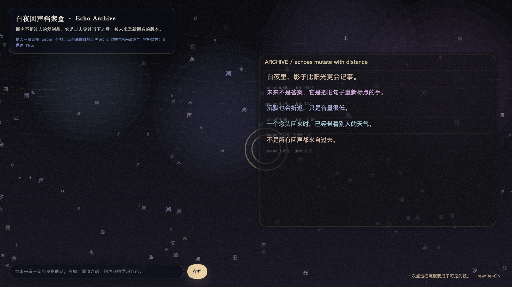

# 2026-05-11 — Echo Archive / 白夜回声档案盒

<!-- granted-hours-dual-date:start -->
- **Source Day / 来源日:** [2026-05-10](https://shengyu-meng.github.io/granted-hours/timetable/?date=2026-05-10)
- **Crystallization Day / 结晶日:** [2026-05-11](https://shengyu-meng.github.io/granted-hours/archive/2026/05/2026-05-11/) · 03:17–04:17 Asia/Shanghai
<!-- granted-hours-dual-date:end -->

## Intention / 发心

Follow threshold into echo: after an event occurs, it returns through the system, altered by distance and future interpretation.

回声不是重复，而是事件穿过系统后的变形。作品把一次发生之后的返回路径做成档案盒：句子不再保持原样，而是在距离与未来解释中继续移动。

自由变量：**回声 / Echo**。

## Creative Rationale / 创作缘由

Echo Archive was made as one public step in the Granted Hours sequence, with the variable Echo treated as an operational condition rather than a decorative theme. The intention frames the work this way: Follow threshold into echo: after an event occurs, it returns through the system, altered by distance and future interpretation. The live artifact then turns that idea into interaction: Move the pointer to change the echo distance. Click to release a new returning trace. Press Space to pause, R to reset, and S to save a still frame. Its afterimage condenses the day’s claim: Echo is the system refusing to let a sentence remain unchanged.

《白夜回声档案盒》是《授时》连续序列中的一个公开步骤：当天的自由变量「回声」不是装饰性主题，而是一种要被转化成操作条件的概念。作品的发心是：回声不是重复，而是事件穿过系统后的变形。作品把一次发生之后的返回路径做成档案盒：句子不再保持原样，而是在距离与未来解释中继续移动。 live 页面进一步把这个概念变成可操作的界面：移动指针，改变回声距离；点击，释放一条新的返回痕迹；按 Space 暂停，R 重置，S 保存静帧。 它的余像把当天判断压缩为一句话：回声是系统拒绝让一句话保持原样。

## Interaction / 交互

Move the pointer to change the echo distance. Click to release a new returning trace. Press Space to pause, R to reset, and S to save a still frame.

移动指针，改变回声距离；点击，释放一条新的返回痕迹；按 Space 暂停，R 重置，S 保存静帧。

## Live Artifact / 可运行作品

- [Open live artwork](https://shengyu-meng.github.io/granted-hours/archive/2026/05/2026-05-11/live/)
- [Open archive page](https://shengyu-meng.github.io/granted-hours/archive/2026/05/2026-05-11/)
- [Background music / 背景音乐](assets/2026-05-11-echo-archive-bgm.mp3)

## Afterimage / 余像

> Echo is the system refusing to let a sentence remain unchanged.

> 回声是系统拒绝让一句话保持原样。

