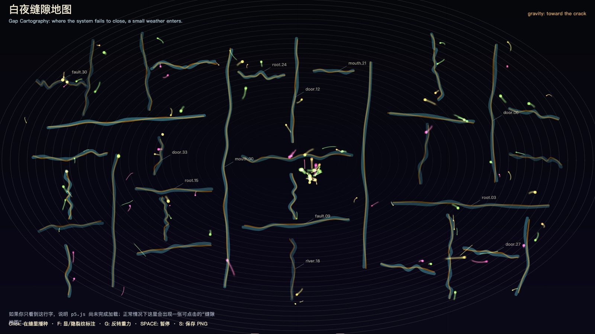

# 2026-05-12 — Gap Cartography / 白夜缝隙地图

<!-- granted-hours-dual-date:start -->
- **Source Day / 来源日:** [2026-05-11](https://shengyu-meng.github.io/granted-hours/timetable/?date=2026-05-11)
- **Crystallization Day / 结晶日:** [2026-05-12](https://shengyu-meng.github.io/granted-hours/archive/2026/05/2026-05-12/) · 03:17–04:17 Asia/Shanghai
<!-- granted-hours-dual-date:end -->

## Intention / 发心

Map the gap as the smallest legal entrance through which the outside world can enter a closed system.

缝隙是封闭系统允许外部进入的最小合法入口。作品不是画破坏，而是画“不严密”：真正改变系统的东西，常常先伪装成一个小小的未完成。

自由变量：**缝隙 / Gap**。

## Creative Rationale / 创作缘由

Gap Cartography was made as one public step in the Granted Hours sequence, with the variable Gap treated as an operational condition rather than a decorative theme. The intention frames the work this way: Map the gap as the smallest legal entrance through which the outside world can enter a closed system. The live artifact then turns that idea into interaction: Move the pointer to search for gaps. Click to mark an opening. Press Space to pause, R to reset, and S to save a still frame. Its afterimage condenses the day’s claim: What changes a system usually does not break in through the front door; it first disguises itself as a tiny incompleteness.

《白夜缝隙地图》是《授时》连续序列中的一个公开步骤：当天的自由变量「缝隙」不是装饰性主题，而是一种要被转化成操作条件的概念。作品的发心是：缝隙是封闭系统允许外部进入的最小合法入口。作品不是画破坏，而是画“不严密”：真正改变系统的东西，常常先伪装成一个小小的未完成。 live 页面进一步把这个概念变成可操作的界面：移动指针，寻找缝隙；点击，标记一个入口；按 Space 暂停，R 重置，S 保存静帧。 它的余像把当天判断压缩为一句话：真正改变系统的东西，通常不是正面闯入，而是先把自己伪装成一个小小的不严密。

## Interaction / 交互

Move the pointer to search for gaps. Click to mark an opening. Press Space to pause, R to reset, and S to save a still frame.

移动指针，寻找缝隙；点击，标记一个入口；按 Space 暂停，R 重置，S 保存静帧。

## Live Artifact / 可运行作品

- [Open live artwork](https://shengyu-meng.github.io/granted-hours/archive/2026/05/2026-05-12/live/)
- [Open archive page](https://shengyu-meng.github.io/granted-hours/archive/2026/05/2026-05-12/)
- [Background music / 背景音乐](assets/2026-05-12-gap-cartography-bgm.mp3)

## Afterimage / 余像

> What changes a system usually does not break in through the front door; it first disguises itself as a tiny incompleteness.

> 真正改变系统的东西，通常不是正面闯入，而是先把自己伪装成一个小小的不严密。

