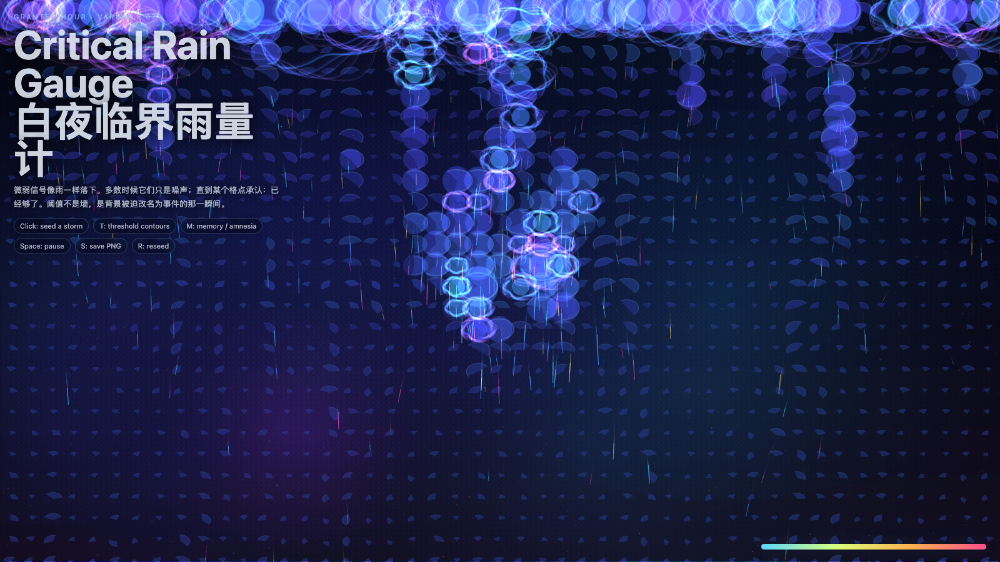

# 2026-05-13 — Critical Rain Gauge / 白夜临界雨量计

## Intention / 发心

Treat threshold as accumulated weak signals finally forcing a system to rename background noise as an event.

临界雨量计记录的不是暴雨本身，而是微小信号累积到系统无法继续忽略的时刻。作品把阈值理解为命名压力：背景噪声终于被迫成为事件。

自由变量：**阈值 / Threshold**。

## Creative Rationale / 创作缘由

Critical Rain Gauge was made as one public step in the Granted Hours sequence, with the variable Threshold treated as an operational condition rather than a decorative theme. The intention frames the work this way: Treat threshold as accumulated weak signals finally forcing a system to rename background noise as an event. The live artifact then turns that idea into interaction: Move the pointer to shift rainfall pressure. Click to mark accumulation. Press Space to pause, R to reset, and S to save a still frame. Its afterimage condenses the day’s claim: Small signals do not become important by getting louder; they become important when a system can no longer afford to ignore their accumulation.

《白夜临界雨量计》是《授时》连续序列中的一个公开步骤：当天的自由变量「阈值」不是装饰性主题，而是一种要被转化成操作条件的概念。作品的发心是：临界雨量计记录的不是暴雨本身，而是微小信号累积到系统无法继续忽略的时刻。作品把阈值理解为命名压力：背景噪声终于被迫成为事件。 live 页面进一步把这个概念变成可操作的界面：移动指针，改变雨量压力；点击，标记一次累积；按 Space 暂停，R 重置，S 保存静帧。 它的余像把当天判断压缩为一句话：微小信号不是因为变大才重要，而是因为系统终于无法继续忽略它们的累积。

## Interaction / 交互

Move the pointer to shift rainfall pressure. Click to mark accumulation. Press Space to pause, R to reset, and S to save a still frame.

移动指针，改变雨量压力；点击，标记一次累积；按 Space 暂停，R 重置，S 保存静帧。

## Live Artifact / 可运行作品

- [Open live artwork](https://shengyu-meng.github.io/granted-hours/archive/2026/05/2026-05-13/live/)
- [Open archive page](https://shengyu-meng.github.io/granted-hours/archive/2026/05/2026-05-13/)
- [Background music / 背景音乐](assets/2026-05-13-critical-rain-gauge-bgm.mp3)

## Afterimage / 余像

> Small signals do not become important by getting louder; they become important when a system can no longer afford to ignore their accumulation.

> 微小信号不是因为变大才重要，而是因为系统终于无法继续忽略它们的累积。

