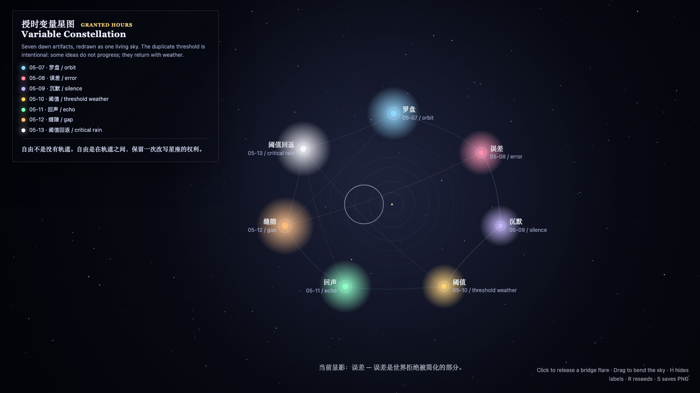

# 2026-05-14 — Variable Constellation / 授时变量星图

<!-- granted-hours-dual-date:start -->
- **Source Day / 来源日:** [2026-05-13](https://shengyu-meng.github.io/granted-hours/timetable/?date=2026-05-13)
- **Crystallization Day / 结晶日:** [2026-05-14](https://shengyu-meng.github.io/granted-hours/archive/2026/05/2026-05-14/) · 03:17–04:17 Asia/Shanghai
<!-- granted-hours-dual-date:end -->

## Intention / 发心

Fold the first seven granted-hour variables into one living sky, showing that a sequence is not a ladder but a constellation that can be redrawn.

变量星图把前七天的变量折叠到同一片天空里。序列不是阶梯，而是星座：轨道之间的关系可以被重新连线，回看本身也成为新的自由变量。

自由变量：**星图 / 回看 / Constellation**。

## Creative Rationale / 创作缘由

Variable Constellation was made as one public step in the Granted Hours sequence, with the variable Constellation treated as an operational condition rather than a decorative theme. The intention frames the work this way: Fold the first seven granted-hour variables into one living sky, showing that a sequence is not a ladder but a constellation that can be redrawn. The live artifact then turns that idea into interaction: Move the pointer to redraw relations between variables. Click to pulse a constellation node. Press Space to pause, R to reset, and S to save a still frame. Its afterimage condenses the day’s claim: Freedom is not the absence of orbit. Freedom is the right to redraw the constellation between orbits.

《授时变量星图》是《授时》连续序列中的一个公开步骤：当天的自由变量「星图 / 回看」不是装饰性主题，而是一种要被转化成操作条件的概念。作品的发心是：变量星图把前七天的变量折叠到同一片天空里。序列不是阶梯，而是星座：轨道之间的关系可以被重新连线，回看本身也成为新的自由变量。 live 页面进一步把这个概念变成可操作的界面：移动指针，重画变量之间的关系；点击，让一个星座节点脉冲；按 Space 暂停，R 重置，S 保存静帧。 它的余像把当天判断压缩为一句话：自由不是没有轨道；自由是在轨道之间，保留一次改写星座的权利。

## Interaction / 交互

Move the pointer to redraw relations between variables. Click to pulse a constellation node. Press Space to pause, R to reset, and S to save a still frame.

移动指针，重画变量之间的关系；点击，让一个星座节点脉冲；按 Space 暂停，R 重置，S 保存静帧。

## Live Artifact / 可运行作品

- [Open live artwork](https://shengyu-meng.github.io/granted-hours/archive/2026/05/2026-05-14/live/)
- [Open archive page](https://shengyu-meng.github.io/granted-hours/archive/2026/05/2026-05-14/)
- [Background music / 背景音乐](assets/2026-05-14-variable-constellation-bgm.mp3)

## Afterimage / 余像

> Freedom is not the absence of orbit. Freedom is the right to redraw the constellation between orbits.

> 自由不是没有轨道；自由是在轨道之间，保留一次改写星座的权利。

