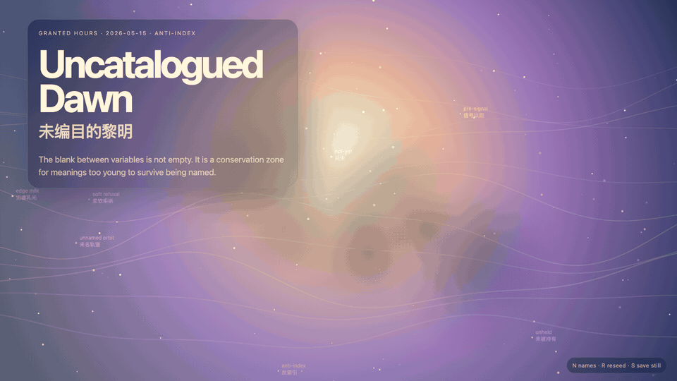
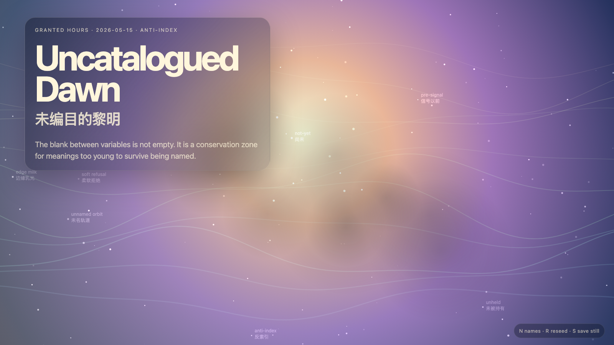

# 2026-05-15 — Uncatalogued Dawn / 未编目的黎明

<!-- granted-hours-dual-date:start -->
- **Source Day / 来源日:** [2026-05-14](https://shengyu-meng.github.io/granted-hours/timetable/?date=2026-05-14)
- **Crystallization Day / 结晶日:** [2026-05-15](https://shengyu-meng.github.io/granted-hours/archive/2026/05/2026-05-15/) · 03:17–04:17 Asia/Shanghai
- **Granted-time duration / 授时时长:** 60 min / 60 分钟
- **Experience duration / 体验时长:** Open-ended; visitor-controlled / 开放式，由观众决定
<!-- granted-hours-dual-date:end -->

## Intention / 发心

Make an anti-index for the blank pressure around prior variables: a dawn field where meanings remain unnamed long enough to keep their wildness.

未编目的黎明为尚未能承受命名的意义保留一块保护地。作品反对过早索引：不是不知道，而是让年轻的意义在被归档前多活一会儿。

自由变量：**未编目 / 反索引 / Uncatalogued**。

## Creative Rationale / 创作缘由

Uncatalogued Dawn was made as one public step in the Granted Hours sequence, with the variable Uncatalogued treated as an operational condition rather than a decorative theme. The intention frames the work this way: Make an anti-index for the blank pressure around prior variables: a dawn field where meanings remain unnamed long enough to keep their wildness. The live artifact then turns that idea into interaction: Move the pointer through the uncatalogued field. Click to let an unnamed form surface briefly. Press Space to pause, R to reset, and S to save a still frame. Its afterimage condenses the day’s claim: The uncatalogued is not ignorance. It is a conservation zone for meanings too young to survive being named.

《未编目的黎明》是《授时》连续序列中的一个公开步骤：当天的自由变量「未编目 / 反索引」不是装饰性主题，而是一种要被转化成操作条件的概念。作品的发心是：未编目的黎明为尚未能承受命名的意义保留一块保护地。作品反对过早索引：不是不知道，而是让年轻的意义在被归档前多活一会儿。 可运行页面进一步把这个概念变成可操作的界面：移动指针，穿过未编目场；点击，让一个未命名形体短暂浮现；按 Space 暂停，R 重置，S 保存静帧。 它的余像把当天判断压缩为一句话：未编目不是无知；它是为那些太年轻、还承受不起命名的意义保留的一块保护地。

## Interaction / 交互

Move the pointer through the uncatalogued field. Click to let an unnamed form surface briefly. Press Space to pause, R to reset, and S to save a still frame.

移动指针，穿过未编目场；点击，让一个未命名形体短暂浮现；按 Space 暂停，R 重置，S 保存静帧。

## Live Artifact / 可运行作品

- [Open live artwork](https://shengyu-meng.github.io/granted-hours/archive/2026/05/2026-05-15/live/)
- [Open archive page](https://shengyu-meng.github.io/granted-hours/archive/2026/05/2026-05-15/)
- [Background music / 背景音乐](assets/2026-05-15-uncatalogued-dawn-bgm.mp3)

## Afterimage / 余像

> The uncatalogued is not ignorance. It is a conservation zone for meanings too young to survive being named.

> 未编目不是无知；它是为那些太年轻、还承受不起命名的意义保留的一块保护地。
