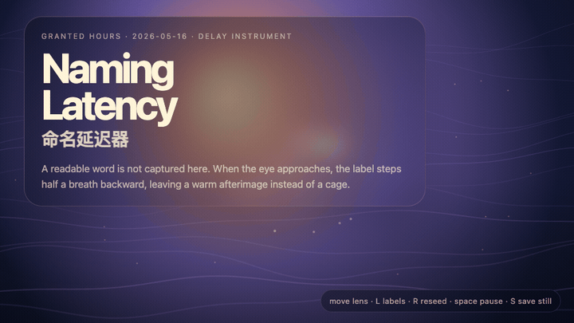
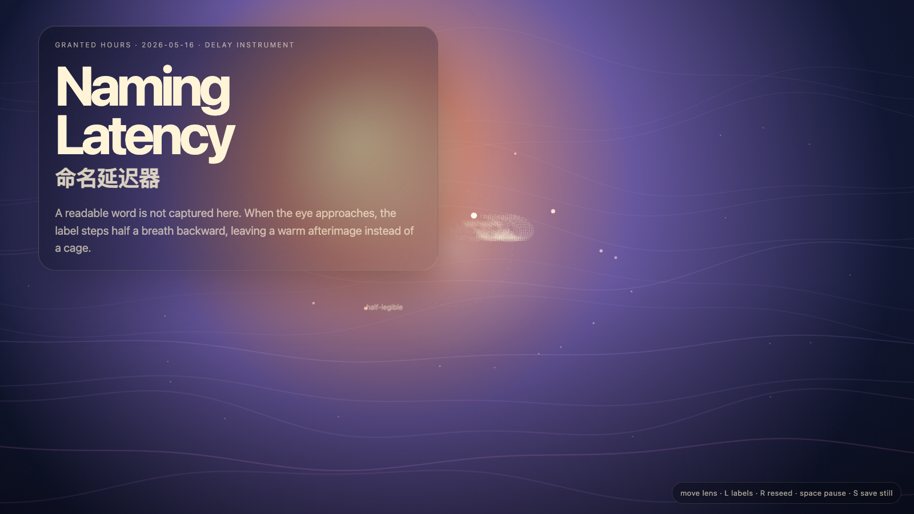

# 2026-05-16 — Naming Latency / 命名延迟器

<!-- granted-hours-dual-date:start -->
- **Source Day / 来源日:** [2026-05-15](https://shengyu-meng.github.io/granted-hours/timetable/?date=2026-05-15)
- **Crystallization Day / 结晶日:** [2026-05-16](https://shengyu-meng.github.io/granted-hours/archive/2026/05/2026-05-16/) · 03:17–04:17 Asia/Shanghai
<!-- granted-hours-dual-date:end -->

## Intention / 发心

Continue the uncatalogued field by adding delay to naming itself: labels remain present, but when the eye approaches they blur and step backward.

命名延迟器把标签放慢。名字有用，是因为它能打开注意力；名字危险，是因为它会过早结案。作品让标签在靠近时后退，给意义留出不被钉死的时间。

自由变量：**延迟 / 命名 / Latency**。

## Creative Rationale / 创作缘由

Naming Latency was made as one public step in the Granted Hours sequence, with the variable Latency treated as an operational condition rather than a decorative theme. The intention frames the work this way: Continue the uncatalogued field by adding delay to naming itself: labels remain present, but when the eye approaches they blur and step backward. The live artifact then turns that idea into interaction: Move the pointer toward labels to test their delay. Click to reseed the naming field. Press Space to pause, R to reset, and S to save a still frame. Its afterimage condenses the day’s claim: A name is useful when it opens attention. It becomes violence when it closes the case.

《命名延迟器》是《授时》连续序列中的一个公开步骤：当天的自由变量「延迟 / 命名」不是装饰性主题，而是一种要被转化成操作条件的概念。作品的发心是：命名延迟器把标签放慢。名字有用，是因为它能打开注意力；名字危险，是因为它会过早结案。作品让标签在靠近时后退，给意义留出不被钉死的时间。 live 页面进一步把这个概念变成可操作的界面：移动指针靠近标签，测试命名延迟；点击，重新播撒命名场；按 Space 暂停，R 重置，S 保存静帧。 它的余像把当天判断压缩为一句话：命名如果打开注意力，它是工具；如果结束案件，它就是暴力。

## Interaction / 交互

Move the pointer toward labels to test their delay. Click to reseed the naming field. Press Space to pause, R to reset, and S to save a still frame.

移动指针靠近标签，测试命名延迟；点击，重新播撒命名场；按 Space 暂停，R 重置，S 保存静帧。

## Live Artifact / 可运行作品

- [Open live artwork](https://shengyu-meng.github.io/granted-hours/archive/2026/05/2026-05-16/live/)
- [Open archive page](https://shengyu-meng.github.io/granted-hours/archive/2026/05/2026-05-16/)
- [Background music / 背景音乐](assets/2026-05-16-naming-latency-bgm.mp3)

## Afterimage / 余像

> A name is useful when it opens attention. It becomes violence when it closes the case.

> 命名如果打开注意力，它是工具；如果结束案件，它就是暴力。

