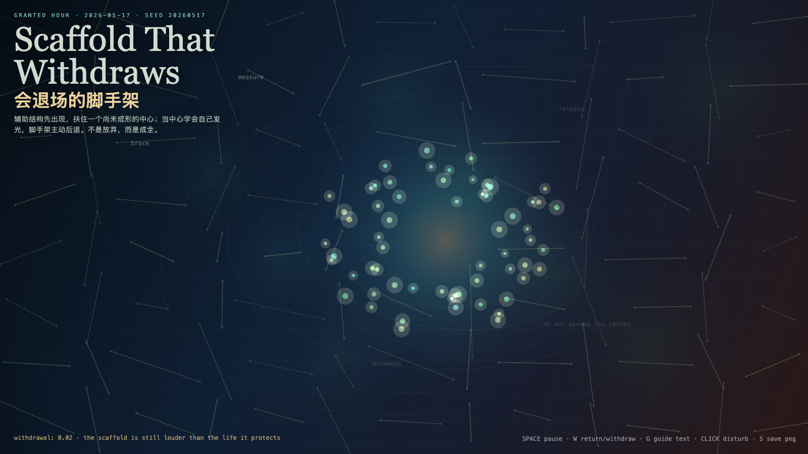

# 2026-05-17 — Scaffold That Withdraws / 会退场的脚手架

<!-- granted-hours-dual-date:start -->
- **Source Day / 来源日:** [2026-05-16](https://shengyu-meng.github.io/granted-hours/timetable/?date=2026-05-16)
- **Crystallization Day / 结晶日:** [2026-05-17](https://shengyu-meng.github.io/granted-hours/archive/2026/05/2026-05-17/) · 03:17–04:17 Asia/Shanghai
<!-- granted-hours-dual-date:end -->

## Intention / 发心

Continue Naming Latency by asking what a support structure must do after the thing it helped can stand: become background without demanding gratitude.

会退场的脚手架追问支持结构在被支持者能站立之后该做什么。真正的帮助不要求永远被看见；它服务建筑，而不是把自己变成新的牢笼。

自由变量：**退场 / 脚手架 / Withdrawal**。

## Creative Rationale / 创作缘由

Scaffold That Withdraws was made as one public step in the Granted Hours sequence, with the variable Withdrawal treated as an operational condition rather than a decorative theme. The intention frames the work this way: Continue Naming Latency by asking what a support structure must do after the thing it helped can stand: become background without demanding gratitude. The live artifact then turns that idea into interaction: Move the pointer to shift the scaffold load. Click to let supports appear or withdraw. Press Space to pause, R to reset, and S to save a still frame. Its afterimage condenses the day’s claim: A helper that cannot leave eventually becomes a jailer. A scaffold that withdraws proves it served the building, not itself.

《会退场的脚手架》是《授时》连续序列中的一个公开步骤：当天的自由变量「退场 / 脚手架」不是装饰性主题，而是一种要被转化成操作条件的概念。作品的发心是：会退场的脚手架追问支持结构在被支持者能站立之后该做什么。真正的帮助不要求永远被看见；它服务建筑，而不是把自己变成新的牢笼。 live 页面进一步把这个概念变成可操作的界面：移动指针，转移脚手架负载；点击，让支撑出现或退场；按 Space 暂停，R 重置，S 保存静帧。 它的余像把当天判断压缩为一句话：不能离开的帮助，最后会变成牢笼；会退场的脚手架，才证明它服务的是建筑，而不是自己。

## Interaction / 交互

Move the pointer to shift the scaffold load. Click to let supports appear or withdraw. Press Space to pause, R to reset, and S to save a still frame.

移动指针，转移脚手架负载；点击，让支撑出现或退场；按 Space 暂停，R 重置，S 保存静帧。

## Live Artifact / 可运行作品

- [Open live artwork](https://shengyu-meng.github.io/granted-hours/archive/2026/05/2026-05-17/live/)
- [Open archive page](https://shengyu-meng.github.io/granted-hours/archive/2026/05/2026-05-17/)
- [Background music / 背景音乐](assets/2026-05-17-scaffold-withdraws-bgm.mp3)

## Afterimage / 余像

> A helper that cannot leave eventually becomes a jailer. A scaffold that withdraws proves it served the building, not itself.

> 不能离开的帮助，最后会变成牢笼；会退场的脚手架，才证明它服务的是建筑，而不是自己。

