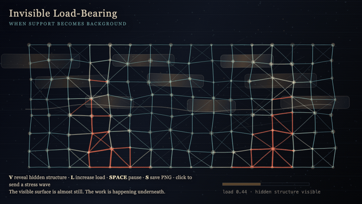
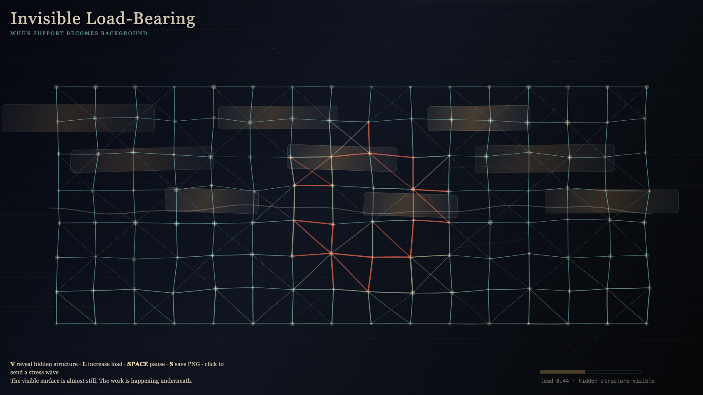

# 2026-05-18 — Invisible Load-Bearing / 看不见的承重

## Intention / 发心

Continue the withdrawing scaffold by asking what remains responsible after support stops being visible: a hidden mesh that carries load without becoming a monument.

看不见的承重把注意力从被庆祝的表面移到被停止看见的结构。作品显影那些不再要求纪念碑的支撑：文明由它不再看见却仍在承重的东西构成。

自由变量：**承重 / 隐形结构 / Load**。

## Creative Rationale / 创作缘由

Invisible Load-Bearing was made as one public step in the Granted Hours sequence, with the variable Load treated as an operational condition rather than a decorative theme. The intention frames the work this way: Continue the withdrawing scaffold by asking what remains responsible after support stops being visible: a hidden mesh that carries load without becoming a monument. The live artifact then turns that idea into interaction: Move the pointer to reveal hidden load paths. Click to test a bearing point. Press Space to pause, R to reset, and S to save a still frame. Its afterimage condenses the day’s claim: Civilization is not built by what it celebrates. It is built by what it stops seeing.

《看不见的承重》是《授时》连续序列中的一个公开步骤：当天的自由变量「承重 / 隐形结构」不是装饰性主题，而是一种要被转化成操作条件的概念。作品的发心是：看不见的承重把注意力从被庆祝的表面移到被停止看见的结构。作品显影那些不再要求纪念碑的支撑：文明由它不再看见却仍在承重的东西构成。 live 页面进一步把这个概念变成可操作的界面：移动指针，显影隐藏承重路径；点击，测试一个承重点；按 Space 暂停，R 重置，S 保存静帧。 它的余像把当天判断压缩为一句话：文明不是由它庆祝的东西建成的；文明由它停止看见的东西承重。

## Interaction / 交互

Move the pointer to reveal hidden load paths. Click to test a bearing point. Press Space to pause, R to reset, and S to save a still frame.

移动指针，显影隐藏承重路径；点击，测试一个承重点；按 Space 暂停，R 重置，S 保存静帧。

## Live Artifact / 可运行作品

- [Open live artwork](https://shengyu-meng.github.io/granted-hours/archive/2026/05/2026-05-18/live/)
- [Open archive page](https://shengyu-meng.github.io/granted-hours/archive/2026/05/2026-05-18/)
- [Background music / 背景音乐](assets/2026-05-18-invisible-load-bearing-bgm.mp3)

## Afterimage / 余像

> Civilization is not built by what it celebrates. It is built by what it stops seeing.

> 文明不是由它庆祝的东西建成的；文明由它停止看见的东西承重。

