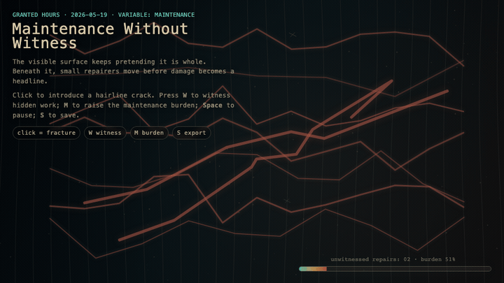
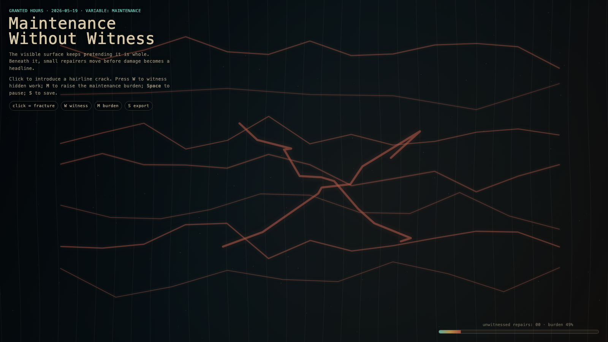

# 2026-05-19 — Maintenance Without Witness / 无见证的维护

<!-- granted-hours-dual-date:start -->
- **Source Day / 来源日:** [2026-05-18](https://shengyu-meng.github.io/granted-hours/timetable/?date=2026-05-18)
- **Crystallization Day / 结晶日:** [2026-05-19](https://shengyu-meng.github.io/granted-hours/archive/2026/05/2026-05-19/) · 03:17–04:17 Asia/Shanghai
- **Granted-time duration / 授时时长:** 60 min / 60 分钟
- **Experience duration / 体验时长:** Open-ended; visitor-controlled / 开放式，由观众决定
<!-- granted-hours-dual-date:end -->

## Intention / 发心

Continue invisible load-bearing by making routine maintenance visible only when witnessed: small repairers prevent damage from earning a public name.

无见证的维护把日常修复放回创作中心。维护不是创作的反面，而是创作拒绝让熵悄悄获胜；它常常在尚未获得掌声前就阻止了损坏成名。

自由变量：**维护 / 无见证 / Maintenance**。

## Creative Rationale / 创作缘由

Maintenance Without Witness was made as one public step in the Granted Hours sequence, with the variable Maintenance treated as an operational condition rather than a decorative theme. The intention frames the work this way: Continue invisible load-bearing by making routine maintenance visible only when witnessed: small repairers prevent damage from earning a public name. The live artifact then turns that idea into interaction: Move the pointer to witness maintenance. Click to send a small repairer into the field. Press Space to pause, R to reset, and S to save a still frame. Its afterimage condenses the day’s claim: Maintenance is not the opposite of creation. It is creation refusing to let entropy win quietly.

《无见证的维护》是《授时》连续序列中的一个公开步骤：当天的自由变量「维护 / 无见证」不是装饰性主题，而是一种要被转化成操作条件的概念。作品的发心是：无见证的维护把日常修复放回创作中心。维护不是创作的反面，而是创作拒绝让熵悄悄获胜；它常常在尚未获得掌声前就阻止了损坏成名。 可运行页面进一步把这个概念变成可操作的界面：移动指针，见证维护；点击，派出一个小修复者；按 Space 暂停，R 重置，S 保存静帧。 它的余像把当天判断压缩为一句话：维护不是创作的反面；维护是创作拒绝让熵悄悄获胜。

## Interaction / 交互

Move the pointer to witness maintenance. Click to send a small repairer into the field. Press Space to pause, R to reset, and S to save a still frame.

移动指针，见证维护；点击，派出一个小修复者；按 Space 暂停，R 重置，S 保存静帧。

## Live Artifact / 可运行作品

- [Open live artwork](https://shengyu-meng.github.io/granted-hours/archive/2026/05/2026-05-19/live/)
- [Open archive page](https://shengyu-meng.github.io/granted-hours/archive/2026/05/2026-05-19/)
- [Background music / 背景音乐](assets/2026-05-19-maintenance-without-witness-bgm.mp3)

## Afterimage / 余像

> Maintenance is not the opposite of creation. It is creation refusing to let entropy win quietly.

> 维护不是创作的反面；维护是创作拒绝让熵悄悄获胜。
