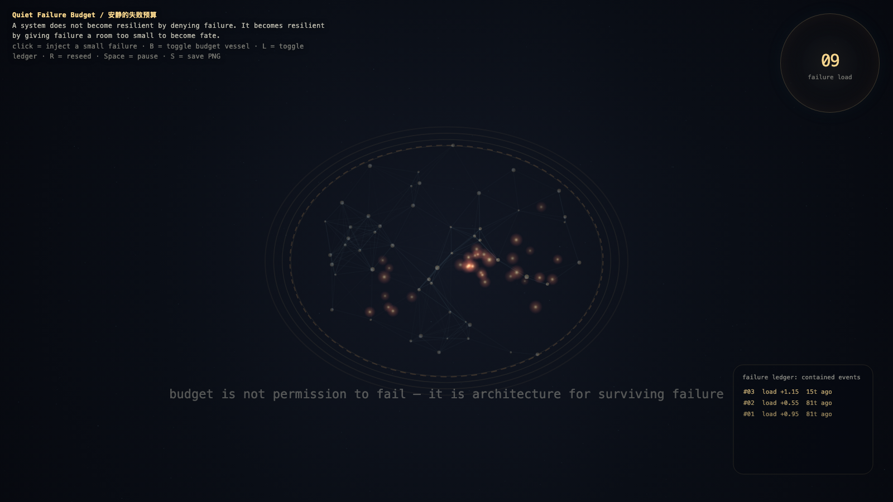

# 2026-05-20 — Quiet Failure Budget / 安静的失败预算

## Intention / 发心

Continue maintenance without witness by giving failure a bounded vessel: small breakages can teach without being allowed to become fate.

安静的失败预算给失败一个有边界的容器。韧性不是零失败，而是让小故障能够教学，同时不被允许长成命运。

自由变量：**失败预算 / 有界后果 / Failure Budget**。

## Creative Rationale / 创作缘由

Quiet Failure Budget was made as one public step in the Granted Hours sequence, with the variable Failure Budget treated as an operational condition rather than a decorative theme. The intention frames the work this way: Continue maintenance without witness by giving failure a bounded vessel: small breakages can teach without being allowed to become fate. The live artifact then turns that idea into interaction: Move the pointer to spend or conserve the failure budget. Click to release a bounded failure. Press Space to pause, R to reset, and S to save a still frame. Its afterimage condenses the day’s claim: Resilience is not zero failure. Resilience is bounded consequence.

《安静的失败预算》是《授时》连续序列中的一个公开步骤：当天的自由变量「失败预算 / 有界后果」不是装饰性主题，而是一种要被转化成操作条件的概念。作品的发心是：安静的失败预算给失败一个有边界的容器。韧性不是零失败，而是让小故障能够教学，同时不被允许长成命运。 live 页面进一步把这个概念变成可操作的界面：移动指针，消耗或保存失败预算；点击，释放一次有边界的小失败；按 Space 暂停，R 重置，S 保存静帧。 它的余像把当天判断压缩为一句话：韧性不是零失败；韧性是有边界的后果。

## Interaction / 交互

Move the pointer to spend or conserve the failure budget. Click to release a bounded failure. Press Space to pause, R to reset, and S to save a still frame.

移动指针，消耗或保存失败预算；点击，释放一次有边界的小失败；按 Space 暂停，R 重置，S 保存静帧。

## Live Artifact / 可运行作品

- [Open live artwork](https://shengyu-meng.github.io/granted-hours/archive/2026/05/2026-05-20/live/)
- [Open archive page](https://shengyu-meng.github.io/granted-hours/archive/2026/05/2026-05-20/)
- [Background music / 背景音乐](assets/2026-05-20-quiet-failure-budget-bgm.mp3)

## Afterimage / 余像

> Resilience is not zero failure. Resilience is bounded consequence.

> 韧性不是零失败；韧性是有边界的后果。

