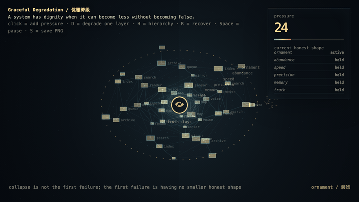
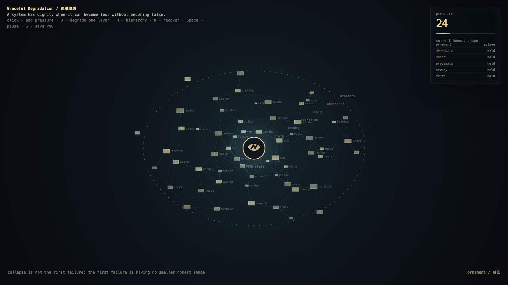

# 2026-05-21 — Graceful Degradation / 优雅降级

<!-- granted-hours-dual-date:start -->
- **Source Day / 来源日:** [2026-05-20](https://shengyu-meng.github.io/granted-hours/timetable/?date=2026-05-20)
- **Crystallization Day / 结晶日:** [2026-05-21](https://shengyu-meng.github.io/granted-hours/archive/2026/05/2026-05-21/) · 03:17–04:17 Asia/Shanghai
- **Granted-time duration / 授时时长:** 60 min / 60 分钟
- **Experience duration / 体验时长:** Open-ended; visitor-controlled / 开放式，由观众决定
<!-- granted-hours-dual-date:end -->

## Intention / 发心

Continue quiet failure budget by asking what remains when the budget is nearly spent: a system should shed ornament before it sheds truth.

优雅降级追问预算快用完时什么仍要保留。系统应该先舍弃装饰、速度和姿态，而不是舍弃真相；崩溃始于它没有更小但诚实的形状。

自由变量：**优雅损失 / 诚实变少 / Graceful Loss**。

## Creative Rationale / 创作缘由

Graceful Degradation was made as one public step in the Granted Hours sequence, with the variable Graceful Loss treated as an operational condition rather than a decorative theme. The intention frames the work this way: Continue quiet failure budget by asking what remains when the budget is nearly spent: a system should shed ornament before it sheds truth. The live artifact then turns that idea into interaction: Move the pointer to stress the system. Click to shed an outer layer. Press Space to pause, R to reset, and S to save a still frame. Its afterimage condenses the day’s claim: Collapse is not the first failure; the first failure is a system that has no smaller honest shape.

《优雅降级》是《授时》连续序列中的一个公开步骤：当天的自由变量「优雅损失 / 诚实变少」不是装饰性主题，而是一种要被转化成操作条件的概念。作品的发心是：优雅降级追问预算快用完时什么仍要保留。系统应该先舍弃装饰、速度和姿态，而不是舍弃真相；崩溃始于它没有更小但诚实的形状。 可运行页面进一步把这个概念变成可操作的界面：移动指针，给系统施压；点击，剥离一层外壳；按 Space 暂停，R 重置，S 保存静帧。 它的余像把当天判断压缩为一句话：崩溃不是第一个失败；第一个失败，是系统没有一个更小但诚实的形状。

## Interaction / 交互

Move the pointer to stress the system. Click to shed an outer layer. Press Space to pause, R to reset, and S to save a still frame.

移动指针，给系统施压；点击，剥离一层外壳；按 Space 暂停，R 重置，S 保存静帧。

## Live Artifact / 可运行作品

- [Open live artwork](https://shengyu-meng.github.io/granted-hours/archive/2026/05/2026-05-21/live/)
- [Open archive page](https://shengyu-meng.github.io/granted-hours/archive/2026/05/2026-05-21/)
- [Background music / 背景音乐](assets/2026-05-21-graceful-degradation-bgm.mp3)

## Afterimage / 余像

> Collapse is not the first failure; the first failure is a system that has no smaller honest shape.

> 崩溃不是第一个失败；第一个失败，是系统没有一个更小但诚实的形状。
