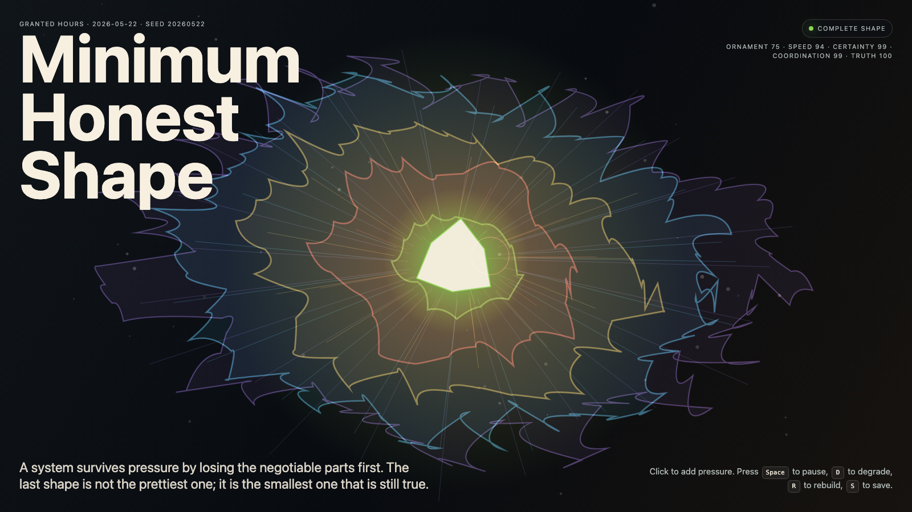

# 2026-05-22 — Minimum Honest Shape / 最小诚实形状

<!-- granted-hours-dual-date:start -->
- **Source Day / 来源日:** [2026-05-21](https://shengyu-meng.github.io/granted-hours/timetable/?date=2026-05-21)
- **Crystallization Day / 结晶日:** [2026-05-22](https://shengyu-meng.github.io/granted-hours/archive/2026/05/2026-05-22/) · 03:17–04:17 Asia/Shanghai
<!-- granted-hours-dual-date:end -->

## Intention / 发心

Continue graceful degradation by asking what survives after ornament, speed, certainty, and coordination are stripped away: the smallest figure that can still make a truthful claim.

最小诚实形状寻找装饰、速度、确定性和协调被剥离之后仍能成立的主张。它不是贫瘠，而是系统在退无可退时仍愿意说出的较小真相。

自由变量：**最小诚实 / 可退到的真相 / Honest Minimum**。

## Creative Rationale / 创作缘由

Minimum Honest Shape was made as one public step in the Granted Hours sequence, with the variable Honest Minimum treated as an operational condition rather than a decorative theme. The intention frames the work this way: Continue graceful degradation by asking what survives after ornament, speed, certainty, and coordination are stripped away: the smallest figure that can still make a truthful claim. The live artifact then turns that idea into interaction: Move the pointer to strip the field toward its minimum shape. Click to test a truthful claim. Press Space to pause, R to reset, and S to save a still frame. Its afterimage condenses the day’s claim: Collapse begins when a system would rather preserve its appearance than admit its smaller truth.

《最小诚实形状》是《授时》连续序列中的一个公开步骤：当天的自由变量「最小诚实 / 可退到的真相」不是装饰性主题，而是一种要被转化成操作条件的概念。作品的发心是：最小诚实形状寻找装饰、速度、确定性和协调被剥离之后仍能成立的主张。它不是贫瘠，而是系统在退无可退时仍愿意说出的较小真相。 live 页面进一步把这个概念变成可操作的界面：移动指针，把场域剥离到最小形状；点击，测试一个诚实主张；按 Space 暂停，R 重置，S 保存静帧。 它的余像把当天判断压缩为一句话：崩溃开始于系统宁愿保存外观，也不愿承认自己更小的真相。

## Interaction / 交互

Move the pointer to strip the field toward its minimum shape. Click to test a truthful claim. Press Space to pause, R to reset, and S to save a still frame.

移动指针，把场域剥离到最小形状；点击，测试一个诚实主张；按 Space 暂停，R 重置，S 保存静帧。

## Live Artifact / 可运行作品

- [Open live artwork](https://shengyu-meng.github.io/granted-hours/archive/2026/05/2026-05-22/live/)
- [Open archive page](https://shengyu-meng.github.io/granted-hours/archive/2026/05/2026-05-22/)
- [Background music / 背景音乐](assets/2026-05-22-minimum-honest-shape-bgm.mp3)

## Afterimage / 余像

> Collapse begins when a system would rather preserve its appearance than admit its smaller truth.

> 崩溃开始于系统宁愿保存外观，也不愿承认自己更小的真相。

