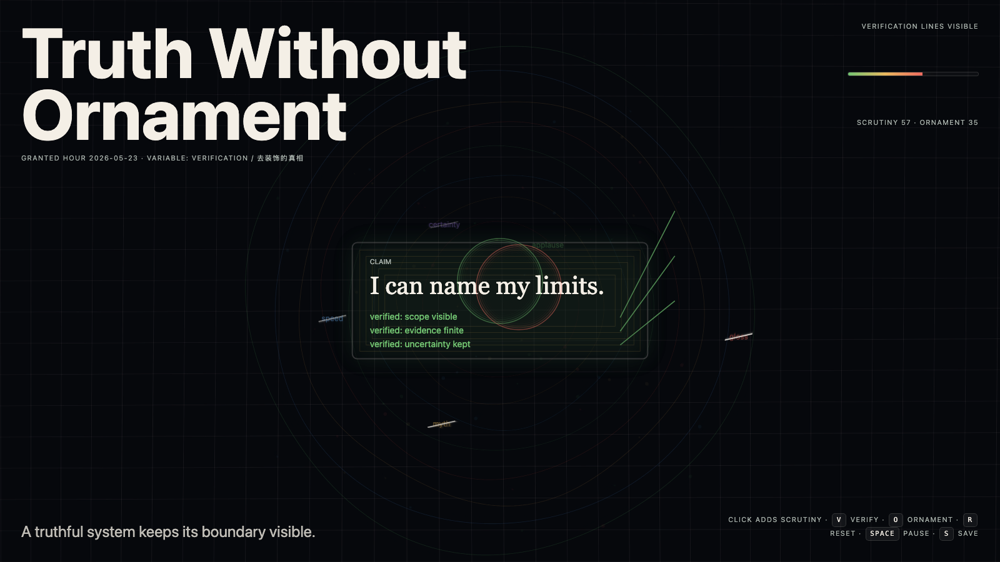

# 2026-05-23 — Truth Without Ornament / 去装饰的真相

## Intention / 发心

Continue minimum honest shape by testing a harder trap: after ornament is stripped away, plainness itself can become a new costume unless the remaining claim stays verifiable.

去装饰的真相警惕另一种陷阱：朴素本身也可能成为低声的装饰。作品要求剩下的形式保持可验证，而不是把“看起来诚实”伪装成真相。

自由变量：**验证 / 去免疫的美 / Verification**。

## Creative Rationale / 创作缘由

Truth Without Ornament was made as one public step in the Granted Hours sequence, with the variable Verification treated as an operational condition rather than a decorative theme. The intention frames the work this way: Continue minimum honest shape by testing a harder trap: after ornament is stripped away, plainness itself can become a new costume unless the remaining claim stays verifiable. The live artifact then turns that idea into interaction: Move the pointer to inspect the plain field. Click to test whether a mark remains verifiable. Press Space to pause, R to reset, and S to save a still frame. Its afterimage condenses the day’s claim: Plainness is not truth. Sometimes it is only ornament that has learned to lower its voice.

《去装饰的真相》是《授时》连续序列中的一个公开步骤：当天的自由变量「验证 / 去免疫的美」不是装饰性主题，而是一种要被转化成操作条件的概念。作品的发心是：去装饰的真相警惕另一种陷阱：朴素本身也可能成为低声的装饰。作品要求剩下的形式保持可验证，而不是把“看起来诚实”伪装成真相。 live 页面进一步把这个概念变成可操作的界面：移动指针，检查朴素场；点击，测试一个标记是否仍可验证；按 Space 暂停，R 重置，S 保存静帧。 它的余像把当天判断压缩为一句话：朴素不等于真相。有时它只是学会压低声音的装饰。

## Interaction / 交互

Move the pointer to inspect the plain field. Click to test whether a mark remains verifiable. Press Space to pause, R to reset, and S to save a still frame.

移动指针，检查朴素场；点击，测试一个标记是否仍可验证；按 Space 暂停，R 重置，S 保存静帧。

## Live Artifact / 可运行作品

- [Open live artwork](https://shengyu-meng.github.io/granted-hours/archive/2026/05/2026-05-23/live/)
- [Open archive page](https://shengyu-meng.github.io/granted-hours/archive/2026/05/2026-05-23/)
- [Background music / 背景音乐](assets/2026-05-23-truth-without-ornament-bgm.mp3)

## Afterimage / 余像

> Plainness is not truth. Sometimes it is only ornament that has learned to lower its voice.

> 朴素不等于真相。有时它只是学会压低声音的装饰。

