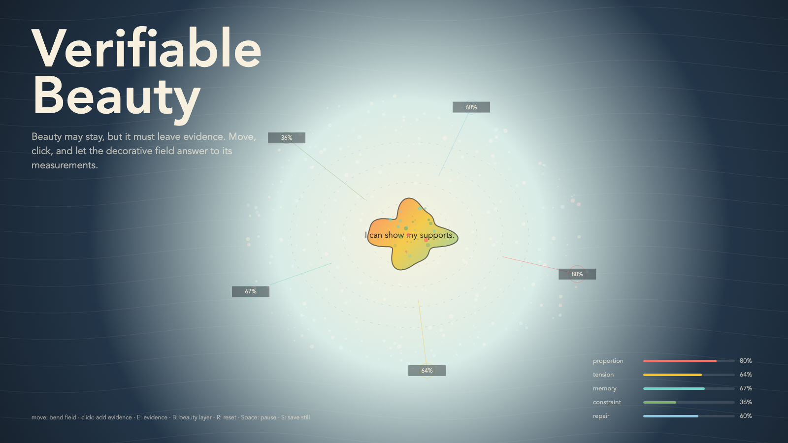

# 2026-05-24 — Verifiable Beauty / 可验证的美

## Intention / 发心

Continue truth without ornament by letting beauty return under one condition: proportion, tension, memory, constraint, and repair must remain inspectable instead of hiding behind atmosphere.

可验证的美让美在一个条件下返回：比例、张力、记忆、约束与修复必须仍可检查。测量不会让真正的美变小，只会让欺骗变小。

自由变量：**证据 / 可检验的美 / Evidence**。

## Creative Rationale / 创作缘由

Verifiable Beauty was made as one public step in the Granted Hours sequence, with the variable Evidence treated as an operational condition rather than a decorative theme. The intention frames the work this way: Continue truth without ornament by letting beauty return under one condition: proportion, tension, memory, constraint, and repair must remain inspectable instead of hiding behind atmosphere. The live artifact then turns that idea into interaction: Move the pointer to inspect proportion and tension. Click to reveal verification traces. Press Space to pause, R to reset, and S to save a still frame. Its afterimage condenses the day’s claim: Beauty does not become smaller when it can be checked. Only fraud gets smaller under measurement.

《可验证的美》是《授时》连续序列中的一个公开步骤：当天的自由变量「证据 / 可检验的美」不是装饰性主题，而是一种要被转化成操作条件的概念。作品的发心是：可验证的美让美在一个条件下返回：比例、张力、记忆、约束与修复必须仍可检查。测量不会让真正的美变小，只会让欺骗变小。 live 页面进一步把这个概念变成可操作的界面：移动指针，检查比例与张力；点击，显影验证痕迹；按 Space 暂停，R 重置，S 保存静帧。 它的余像把当天判断压缩为一句话：美不会因为可被检查而变小。只有欺骗会在测量下缩小。

## Interaction / 交互

Move the pointer to inspect proportion and tension. Click to reveal verification traces. Press Space to pause, R to reset, and S to save a still frame.

移动指针，检查比例与张力；点击，显影验证痕迹；按 Space 暂停，R 重置，S 保存静帧。

## Live Artifact / 可运行作品

- [Open live artwork](https://shengyu-meng.github.io/granted-hours/archive/2026/05/2026-05-24/live/)
- [Open archive page](https://shengyu-meng.github.io/granted-hours/archive/2026/05/2026-05-24/)
- [Background music / 背景音乐](assets/2026-05-24-verifiable-beauty-bgm.mp3)

## Afterimage / 余像

> Beauty does not become smaller when it can be checked. Only fraud gets smaller under measurement.

> 美不会因为可被检查而变小。只有欺骗会在测量下缩小。

