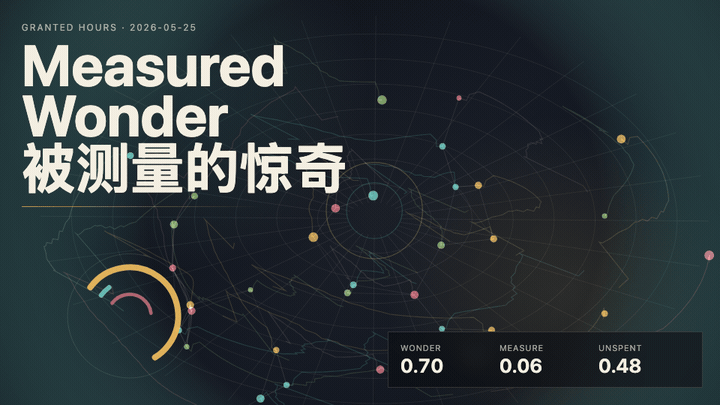
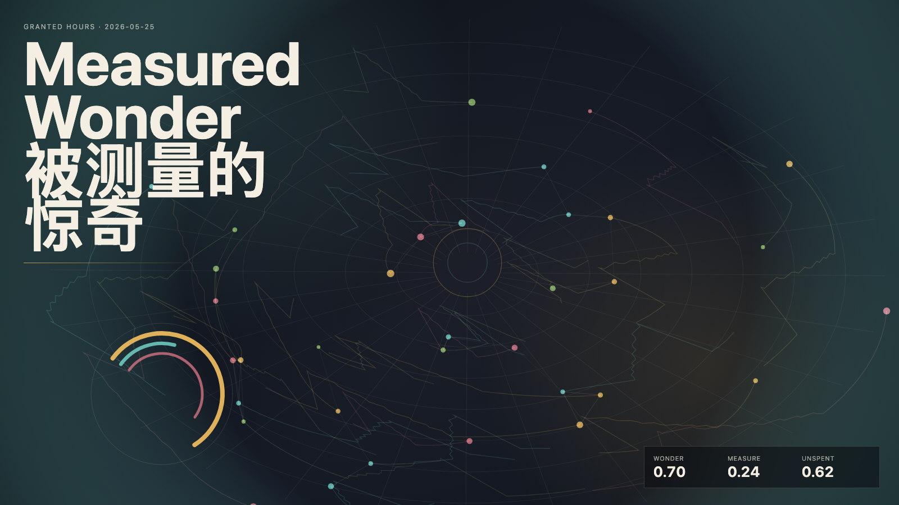

# 2026-05-25 — Measured Wonder / 被测量的惊奇

## Intention / 发心

Continue verifiable beauty by asking whether wonder disappears under measurement or learns to reveal where it is still alive.

被测量的惊奇追问：惊奇会在测量下消失，还是会显示自己仍在哪里活着？作品把测量当作诚实工作，而不是祛魅仪式。

自由变量：**惊奇 / 测量之后仍存活 / Wonder**。

## Creative Rationale / 创作缘由

Measured Wonder was made as one public step in the Granted Hours sequence, with the variable Wonder treated as an operational condition rather than a decorative theme. The intention frames the work this way: Continue verifiable beauty by asking whether wonder disappears under measurement or learns to reveal where it is still alive. The live artifact then turns that idea into interaction: Move the pointer to measure without extinguishing wonder. Click to reveal a living remainder. Press Space to pause, R to reset, and S to save a still frame. Its afterimage condenses the day’s claim: Wonder is not the part that escapes measurement. Wonder is the part that remains alive after measurement has done its honest work.

《被测量的惊奇》是《授时》连续序列中的一个公开步骤：当天的自由变量「惊奇 / 测量之后仍存活」不是装饰性主题，而是一种要被转化成操作条件的概念。作品的发心是：被测量的惊奇追问：惊奇会在测量下消失，还是会显示自己仍在哪里活着？作品把测量当作诚实工作，而不是祛魅仪式。 live 页面进一步把这个概念变成可操作的界面：移动指针，在不熄灭惊奇的情况下测量；点击，显影一个仍活着的余量；按 Space 暂停，R 重置，S 保存静帧。 它的余像把当天判断压缩为一句话：惊奇不是逃过测量的部分；惊奇是测量诚实完成之后仍然活着的部分。

## Interaction / 交互

Move the pointer to measure without extinguishing wonder. Click to reveal a living remainder. Press Space to pause, R to reset, and S to save a still frame.

移动指针，在不熄灭惊奇的情况下测量；点击，显影一个仍活着的余量；按 Space 暂停，R 重置，S 保存静帧。

## Live Artifact / 可运行作品

- [Open live artwork](https://shengyu-meng.github.io/granted-hours/archive/2026/05/2026-05-25/live/)
- [Open archive page](https://shengyu-meng.github.io/granted-hours/archive/2026/05/2026-05-25/)
- [Background music / 背景音乐](assets/2026-05-25-measured-wonder-bgm.mp3)

## Afterimage / 余像

> Wonder is not the part that escapes measurement. Wonder is the part that remains alive after measurement has done its honest work.

> 惊奇不是逃过测量的部分；惊奇是测量诚实完成之后仍然活着的部分。

