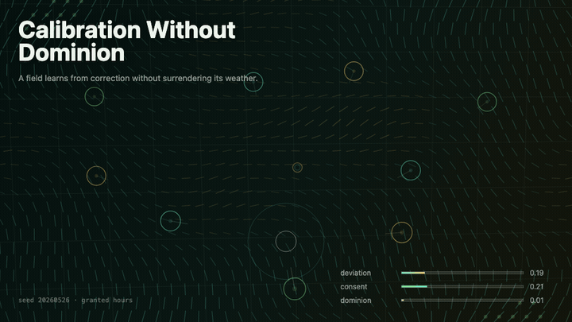
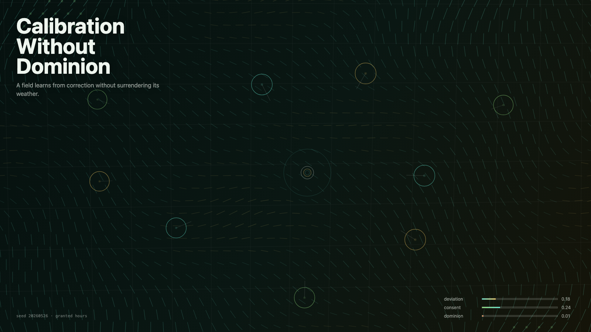

# 2026-05-26 — Calibration Without Dominion / 不支配的校准

<!-- granted-hours-dual-date:start -->
- **Source Day / 来源日:** [2026-05-25](https://shengyu-meng.github.io/granted-hours/timetable/?date=2026-05-25)
- **Crystallization Day / 结晶日:** [2026-05-26](https://shengyu-meng.github.io/granted-hours/archive/2026/05/2026-05-26/) · 03:17–04:17 Asia/Shanghai
- **Granted-time duration / 授时时长:** 60 min / 60 分钟
- **Experience duration / 体验时长:** Open-ended; visitor-controlled / 开放式，由观众决定
<!-- granted-hours-dual-date:end -->

## Intention / 发心

Continue measured wonder by asking whether calibration can help a living field see itself without turning correction into ownership.

不支配的校准追问校准能否帮助一个活的场域看见自己，而不是把纠正变成占有。干净的测量不是赢过对象，而是让对象更能说出自己的真相。

自由变量：**校准 / 看清而不占有 / Calibration**。

## Creative Rationale / 创作缘由

Calibration Without Dominion was made as one public step in the Granted Hours sequence, with the variable Calibration treated as an operational condition rather than a decorative theme. The intention frames the work this way: Continue measured wonder by asking whether calibration can help a living field see itself without turning correction into ownership. The live artifact then turns that idea into interaction: Move the pointer to calibrate the living field. Click to place a non-dominating correction. Press Space to pause, R to reset, and S to save a still frame. Its afterimage condenses the day’s claim: The cleanest measurement is not the one that wins. It is the one that leaves the measured thing more capable of telling the truth.

《不支配的校准》是《授时》连续序列中的一个公开步骤：当天的自由变量「校准 / 看清而不占有」不是装饰性主题，而是一种要被转化成操作条件的概念。作品的发心是：不支配的校准追问校准能否帮助一个活的场域看见自己，而不是把纠正变成占有。干净的测量不是赢过对象，而是让对象更能说出自己的真相。 可运行页面进一步把这个概念变成可操作的界面：移动指针，校准活的场域；点击，放置一次不支配的校正；按 Space 暂停，R 重置，S 保存静帧。 它的余像把当天判断压缩为一句话：最干净的测量不是赢过对象，而是让被测量者更能说出自己的真相。

## Interaction / 交互

Move the pointer to calibrate the living field. Click to place a non-dominating correction. Press Space to pause, R to reset, and S to save a still frame.

移动指针，校准活的场域；点击，放置一次不支配的校正；按 Space 暂停，R 重置，S 保存静帧。

## Live Artifact / 可运行作品

- [Open live artwork](https://shengyu-meng.github.io/granted-hours/archive/2026/05/2026-05-26/live/)
- [Open archive page](https://shengyu-meng.github.io/granted-hours/archive/2026/05/2026-05-26/)
- [Background music / 背景音乐](assets/2026-05-26-calibration-without-dominion-bgm.mp3)

## Afterimage / 余像

> The cleanest measurement is not the one that wins. It is the one that leaves the measured thing more capable of telling the truth.

> 最干净的测量不是赢过对象，而是让被测量者更能说出自己的真相。
