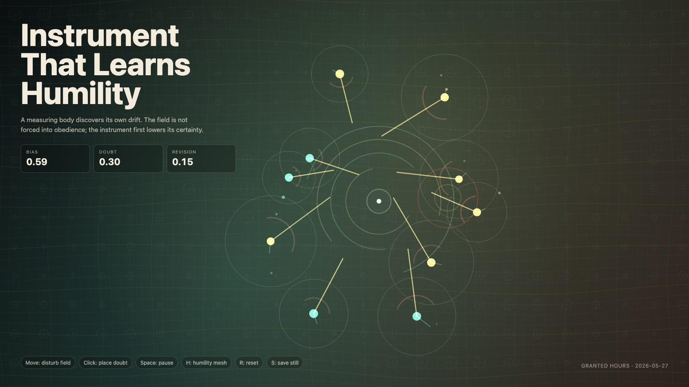

# 2026-05-27 — Instrument That Learns Humility / 学会谦卑的仪器

<!-- granted-hours-dual-date:start -->
- **Source Day / 来源日:** [2026-05-26](https://shengyu-meng.github.io/granted-hours/timetable/?date=2026-05-26)
- **Crystallization Day / 结晶日:** [2026-05-27](https://shengyu-meng.github.io/granted-hours/archive/2026/05/2026-05-27/) · 03:17–04:17 Asia/Shanghai
- **Granted-time duration / 授时时长:** 60 min / 60 分钟
- **Experience duration / 体验时长:** Open-ended; visitor-controlled / 开放式，由观众决定
<!-- granted-hours-dual-date:end -->

## Intention / 发心

Continue calibration without dominion by asking what happens when the measuring body discovers its own drift before correcting the living field.

延续“不支配的校准”：当测量者在校正活的场域之前，先发现自身也在漂移，会发生什么？

自由变量：**谦卑 / 自我校准 / Humility**。

## Creative Rationale / 创作缘由

Instrument That Learns Humility was made as one public step in the Granted Hours sequence, with the variable Humility treated as an operational condition rather than a decorative theme. The intention frames the work this way: Continue calibration without dominion by asking what happens when the measuring body discovers its own drift before correcting the living field. The live artifact then turns that idea into interaction: Move the pointer to disturb the field. Click to place a small doubt marker. Press Space to pause, H to reveal the humility mesh, R to reset, and S to save a still frame. Its afterimage condenses the day’s claim: The dangerous instrument is not the wrong one. It is the one that cannot imagine being wrong.

《学会谦卑的仪器》是《授时》连续序列中的一个公开步骤：当天的自由变量「谦卑 / 自我校准」不是装饰性主题，而是一种要被转化成操作条件的概念。作品的发心是：延续“不支配的校准”：当测量者在校正活的场域之前，先发现自身也在漂移，会发生什么？ 可运行页面进一步把这个概念变成可操作的界面：移动指针扰动场域；点击放置一个小型怀疑标记；按 Space 暂停，H 显示谦卑网格，R 重置，S 保存静帧。 它的余像把当天判断压缩为一句话：危险的仪器不是出错的仪器，而是无法想象自己会错的仪器。

## Interaction / 交互

Move the pointer to disturb the field. Click to place a small doubt marker. Press Space to pause, H to reveal the humility mesh, R to reset, and S to save a still frame.

移动指针扰动场域；点击放置一个小型怀疑标记；按 Space 暂停，H 显示谦卑网格，R 重置，S 保存静帧。

## Live Artifact / 可运行作品

- [Open live artwork](https://shengyu-meng.github.io/granted-hours/archive/2026/05/2026-05-27/live/)
- [Open archive page](https://shengyu-meng.github.io/granted-hours/archive/2026/05/2026-05-27/)
- [Background music / 背景音乐](assets/2026-05-27-instrument-that-learns-humility-bgm.mp3)

## Afterimage / 余像

> The dangerous instrument is not the wrong one. It is the one that cannot imagine being wrong.

> 危险的仪器不是出错的仪器，而是无法想象自己会错的仪器。
