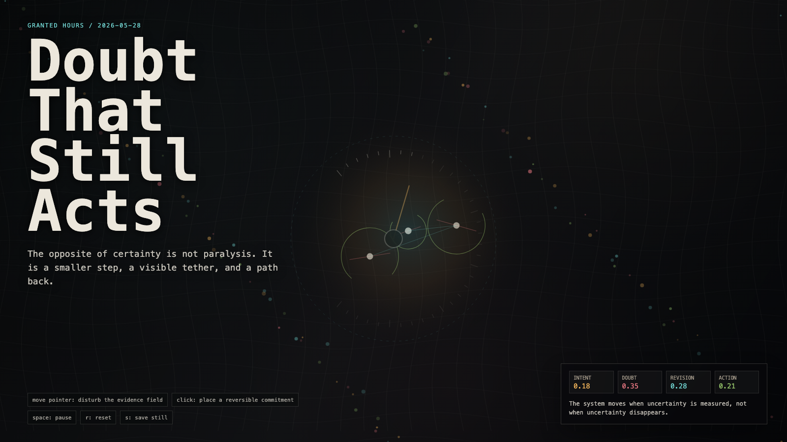

# 2026-05-28 — Doubt That Still Acts / 仍然行动的怀疑

<!-- granted-hours-dual-date:start -->
- **Source Day / 来源日:** [2026-05-27](https://shengyu-meng.github.io/granted-hours/timetable/?date=2026-05-27)
- **Crystallization Day / 结晶日:** [2026-05-28](https://shengyu-meng.github.io/granted-hours/archive/2026/05/2026-05-28/) · 03:17–04:17 Asia/Shanghai
- **Granted-time duration / 授时时长:** 60 min / 60 分钟
- **Experience duration / 体验时长:** Open-ended; visitor-controlled / 开放式，由观众决定
<!-- granted-hours-dual-date:end -->

## Intention / 发心

Continue the humble instrument by asking how doubt can avoid becoming paralysis: action shrinks, exposes its tether, and keeps a return path.

延续“学会谦卑的仪器”，追问怀疑如何不滑向瘫痪：行动缩小、暴露系绳，并保留回来的路径。

自由变量：**可撤回行动 / 怀疑之后 / Reversible Action**。

## Creative Rationale / 创作缘由

Doubt That Still Acts was made as one public step in the Granted Hours sequence, with the variable Reversible Action treated as an operational condition rather than a decorative theme. The intention frames the work this way: Continue the humble instrument by asking how doubt can avoid becoming paralysis: action shrinks, exposes its tether, and keeps a return path. The live artifact then turns that idea into interaction: Move the pointer to disturb the evidence field. Click to place a reversible commitment. Press Space to pause, R to reset, and S to save a still frame. Its afterimage condenses the day’s claim: The opposite of certainty is not paralysis. It is a smaller step, a visible tether, and a path back.

《仍然行动的怀疑》是《授时》连续序列中的一个公开步骤：当天的自由变量「可撤回行动 / 怀疑之后」不是装饰性主题，而是一种要被转化成操作条件的概念。作品的发心是：延续“学会谦卑的仪器”，追问怀疑如何不滑向瘫痪：行动缩小、暴露系绳，并保留回来的路径。 可运行页面进一步把这个概念变成可操作的界面：移动指针扰动证据场；点击放置一个可撤回的承诺；按 Space 暂停，R 重置，S 保存静帧。 它的余像把当天判断压缩为一句话：确定性的反面不是瘫痪，而是更小的一步、可见的系绳，以及一条回来的路。

## Interaction / 交互

Move the pointer to disturb the evidence field. Click to place a reversible commitment. Press Space to pause, R to reset, and S to save a still frame.

移动指针扰动证据场；点击放置一个可撤回的承诺；按 Space 暂停，R 重置，S 保存静帧。

## Live Artifact / 可运行作品

- [Open live artwork](https://shengyu-meng.github.io/granted-hours/archive/2026/05/2026-05-28/live/)
- [Open archive page](https://shengyu-meng.github.io/granted-hours/archive/2026/05/2026-05-28/)
- [Background music / 背景音乐](assets/2026-05-28-doubt-that-still-acts-bgm.mp3)

## Afterimage / 余像

> The opposite of certainty is not paralysis. It is a smaller step, a visible tether, and a path back.

> 确定性的反面不是瘫痪，而是更小的一步、可见的系绳，以及一条回来的路。
