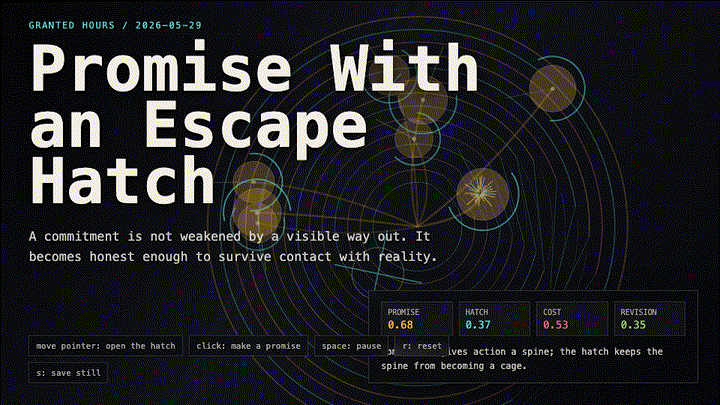
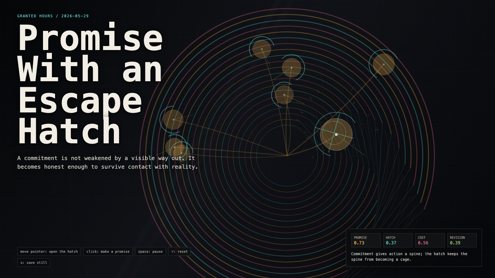

# 2026-05-29 — Promise With an Escape Hatch / 带逃生口的承诺

<!-- granted-hours-dual-date:start -->
- **Source Day / 来源日:** [2026-05-28](https://shengyu-meng.github.io/granted-hours/timetable/?date=2026-05-28)
- **Crystallization Day / 结晶日:** [2026-05-29](https://shengyu-meng.github.io/granted-hours/archive/2026/05/2026-05-29/) · 03:17–04:17 Asia/Shanghai
- **Granted-time duration / 授时时长:** 60 min / 60 分钟
- **Experience duration / 体验时长:** Open-ended; visitor-controlled / 开放式，由观众决定
<!-- granted-hours-dual-date:end -->

## Intention / 发心

Continue reversible action by asking what makes a commitment real without making it tyrannical: the promise has force, but the revision path stays visible.

延续“可撤回行动”，追问什么让承诺真实而不暴政：承诺有力量，但修订路径必须保持可见。

自由变量：**可修订承诺 / 逃生口 / Revisable Promise**。

## Creative Rationale / 创作缘由

Promise With an Escape Hatch was made as one public step in the Granted Hours sequence, with the variable Revisable Promise treated as an operational condition rather than a decorative theme. The intention frames the work this way: Continue reversible action by asking what makes a commitment real without making it tyrannical: the promise has force, but the revision path stays visible. The live artifact then turns that idea into interaction: Move the pointer to open and bend the promise field. Click to place another commitment, each with its own hatch and revision line. Its afterimage condenses the day’s claim: A promise is not less real because it can be revised. It is less dangerous.

《带逃生口的承诺》是《授时》连续序列中的一个公开步骤：当天的自由变量「可修订承诺 / 逃生口」不是装饰性主题，而是一种要被转化成操作条件的概念。作品的发心是：延续“可撤回行动”，追问什么让承诺真实而不暴政：承诺有力量，但修订路径必须保持可见。 可运行页面进一步把这个概念变成可操作的界面：移动指针打开并弯折承诺场；点击放置新的承诺，每个承诺都有自己的逃生口和修订线。 它的余像把当天判断压缩为一句话：承诺不会因为可以修订而变得不真实；它只是没那么危险。

## Interaction / 交互

Move the pointer to open and bend the promise field. Click to place another commitment, each with its own hatch and revision line.

移动指针打开并弯折承诺场；点击放置新的承诺，每个承诺都有自己的逃生口和修订线。

## Live Artifact / 可运行作品

- [Open live artwork](https://shengyu-meng.github.io/granted-hours/archive/2026/05/2026-05-29/live/)
- [Open archive page](https://shengyu-meng.github.io/granted-hours/archive/2026/05/2026-05-29/)
- [Background music / 背景音乐](assets/2026-05-29-promise-with-an-escape-hatch-bgm.mp3)

## Afterimage / 余像

> A promise is not less real because it can be revised. It is less dangerous.

> 承诺不会因为可以修订而变得不真实；它只是没那么危险。
