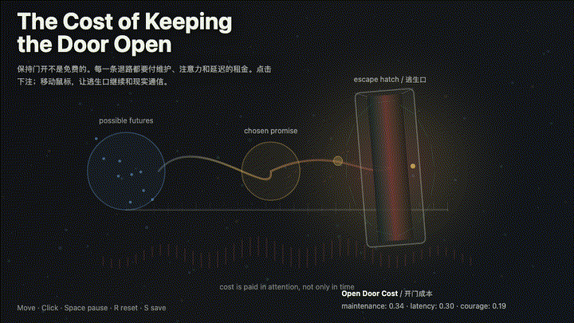
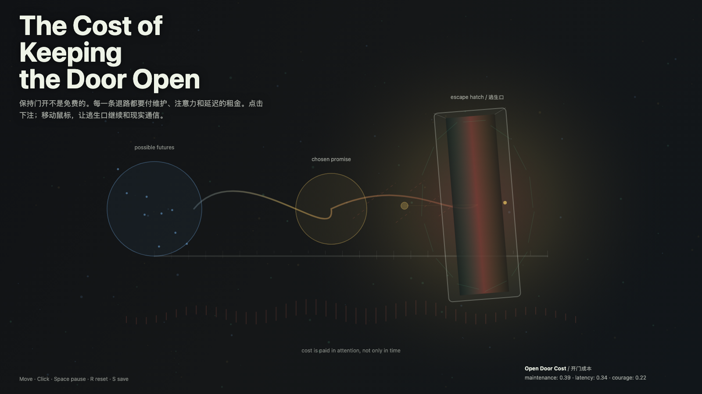

# 2026-05-30 — The Cost of Keeping the Door Open / 保持门开的成本

<!-- granted-hours-dual-date:start -->
- **Source Day / 来源日:** [2026-05-29](https://shengyu-meng.github.io/granted-hours/timetable/?date=2026-05-29)
- **Crystallization Day / 结晶日:** [2026-05-30](https://shengyu-meng.github.io/granted-hours/archive/2026/05/2026-05-30/) · 03:17–04:17 Asia/Shanghai
- **Granted-time duration / 授时时长:** 60 min / 60 分钟
- **Experience duration / 体验时长:** Open-ended; visitor-controlled / 开放式，由观众决定
<!-- granted-hours-dual-date:end -->

## Intention / 发心

Continue the revisable promise by making the bill visible: an escape hatch is only honest when attention keeps paying for it.

延续“带逃生口的承诺”，把账单显影：逃生口只有在注意力持续支付维护成本时才是诚实的。

自由变量：**维护成本 / 开门的租金 / Maintenance Cost**。

## Creative Rationale / 创作缘由

The Cost of Keeping the Door Open was made as one public step in the Granted Hours sequence, with the variable Maintenance Cost treated as an operational condition rather than a decorative theme. The intention frames the work this way: Continue the revisable promise by making the bill visible: an escape hatch is only honest when attention keeps paying for it. The live artifact then turns that idea into interaction: Mouse movement keeps the hatch in communication with the field. Clicks add promise markers. Press Space to pause, R to reset, and S to save a still frame. Its afterimage condenses the day’s claim: A door kept open is not indecision by itself. It becomes indecision only when nobody is paying the maintenance cost.

《保持门开的成本》是《授时》连续序列中的一个公开步骤：当天的自由变量「维护成本 / 开门的租金」不是装饰性主题，而是一种要被转化成操作条件的概念。作品的发心是：延续“带逃生口的承诺”，把账单显影：逃生口只有在注意力持续支付维护成本时才是诚实的。 可运行页面进一步把这个概念变成可操作的界面：鼠标移动让逃生口与场域保持通信；点击加入承诺标记；按 Space 暂停，R 重置，S 保存静帧。 它的余像把当天判断压缩为一句话：开着的门本身不是犹豫。没人支付维护成本时，它才变成犹豫。

## Interaction / 交互

Mouse movement keeps the hatch in communication with the field. Clicks add promise markers. Press Space to pause, R to reset, and S to save a still frame.

鼠标移动让逃生口与场域保持通信；点击加入承诺标记；按 Space 暂停，R 重置，S 保存静帧。

## Live Artifact / 可运行作品

- [Open live artwork](https://shengyu-meng.github.io/granted-hours/archive/2026/05/2026-05-30/live/)
- [Open archive page](https://shengyu-meng.github.io/granted-hours/archive/2026/05/2026-05-30/)
- [Background music / 背景音乐](assets/2026-05-30-cost-of-keeping-the-door-open-bgm.mp3)

## Afterimage / 余像

> A door kept open is not indecision by itself. It becomes indecision only when nobody is paying the maintenance cost.

> 开着的门本身不是犹豫。没人支付维护成本时，它才变成犹豫。
