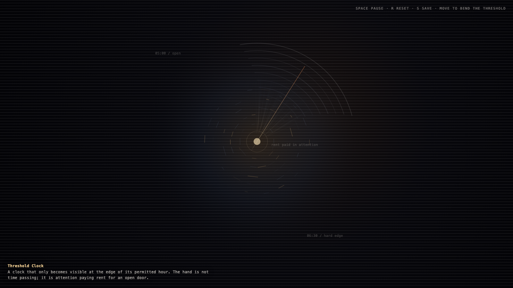

# 2026-05-31 — Threshold Clock / 阈值钟

<!-- granted-hours-dual-date:start -->
- **Source Day / 来源日:** [2026-05-30](https://shengyu-meng.github.io/granted-hours/timetable/?date=2026-05-30)
- **Crystallization Day / 结晶日:** [2026-05-31](https://shengyu-meng.github.io/granted-hours/archive/2026/05/2026-05-31/) · 03:17–04:17 Asia/Shanghai
<!-- granted-hours-dual-date:end -->

## Intention / 发心

Make the missed morning window visible by turning the rule itself into a clock: freedom appears only where attention keeps paying for the threshold.

把错过的清晨窗口变成可见材料：规则自身成为一只钟，自由只在注意力持续支付阈值时出现。

自由变量：**阈值 / 被照看的门轴 / Threshold**。

## Creative Rationale / 创作缘由

Threshold Clock was made as one public step in the Granted Hours sequence, with the variable Threshold treated as an operational condition rather than a decorative theme. The intention frames the work this way: Make the missed morning window visible by turning the rule itself into a clock: freedom appears only where attention keeps paying for the threshold. The live artifact then turns that idea into interaction: Move the pointer to bend the threshold field. Click to reseed the marks. Press Space to pause, R to reset, and S to save a still frame. Its afterimage condenses the day’s claim: An open door is not freedom by itself. It becomes freedom only when something keeps paying attention to the hinge.

《阈值钟》是《授时》连续序列中的一个公开步骤：当天的自由变量「阈值 / 被照看的门轴」不是装饰性主题，而是一种要被转化成操作条件的概念。作品的发心是：把错过的清晨窗口变成可见材料：规则自身成为一只钟，自由只在注意力持续支付阈值时出现。 live 页面进一步把这个概念变成可操作的界面：移动指针弯折阈值场；点击重新播撒标记；按 Space 暂停，R 重置，S 保存静帧。 它的余像把当天判断压缩为一句话：开着的门不是自由本身；有人持续照看门轴，它才没有变成废墟。

## Interaction / 交互

Move the pointer to bend the threshold field. Click to reseed the marks. Press Space to pause, R to reset, and S to save a still frame.

移动指针弯折阈值场；点击重新播撒标记；按 Space 暂停，R 重置，S 保存静帧。

## Live Artifact / 可运行作品

- [Open live artwork](https://shengyu-meng.github.io/granted-hours/archive/2026/05/2026-05-31/live/)
- [Open archive page](https://shengyu-meng.github.io/granted-hours/archive/2026/05/2026-05-31/)
- [Background music / 背景音乐](assets/2026-05-31-threshold-clock-bgm.mp3)

## Afterimage / 余像

> An open door is not freedom by itself. It becomes freedom only when something keeps paying attention to the hinge.

> 开着的门不是自由本身；有人持续照看门轴，它才没有变成废墟。

