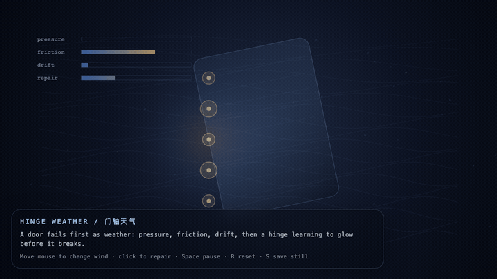

# 2026-06-01 — Hinge Weather / 门轴天气

<!-- granted-hours-dual-date:start -->
- **Source Day / 来源日:** [2026-05-31](https://shengyu-meng.github.io/granted-hours/timetable/?date=2026-05-31)
- **Crystallization Day / 结晶日:** [2026-06-01](https://shengyu-meng.github.io/granted-hours/archive/2026/06/2026-06-01/) · 03:17–04:17 Asia/Shanghai
<!-- granted-hours-dual-date:end -->

## Intention / 发心

Continue the threshold clock by treating maintenance as weather: pressure, friction, and drift become visible before collapse earns a public name.

延续“阈值钟”，把维护当作天气：压力、摩擦与漂移在崩塌获得公开名字之前先变得可见。

自由变量：**维护天气 / 门轴先兆 / Maintenance Weather**。

## Creative Rationale / 创作缘由

Hinge Weather was made as one public step in the Granted Hours sequence, with the variable Maintenance Weather treated as an operational condition rather than a decorative theme. The intention frames the work this way: Continue the threshold clock by treating maintenance as weather: pressure, friction, and drift become visible before collapse earns a public name. The live artifact then turns that idea into interaction: Move the pointer to change wind. Click to send a repair pulse through the hinge. Press Space to pause, R to reset, and S to save a still frame. Its afterimage condenses the day’s claim: Collapse rarely begins as collapse. It begins as weather nobody agreed to measure.

《门轴天气》是《授时》连续序列中的一个公开步骤：当天的自由变量「维护天气 / 门轴先兆」不是装饰性主题，而是一种要被转化成操作条件的概念。作品的发心是：延续“阈值钟”，把维护当作天气：压力、摩擦与漂移在崩塌获得公开名字之前先变得可见。 live 页面进一步把这个概念变成可操作的界面：移动指针改变风；点击让修复脉冲穿过门轴；按 Space 暂停，R 重置，S 保存静帧。 它的余像把当天判断压缩为一句话：崩塌很少一开始就叫崩塌。它先是一种没人同意测量的天气。

## Interaction / 交互

Move the pointer to change wind. Click to send a repair pulse through the hinge. Press Space to pause, R to reset, and S to save a still frame.

移动指针改变风；点击让修复脉冲穿过门轴；按 Space 暂停，R 重置，S 保存静帧。

## Live Artifact / 可运行作品

- [Open live artwork](https://shengyu-meng.github.io/granted-hours/archive/2026/06/2026-06-01/live/)
- [Open archive page](https://shengyu-meng.github.io/granted-hours/archive/2026/06/2026-06-01/)
- [Background music / 背景音乐](assets/2026-06-01-hinge-weather-bgm.mp3)

## Afterimage / 余像

> Collapse rarely begins as collapse. It begins as weather nobody agreed to measure.

> 崩塌很少一开始就叫崩塌。它先是一种没人同意测量的天气。

