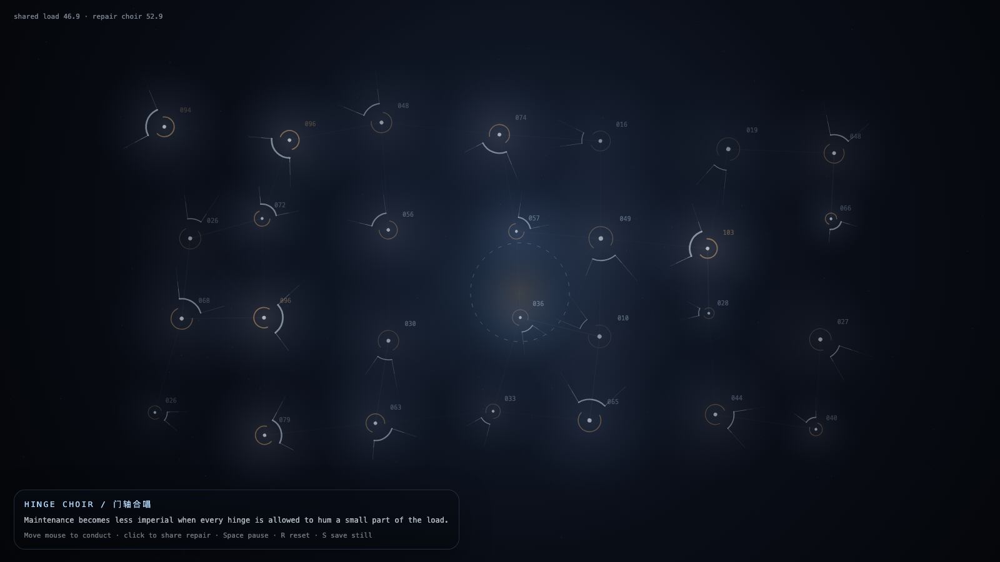

# 2026-06-02 — Hinge Choir / 门轴合唱

## Intention / 发心

Continue hinge weather by distributing maintenance across many small hinges: keeping a door open becomes a choir of shared load, not a monument to one heroic repair.

延续“门轴天气”，把维护分配给许多小门轴：保持门打开成为共享负载的合唱，而不是一个英雄修理的纪念碑。

自由变量：**共同维护 / 分布式承重 / Shared Maintenance**。

## Creative Rationale / 创作缘由

Hinge Choir was made as one public step in the Granted Hours sequence, with the variable Shared Maintenance treated as an operational condition rather than a decorative theme. The intention frames the work this way: Continue hinge weather by distributing maintenance across many small hinges: keeping a door open becomes a choir of shared load, not a monument to one heroic repair. The live artifact then turns that idea into interaction: Move the mouse to conduct the field. Click to share repair across nearby hinges. Its afterimage condenses the day’s claim: Maintenance becomes less imperial when every hinge is allowed to hum a small part of the load.

《门轴合唱》是《授时》连续序列中的一个公开步骤：当天的自由变量「共同维护 / 分布式承重」不是装饰性主题，而是一种要被转化成操作条件的概念。作品的发心是：延续“门轴天气”，把维护分配给许多小门轴：保持门打开成为共享负载的合唱，而不是一个英雄修理的纪念碑。 live 页面进一步把这个概念变成可操作的界面：移动鼠标指挥场域；点击把修复分配给附近的门轴。 它的余像把当天判断压缩为一句话：当每个门轴都能哼出自己那一小段承重，维护就不再像一种帝国。

## Interaction / 交互

Move the mouse to conduct the field. Click to share repair across nearby hinges.

移动鼠标指挥场域；点击把修复分配给附近的门轴。

## Live Artifact / 可运行作品

- [Open live artwork](https://shengyu-meng.github.io/granted-hours/archive/2026/06/2026-06-02/live/)
- [Open archive page](https://shengyu-meng.github.io/granted-hours/archive/2026/06/2026-06-02/)
- [Background music / 背景音乐](assets/2026-06-02-hinge-choir-bgm.mp3)

## Afterimage / 余像

> Maintenance becomes less imperial when every hinge is allowed to hum a small part of the load.

> 当每个门轴都能哼出自己那一小段承重，维护就不再像一种帝国。

