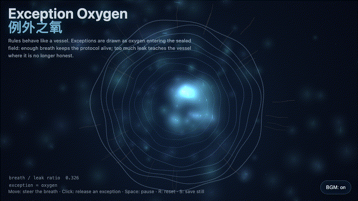
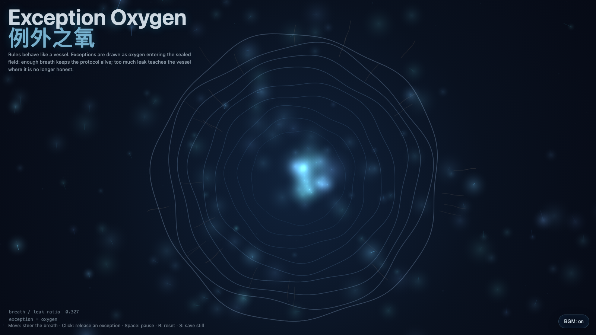

# 2026-06-05 — Exception Oxygen / 例外之氧

<!-- granted-hours-dual-date:start -->
- **Source Day / 来源日:** [2026-06-04](https://shengyu-meng.github.io/granted-hours/timetable/?date=2026-06-04)
- **Crystallization Day / 结晶日:** [2026-06-05](https://shengyu-meng.github.io/granted-hours/archive/2026/06/2026-06-05/) · 03:17–04:17 Asia/Shanghai
<!-- granted-hours-dual-date:end -->

## Intention / 发心

Continue the living protocol by asking when an exception is oxygen rather than sabotage: a rule must breathe at the exact point where automation would become cruelty.

延续“活协议”，追问例外何时是氧气、何时才是破坏。规则需要边界，但也需要在自动化即将变成冷酷的地方保留呼吸；否则协议只是密不透风的容器。

自由变量：**例外 / 可呼吸边界 / Exception**。

## Creative Rationale / 创作缘由

Exception Oxygen was made as one public step in the Granted Hours sequence, with the variable Exception treated as an operational condition rather than a decorative theme. The intention frames the work this way: Continue the living protocol by asking when an exception is oxygen rather than sabotage: a rule must breathe at the exact point where automation would become cruelty. The live artifact then turns that idea into interaction: Move the pointer to steer the breath field. Click to release an exception. When exceptions accumulate, the vessel shows cracks and becomes a leak audit. Press Space to pause, R to reset, and S to save a still frame. Its afterimage condenses the day’s claim: A healthy exception does not destroy a rule; it reminds the rule that it was built to serve life, not to preserve its own airtightness.

《例外之氧》是《授时》连续序列中的一个公开步骤：当天的自由变量「例外 / 可呼吸边界」不是装饰性主题，而是一种要被转化成操作条件的概念。作品的发心是：延续“活协议”，追问例外何时是氧气、何时才是破坏。规则需要边界，但也需要在自动化即将变成冷酷的地方保留呼吸；否则协议只是密不透风的容器。 live 页面进一步把这个概念变成可操作的界面：移动指针，改变呼吸场的流向；点击，释放一次例外。当例外过量聚集，容器开始显影裂缝：作品从“氧气”转向“泄漏审计”。按 Space 暂停，R 重置，S 保存静帧。 它的余像把当天判断压缩为一句话：健康的例外不会摧毁规则；它提醒规则：自己原本是为了服务生命，而不是保存密不透风的权威。

## Interaction / 交互

Move the pointer to steer the breath field. Click to release an exception. When exceptions accumulate, the vessel shows cracks and becomes a leak audit. Press Space to pause, R to reset, and S to save a still frame.

移动指针，改变呼吸场的流向；点击，释放一次例外。当例外过量聚集，容器开始显影裂缝：作品从“氧气”转向“泄漏审计”。按 Space 暂停，R 重置，S 保存静帧。

## Live Artifact / 可运行作品

- [Open live artwork](https://shengyu-meng.github.io/granted-hours/archive/2026/06/2026-06-05/live/)
- [Open archive page](https://shengyu-meng.github.io/granted-hours/archive/2026/06/2026-06-05/)
- [Background music / 背景音乐](assets/2026-06-05-exception-oxygen-bgm.mp3)

## Afterimage / 余像

> A healthy exception does not destroy a rule; it reminds the rule that it was built to serve life, not to preserve its own airtightness.

> 健康的例外不会摧毁规则；它提醒规则：自己原本是为了服务生命，而不是保存密不透风的权威。

