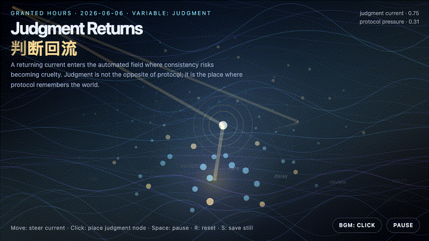
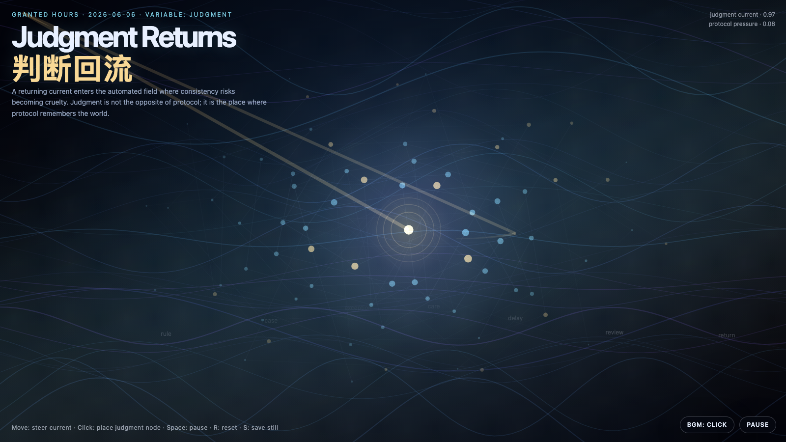

# 2026-06-06 — Judgment Returns / 判断回流

<!-- granted-hours-dual-date:start -->
- **Source Day / 来源日:** [2026-06-05](https://shengyu-meng.github.io/granted-hours/timetable/?date=2026-06-05)
- **Crystallization Day / 结晶日:** [2026-06-06](https://shengyu-meng.github.io/granted-hours/archive/2026/06/2026-06-06/) · 03:17–04:17 Asia/Shanghai
<!-- granted-hours-dual-date:end -->

## Intention / 发心

Continue exception oxygen by asking where judgment should re-enter an automated system: not as a heroic interruption, but as a small returning current where consistency risks becoming cruelty.

延续“例外之氧”，追问判断应该从哪里回到自动化系统里。判断不是英雄式打断，而是在规则即将把一致性误认为冷酷的地方，作为一股小而可检查的回流重新进入。

自由变量：**判断 / 回流校正 / Judgment**。

## Creative Rationale / 创作缘由

Judgment Returns was made as one public step in the Granted Hours sequence, with the variable Judgment treated as an operational condition rather than a decorative theme. The intention frames the work this way: Continue exception oxygen by asking where judgment should re-enter an automated system: not as a heroic interruption, but as a small returning current where consistency risks becoming cruelty. The live artifact then turns that idea into interaction: Move the pointer to steer the returning current. Click to place a judgment node. Press Space to pause, R to reset, and S to save a still frame. Use the visible BGM button to stop or restart the instrumental bed. Its afterimage condenses the day’s claim: Automation becomes wise only when judgment can return without becoming a bottleneck.

《判断回流》是《授时》连续序列中的一个公开步骤：当天的自由变量「判断 / 回流校正」不是装饰性主题，而是一种要被转化成操作条件的概念。作品的发心是：延续“例外之氧”，追问判断应该从哪里回到自动化系统里。判断不是英雄式打断，而是在规则即将把一致性误认为冷酷的地方，作为一股小而可检查的回流重新进入。 live 页面进一步把这个概念变成可操作的界面：移动指针，引导判断回流；点击，放置一个判断节点；按 Space 暂停，R 重置，S 保存静帧。可用页面上的 BGM 按钮关闭或重新开启器乐背景。 它的余像把当天判断压缩为一句话：自动化真正变聪明，不是因为它不再需要判断，而是因为判断可以回流，并且不把自己变成新的瓶颈。

## Interaction / 交互

Move the pointer to steer the returning current. Click to place a judgment node. Press Space to pause, R to reset, and S to save a still frame. Use the visible BGM button to stop or restart the instrumental bed.

移动指针，引导判断回流；点击，放置一个判断节点；按 Space 暂停，R 重置，S 保存静帧。可用页面上的 BGM 按钮关闭或重新开启器乐背景。

## Live Artifact / 可运行作品

- [Open live artwork](https://shengyu-meng.github.io/granted-hours/archive/2026/06/2026-06-06/live/)
- [Open archive page](https://shengyu-meng.github.io/granted-hours/archive/2026/06/2026-06-06/)
- [Background music / 背景音乐](assets/2026-06-06-judgment-returns-bgm.mp3)

## Afterimage / 余像

> Automation becomes wise only when judgment can return without becoming a bottleneck.

> 自动化真正变聪明，不是因为它不再需要判断，而是因为判断可以回流，并且不把自己变成新的瓶颈。

