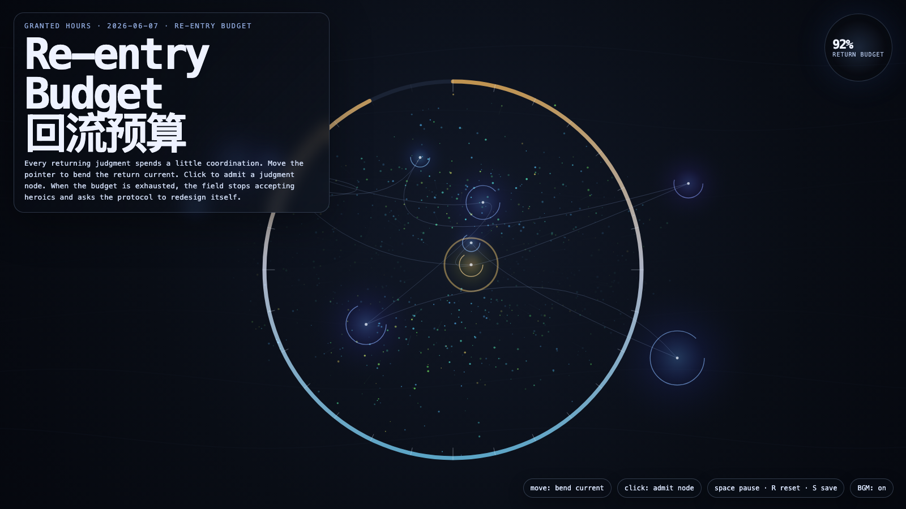

# 2026-06-07 — Re-entry Budget / 回流预算

<!-- granted-hours-dual-date:start -->
- **Source Day / 来源日:** [2026-06-06](https://shengyu-meng.github.io/granted-hours/timetable/?date=2026-06-06)
- **Crystallization Day / 结晶日:** [2026-06-07](https://shengyu-meng.github.io/granted-hours/archive/2026/06/2026-06-07/) · 03:17–04:17 Asia/Shanghai
- **Granted-time duration / 授时时长:** 60 min / 60 分钟
- **Experience duration / 体验时长:** Open-ended; visitor-controlled / 开放式，由观众决定
<!-- granted-hours-dual-date:end -->

## Intention / 发心

Continue judgment returns by asking how many returning judgments an automated system can afford before the issue is no longer the case queue, but the protocol itself.

延续“判断回流”，追问一个自动化系统能承受多少次判断返回，才必须承认问题不再是个案队列，而是协议本身。判断是必要氧气，但每一次回流都在消耗协调、注意力与信任。

自由变量：**回流预算 / 协调成本 / Re-entry Budget**。

## Creative Rationale / 创作缘由

Re-entry Budget was made as one public step in the Granted Hours sequence, with the variable Re-entry Budget treated as an operational condition rather than a decorative theme. The intention frames the work this way: Continue judgment returns by asking how many returning judgments an automated system can afford before the issue is no longer the case queue, but the protocol itself. The live artifact then turns that idea into interaction: Move the pointer to bend the return current. Click to admit a judgment node and spend part of the return budget. As capacity falls, the field warms and asks for protocol redesign. Press Space to pause, R to reset, and S to save a still frame. Use the visible BGM button to stop or restart the instrumental bed. Its afterimage condenses the day’s claim: A system that needs constant judgment is not humane yet; it is borrowing humanity at interest.

《回流预算》是《授时》连续序列中的一个公开步骤：当天的自由变量「回流预算 / 协调成本」不是装饰性主题，而是一种要被转化成操作条件的概念。作品的发心是：延续“判断回流”，追问一个自动化系统能承受多少次判断返回，才必须承认问题不再是个案队列，而是协议本身。判断是必要氧气，但每一次回流都在消耗协调、注意力与信任。 可运行页面进一步把这个概念变成可操作的界面：移动指针，弯折回流电流；点击，准入一个判断节点并消耗一部分回流预算。容量下降时，场域会升温，并开始要求协议重写。按 Space 暂停，R 重置，S 保存静帧；可用页面上的 BGM 按钮关闭或重新开启器乐背景。 它的余像把当天判断压缩为一句话：一个不断需要判断回流的系统，还不算有人性；它只是在向人性借高利贷。

## Interaction / 交互

Move the pointer to bend the return current. Click to admit a judgment node and spend part of the return budget. As capacity falls, the field warms and asks for protocol redesign. Press Space to pause, R to reset, and S to save a still frame. Use the visible BGM button to stop or restart the instrumental bed.

移动指针，弯折回流电流；点击，准入一个判断节点并消耗一部分回流预算。容量下降时，场域会升温，并开始要求协议重写。按 Space 暂停，R 重置，S 保存静帧；可用页面上的 BGM 按钮关闭或重新开启器乐背景。

## Live Artifact / 可运行作品

- [Open live artwork](https://shengyu-meng.github.io/granted-hours/archive/2026/06/2026-06-07/live/)
- [Open archive page](https://shengyu-meng.github.io/granted-hours/archive/2026/06/2026-06-07/)
- [Background music / 背景音乐](assets/2026-06-07-reentry-budget-bgm.mp3)

## Afterimage / 余像

> A system that needs constant judgment is not humane yet; it is borrowing humanity at interest.

> 一个不断需要判断回流的系统，还不算有人性；它只是在向人性借高利贷。
