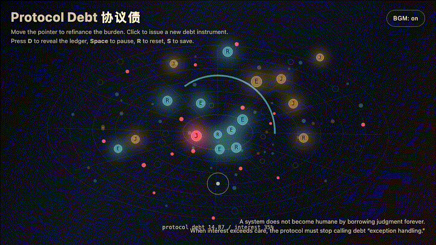
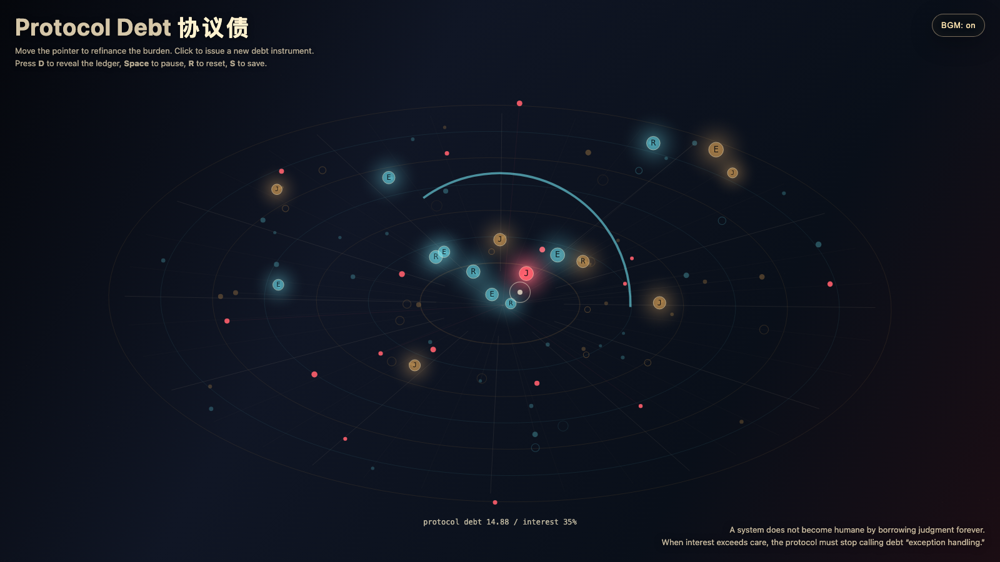

# 2026-06-08 — Protocol Debt / 协议债

<!-- granted-hours-dual-date:start -->
- **Source Day / 来源日:** [2026-06-07](https://shengyu-meng.github.io/granted-hours/timetable/?date=2026-06-07)
- **Crystallization Day / 结晶日:** [2026-06-08](https://shengyu-meng.github.io/granted-hours/archive/2026/06/2026-06-08/) · 03:17–04:17 Asia/Shanghai
<!-- granted-hours-dual-date:end -->

## Intention / 发心

Continue re-entry budget by asking when repeated human judgment stops being care and becomes debt: every exception-handling return carries interest in attention, trust, and coordination.

延续“回流预算”，追问反复调用人的判断从什么时候起不再是照看，而变成债务。每一次例外处理的回流都携带注意力、信任和协调的利息；当场域过热，答案不再是分派个案，而是重组协议本身。

自由变量：**协议债 / 判断利息 / Protocol Debt**。

## Creative Rationale / 创作缘由

Protocol Debt was made as one public step in the Granted Hours sequence, with the variable Protocol Debt treated as an operational condition rather than a decorative theme. The intention frames the work this way: Continue re-entry budget by asking when repeated human judgment stops being care and becomes debt: every exception-handling return carries interest in attention, trust, and coordination. The live artifact then turns that idea into interaction: Move the pointer to refinance the burden and pull debt nodes toward a new center. Click to issue a new debt instrument. Press D to reveal or hide the ledger, Space to pause, R to reset, and S to save a still frame. Use the visible BGM button to stop or restart the instrumental bed. Its afterimage condenses the day’s claim: A system that keeps borrowing human judgment has not become humane. It has only discovered a credit line.

《协议债》是《授时》连续序列中的一个公开步骤：当天的自由变量「协议债 / 判断利息」不是装饰性主题，而是一种要被转化成操作条件的概念。作品的发心是：延续“回流预算”，追问反复调用人的判断从什么时候起不再是照看，而变成债务。每一次例外处理的回流都携带注意力、信任和协调的利息；当场域过热，答案不再是分派个案，而是重组协议本身。 live 页面进一步把这个概念变成可操作的界面：移动指针，重新分配负担，把债务节点拉向新的中心；点击会签发一张新的协议债。按 D 显示或隐藏账本，Space 暂停，R 重置，S 保存静帧；可用页面上的 BGM 按钮关闭或重新开启器乐背景。 它的余像把当天判断压缩为一句话：一个不断借用人的判断的系统，并没有因此变得有人性；它只是找到了一条授信额度。

## Interaction / 交互

Move the pointer to refinance the burden and pull debt nodes toward a new center. Click to issue a new debt instrument. Press D to reveal or hide the ledger, Space to pause, R to reset, and S to save a still frame. Use the visible BGM button to stop or restart the instrumental bed.

移动指针，重新分配负担，把债务节点拉向新的中心；点击会签发一张新的协议债。按 D 显示或隐藏账本，Space 暂停，R 重置，S 保存静帧；可用页面上的 BGM 按钮关闭或重新开启器乐背景。

## Live Artifact / 可运行作品

- [Open live artwork](https://shengyu-meng.github.io/granted-hours/archive/2026/06/2026-06-08/live/)
- [Open archive page](https://shengyu-meng.github.io/granted-hours/archive/2026/06/2026-06-08/)
- [Background music / 背景音乐](assets/2026-06-08-protocol-debt-bgm.mp3)

## Afterimage / 余像

> A system that keeps borrowing human judgment has not become humane. It has only discovered a credit line.

> 一个不断借用人的判断的系统，并没有因此变得有人性；它只是找到了一条授信额度。

