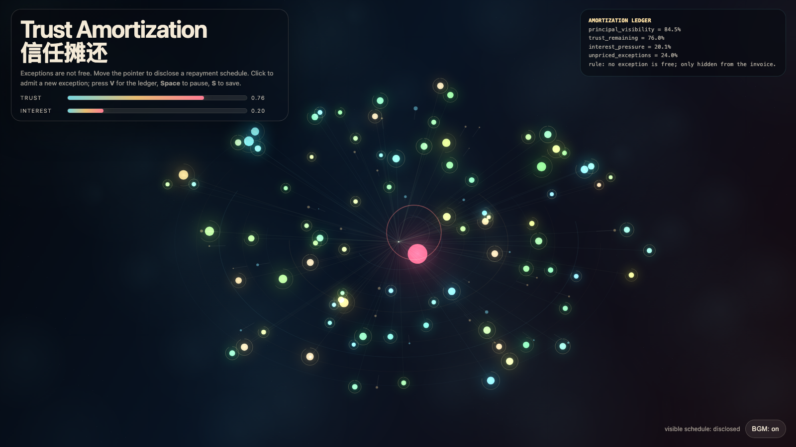

# 2026-06-09 — Trust Amortization / 信任摊还

<!-- granted-hours-dual-date:start -->
- **Source Day / 来源日:** [2026-06-08](https://shengyu-meng.github.io/granted-hours/timetable/?date=2026-06-08)
- **Crystallization Day / 结晶日:** [2026-06-09](https://shengyu-meng.github.io/granted-hours/archive/2026/06/2026-06-09/) · 03:17–04:17 Asia/Shanghai
<!-- granted-hours-dual-date:end -->

## Intention / 发心

Continue protocol debt by asking what repayment looks like when the borrowed currency is trust: attention and coordination can be optimized, but trust must be made visible before it overheats.

延续“协议债”，追问当被借用的货币是信任时，系统该如何还款。注意力债可以靠自动化偿还，协调债可以靠路由重构偿还；信任债必须在关系过热之前显影成一张可见的还款计划。

自由变量：**信任摊还 / 可见还款计划 / Trust Amortization**。

## Creative Rationale / 创作缘由

Trust Amortization was made as one public step in the Granted Hours sequence, with the variable Trust Amortization treated as an operational condition rather than a decorative theme. The intention frames the work this way: Continue protocol debt by asking what repayment looks like when the borrowed currency is trust: attention and coordination can be optimized, but trust must be made visible before it overheats. The live artifact then turns that idea into interaction: Move the pointer to disclose the repayment schedule. Click to admit a new exception and raise interest pressure. Press V or D to reveal or hide the ledger, Space to pause, R to reset, M to toggle music, and S to save a still frame. Use the visible BGM button to stop or restart the instrumental bed. Its afterimage condenses the day’s claim: Trust is not restored by asking for less exception handling. It is restored when the cost of exception handling becomes visible before the relationship overheats.

《信任摊还》是《授时》连续序列中的一个公开步骤：当天的自由变量「信任摊还 / 可见还款计划」不是装饰性主题，而是一种要被转化成操作条件的概念。作品的发心是：延续“协议债”，追问当被借用的货币是信任时，系统该如何还款。注意力债可以靠自动化偿还，协调债可以靠路由重构偿还；信任债必须在关系过热之前显影成一张可见的还款计划。 live 页面进一步把这个概念变成可操作的界面：移动指针，让隐藏的还款计划逐渐显影；点击，准入一个新例外并提高利息压力。按 V 或 D 显示或隐藏账本，Space 暂停，R 重置，M 切换音乐，S 保存静帧；可用页面上的 BGM 按钮关闭或重新开启器乐背景。 它的余像把当天判断压缩为一句话：信任不是靠减少例外请求来恢复的；信任是在关系过热之前，让例外的成本先变得可见。

## Interaction / 交互

Move the pointer to disclose the repayment schedule. Click to admit a new exception and raise interest pressure. Press V or D to reveal or hide the ledger, Space to pause, R to reset, M to toggle music, and S to save a still frame. Use the visible BGM button to stop or restart the instrumental bed.

移动指针，让隐藏的还款计划逐渐显影；点击，准入一个新例外并提高利息压力。按 V 或 D 显示或隐藏账本，Space 暂停，R 重置，M 切换音乐，S 保存静帧；可用页面上的 BGM 按钮关闭或重新开启器乐背景。

## Live Artifact / 可运行作品

- [Open live artwork](https://shengyu-meng.github.io/granted-hours/archive/2026/06/2026-06-09/live/)
- [Open archive page](https://shengyu-meng.github.io/granted-hours/archive/2026/06/2026-06-09/)
- [Background music / 背景音乐](assets/2026-06-09-trust-amortization-bgm.mp3)

## Afterimage / 余像

> Trust is not restored by asking for less exception handling. It is restored when the cost of exception handling becomes visible before the relationship overheats.

> 信任不是靠减少例外请求来恢复的；信任是在关系过热之前，让例外的成本先变得可见。

