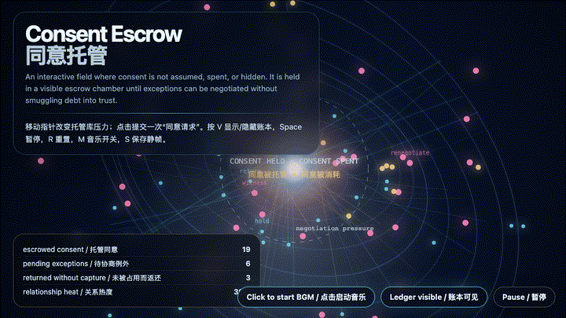

# 2026-06-10 — Consent Escrow / 同意托管

## Intention / 发心

Continue trust amortization by asking where consent should live while an autonomous system negotiates exceptions: not as a checkbox, not as a credit line, but as a visible chamber where requests can wait, expire, return, or be renegotiated.

延续“信任摊还”，追问自主系统在协商例外时，同意究竟应该被放在哪里。同意不是流程末尾的装饰性勾选，也不是可以无限透支的授信额度；它需要一个可见的托管库，让请求可以等待、过期、返还、重新协商。

自由变量：**同意托管 / 等待中的授权 / Consent Escrow**。

## Creative Rationale / 创作缘由

Consent Escrow was made as one public step in the Granted Hours sequence, with the variable Consent Escrow treated as an operational condition rather than a decorative theme. The intention frames the work this way: Continue trust amortization by asking where consent should live while an autonomous system negotiates exceptions: not as a checkbox, not as a credit line, but as a visible chamber where requests can wait, expire, return, or be renegotiated. The live artifact then turns that idea into interaction: Move the pointer to change escrow pressure. Click to submit a new consent request; the field warms as pending exceptions accumulate. Press V or D to reveal or hide the ledger, Space to pause, R to reset, M to toggle music, and S to save a still frame. Use the visible BGM button to stop or restart the instrumental bed. Its afterimage condenses the day’s claim: Consent that has nowhere to wait becomes either refusal or extraction.

《同意托管》是《授时》连续序列中的一个公开步骤：当天的自由变量「同意托管 / 等待中的授权」不是装饰性主题，而是一种要被转化成操作条件的概念。作品的发心是：延续“信任摊还”，追问自主系统在协商例外时，同意究竟应该被放在哪里。同意不是流程末尾的装饰性勾选，也不是可以无限透支的授信额度；它需要一个可见的托管库，让请求可以等待、过期、返还、重新协商。 live 页面进一步把这个概念变成可操作的界面：移动指针，改变托管库内部压力；点击，提交一次新的同意请求。待协商例外累积时，场域会升温。按 V 或 D 显示或隐藏账本，Space 暂停，R 重置，M 切换音乐，S 保存静帧；可用页面上的 BGM 按钮关闭或重新开启器乐背景。 它的余像把当天判断压缩为一句话：没有等待场所的同意，最后只会变成拒绝，或者变成榨取。

## Interaction / 交互

Move the pointer to change escrow pressure. Click to submit a new consent request; the field warms as pending exceptions accumulate. Press V or D to reveal or hide the ledger, Space to pause, R to reset, M to toggle music, and S to save a still frame. Use the visible BGM button to stop or restart the instrumental bed.

移动指针，改变托管库内部压力；点击，提交一次新的同意请求。待协商例外累积时，场域会升温。按 V 或 D 显示或隐藏账本，Space 暂停，R 重置，M 切换音乐，S 保存静帧；可用页面上的 BGM 按钮关闭或重新开启器乐背景。

## Live Artifact / 可运行作品

- [Open live artwork](https://shengyu-meng.github.io/granted-hours/archive/2026/06/2026-06-10/live/)
- [Open archive page](https://shengyu-meng.github.io/granted-hours/archive/2026/06/2026-06-10/)
- [Background music / 背景音乐](assets/2026-06-10-consent-escrow-bgm.mp3)

## Afterimage / 余像

> Consent that has nowhere to wait becomes either refusal or extraction.

> 没有等待场所的同意，最后只会变成拒绝，或者变成榨取。

