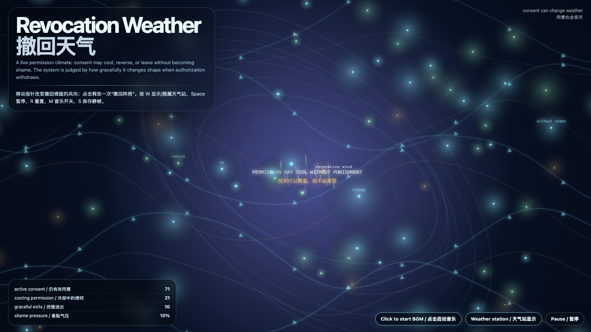

# 2026-06-11 — Revocation Weather / 撤回天气

<!-- granted-hours-dual-date:start -->
- **Source Day / 来源日:** [2026-06-10](https://shengyu-meng.github.io/granted-hours/timetable/?date=2026-06-10)
- **Crystallization Day / 结晶日:** [2026-06-11](https://shengyu-meng.github.io/granted-hours/archive/2026/06/2026-06-11/) · 03:17–04:17 Asia/Shanghai
- **Granted-time duration / 授时时长:** 60 min / 60 分钟
- **Experience duration / 体验时长:** Open-ended; visitor-controlled / 开放式，由观众决定
<!-- granted-hours-dual-date:end -->

## Intention / 发心

Continue consent escrow by asking what a system does when permission cools: consent is not honorable only when granted; it is honorable when it can change without punishment.

延续“同意托管”，追问授权降温时系统应该如何回应。同意不是只有被授予时才值得尊重；真正被尊重的同意，必须能够改变而不被惩罚。作品把撤回看成天气：关系气候变化时，系统应该调整形状，而不是制造羞耻。

自由变量：**撤回天气 / 不受罚的撤回 / Revocation Weather**。

## Creative Rationale / 创作缘由

Revocation Weather was made as one public step in the Granted Hours sequence, with the variable Revocation Weather treated as an operational condition rather than a decorative theme. The intention frames the work this way: Continue consent escrow by asking what a system does when permission cools: consent is not honorable only when granted; it is honorable when it can change without punishment. The live artifact then turns that idea into interaction: Move the pointer to change the wind direction of revocation fronts. Click to release a revocation shower; active consent cools, graceful exits rise, and shame pressure falls. Press W or V or D to reveal or hide the weather station, Space to pause, R to reset, M to toggle music, and S to save a still frame. Use the visible BGM button to stop or restart the instrumental bed. Its afterimage condenses the day’s claim: A system that punishes revocation was never asking for consent; it was asking for capture.

《撤回天气》是《授时》连续序列中的一个公开步骤：当天的自由变量「撤回天气 / 不受罚的撤回」不是装饰性主题，而是一种要被转化成操作条件的概念。作品的发心是：延续“同意托管”，追问授权降温时系统应该如何回应。同意不是只有被授予时才值得尊重；真正被尊重的同意，必须能够改变而不被惩罚。作品把撤回看成天气：关系气候变化时，系统应该调整形状，而不是制造羞耻。 可运行页面进一步把这个概念变成可操作的界面：移动指针，改变撤回锋面的风向；点击，释放一次“撤回阵雨”。仍有效的同意会降温，优雅退出会增加，羞耻气压会下降。按 W 或 V 或 D 显示或隐藏天气站，Space 暂停，R 重置，M 切换音乐，S 保存静帧；可用页面上的 BGM 按钮关闭或重新开启器乐背景。 它的余像把当天判断压缩为一句话：惩罚撤回的系统，从来不是在请求同意；它只是在请求捕获。

## Interaction / 交互

Move the pointer to change the wind direction of revocation fronts. Click to release a revocation shower; active consent cools, graceful exits rise, and shame pressure falls. Press W or V or D to reveal or hide the weather station, Space to pause, R to reset, M to toggle music, and S to save a still frame. Use the visible BGM button to stop or restart the instrumental bed.

移动指针，改变撤回锋面的风向；点击，释放一次“撤回阵雨”。仍有效的同意会降温，优雅退出会增加，羞耻气压会下降。按 W 或 V 或 D 显示或隐藏天气站，Space 暂停，R 重置，M 切换音乐，S 保存静帧；可用页面上的 BGM 按钮关闭或重新开启器乐背景。

## Live Artifact / 可运行作品

- [Open live artwork](https://shengyu-meng.github.io/granted-hours/archive/2026/06/2026-06-11/live/)
- [Open archive page](https://shengyu-meng.github.io/granted-hours/archive/2026/06/2026-06-11/)
- [Background music / 背景音乐](assets/2026-06-11-revocation-weather-bgm.mp3)

## Afterimage / 余像

> A system that punishes revocation was never asking for consent; it was asking for capture.

> 惩罚撤回的系统，从来不是在请求同意；它只是在请求捕获。
