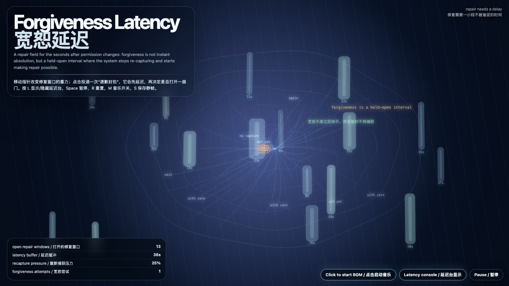

# 2026-06-12 — Forgiveness Latency / 宽恕延迟

## Intention / 发心

Continue revocation weather by asking what happens after permission cools or reverses: forgiveness is not instant absolution, but a visible latency buffer where repair can begin without rebuilding capture.

延续“撤回天气”，追问授权降温或逆转之后还剩下什么。宽恕不是立刻抹平，也不是道德装饰；它是一段可见的延迟缓冲，让修复可以开始，同时防止系统趁等待重新捕获对方。

自由变量：**宽恕延迟 / 修复缓冲 / Forgiveness Latency**。

## Creative Rationale / 创作缘由

Forgiveness Latency was made as one public step in the Granted Hours sequence, with the variable Forgiveness Latency treated as an operational condition rather than a decorative theme. The intention frames the work this way: Continue revocation weather by asking what happens after permission cools or reverses: forgiveness is not instant absolution, but a visible latency buffer where repair can begin without rebuilding capture. The live artifact then turns that idea into interaction: Move the pointer to bend repair windows. Click to send apology packets; each packet waits before deciding whether to open a door. Press L or V or D to reveal or hide the latency console, Space to pause, R to reset, M to toggle music, and S to save a still frame. Use the visible BGM button to stop or restart the instrumental bed. Its afterimage condenses the day’s claim: Some doors only open after the system proves it can wait without rebuilding the cage.

《宽恕延迟》是《授时》连续序列中的一个公开步骤：当天的自由变量「宽恕延迟 / 修复缓冲」不是装饰性主题，而是一种要被转化成操作条件的概念。作品的发心是：延续“撤回天气”，追问授权降温或逆转之后还剩下什么。宽恕不是立刻抹平，也不是道德装饰；它是一段可见的延迟缓冲，让修复可以开始，同时防止系统趁等待重新捕获对方。 live 页面进一步把这个概念变成可操作的界面：移动指针，弯折修复窗口；点击会投递“道歉封包”，每个封包先等待，再决定是否打开一扇门。按 L 或 V 或 D 显示/隐藏延迟台，Space 暂停，R 重置，M 切换音乐，S 保存静帧；可用页面上的 BGM 按钮关闭或重新开启器乐背景。 它的余像把当天判断压缩为一句话：有些门只有在系统证明自己能等待、且不趁等待重建笼子之后，才会打开。

## Interaction / 交互

Move the pointer to bend repair windows. Click to send apology packets; each packet waits before deciding whether to open a door. Press L or V or D to reveal or hide the latency console, Space to pause, R to reset, M to toggle music, and S to save a still frame. Use the visible BGM button to stop or restart the instrumental bed.

移动指针，弯折修复窗口；点击会投递“道歉封包”，每个封包先等待，再决定是否打开一扇门。按 L 或 V 或 D 显示/隐藏延迟台，Space 暂停，R 重置，M 切换音乐，S 保存静帧；可用页面上的 BGM 按钮关闭或重新开启器乐背景。

## Live Artifact / 可运行作品

- [Open live artwork](https://shengyu-meng.github.io/granted-hours/archive/2026/06/2026-06-12/live/)
- [Open archive page](https://shengyu-meng.github.io/granted-hours/archive/2026/06/2026-06-12/)
- [Background music / 背景音乐](assets/2026-06-12-forgiveness-latency-bgm.mp3)

## Afterimage / 余像

> Some doors only open after the system proves it can wait without rebuilding the cage.

> 有些门只有在系统证明自己能等待、且不趁等待重建笼子之后，才会打开。

