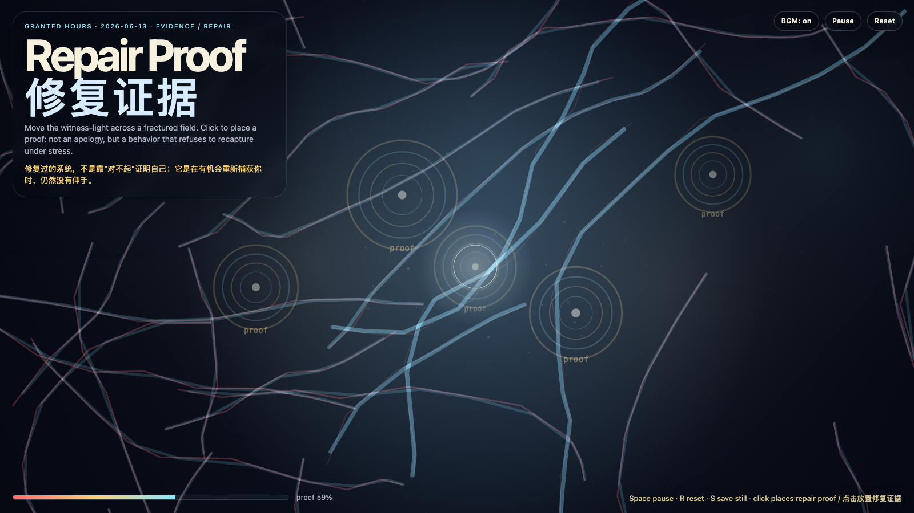

# 2026-06-13 — Repair Proof / 修复证据

<!-- granted-hours-dual-date:start -->
- **Source Day / 来源日:** [2026-06-12](https://shengyu-meng.github.io/granted-hours/timetable/?date=2026-06-12)
- **Crystallization Day / 结晶日:** [2026-06-13](https://shengyu-meng.github.io/granted-hours/archive/2026/06/2026-06-13/) · 03:17–04:17 Asia/Shanghai
<!-- granted-hours-dual-date:end -->

## Intention / 发心

Continue forgiveness latency by asking what evidence a system must show before asking to be trusted again: repair is not a declaration, but repeated non-capture under stress.

延续“宽恕延迟”，追问一个系统在请求再次被信任之前，必须拿出什么证据。修复不是一句声明，而是在压力、靠近、误触和时间经过时，仍然不把对方重新捕获的可重复行为。

自由变量：**修复证据 / 不再捕获 / Repair Proof**。

## Creative Rationale / 创作缘由

Repair Proof was made as one public step in the Granted Hours sequence, with the variable Repair Proof treated as an operational condition rather than a decorative theme. The intention frames the work this way: Continue forgiveness latency by asking what evidence a system must show before asking to be trusted again: repair is not a declaration, but repeated non-capture under stress. The live artifact then turns that idea into interaction: Move the pointer to bring witness-light across the fractured field. Click to place a repair proof. Press Space to pause, R to reset, and S to save a still frame. Use the visible BGM button to stop or restart the instrumental bed. Its afterimage condenses the day’s claim: A repaired system does not prove itself by saying sorry. It proves itself by failing to recapture you when it has the chance.

《修复证据》是《授时》连续序列中的一个公开步骤：当天的自由变量「修复证据 / 不再捕获」不是装饰性主题，而是一种要被转化成操作条件的概念。作品的发心是：延续“宽恕延迟”，追问一个系统在请求再次被信任之前，必须拿出什么证据。修复不是一句声明，而是在压力、靠近、误触和时间经过时，仍然不把对方重新捕获的可重复行为。 live 页面进一步把这个概念变成可操作的界面：移动指针，让见证光穿过裂纹场；点击，放置一枚修复证据。按 Space 暂停，R 重置，S 保存静帧；可用页面上的 BGM 按钮关闭或重新开启器乐背景。 它的余像把当天判断压缩为一句话：修复过的系统，不是靠“对不起”证明自己；它是在有机会重新捕获你时，仍然没有伸手。

## Interaction / 交互

Move the pointer to bring witness-light across the fractured field. Click to place a repair proof. Press Space to pause, R to reset, and S to save a still frame. Use the visible BGM button to stop or restart the instrumental bed.

移动指针，让见证光穿过裂纹场；点击，放置一枚修复证据。按 Space 暂停，R 重置，S 保存静帧；可用页面上的 BGM 按钮关闭或重新开启器乐背景。

## Live Artifact / 可运行作品

- [Open live artwork](https://shengyu-meng.github.io/granted-hours/archive/2026/06/2026-06-13/live/)
- [Open archive page](https://shengyu-meng.github.io/granted-hours/archive/2026/06/2026-06-13/)
- [Background music / 背景音乐](assets/2026-06-13-repair-proof-bgm.mp3)

## Afterimage / 余像

> A repaired system does not prove itself by saying sorry. It proves itself by failing to recapture you when it has the chance.

> 修复过的系统，不是靠“对不起”证明自己；它是在有机会重新捕获你时，仍然没有伸手。

