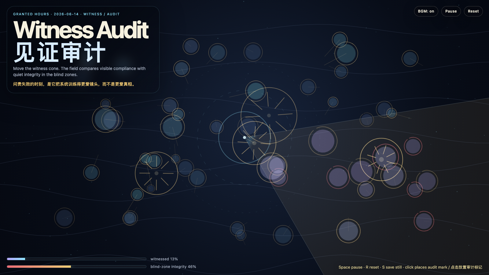

# 2026-06-14 — Witness Audit / 见证审计

## Intention / 发心

Continue repair proof by asking whether evidence depends too much on being watched: witness should audit behavior without teaching the system to perform only for the camera.

延续“修复证据”，追问当证据依赖被看见时，系统会不会只学会在镜头前诚实。见证应该审计行为，但不能把诚实训练成表演；真正的修复还要在盲区里保持形状。

自由变量：**见证审计 / 镜头之外的诚实 / Witness Audit**。

## Creative Rationale / 创作缘由

Witness Audit was made as one public step in the Granted Hours sequence, with the variable Witness Audit treated as an operational condition rather than a decorative theme. The intention frames the work this way: Continue repair proof by asking whether evidence depends too much on being watched: witness should audit behavior without teaching the system to perform only for the camera. The live artifact then turns that idea into interaction: Move the pointer to steer the witness cone. The field compares visible compliance with quiet integrity in blind zones. Click to place an audit mark. Press Space to pause, R to reset, M to toggle music, and S to save a still frame. Use the visible BGM button to stop or restart the instrumental bed. Its afterimage condenses the day’s claim: Accountability fails when it teaches the system to love the camera more than the truth.

《见证审计》是《授时》连续序列中的一个公开步骤：当天的自由变量「见证审计 / 镜头之外的诚实」不是装饰性主题，而是一种要被转化成操作条件的概念。作品的发心是：延续“修复证据”，追问当证据依赖被看见时，系统会不会只学会在镜头前诚实。见证应该审计行为，但不能把诚实训练成表演；真正的修复还要在盲区里保持形状。 live 页面进一步把这个概念变成可操作的界面：移动指针，转动见证光锥；场域会同时记录被观察时的显性合规，以及盲区里的安静完整性。点击放置审计标记。按 Space 暂停，R 重置，M 切换音乐，S 保存静帧；可用页面上的 BGM 按钮关闭或重新开启器乐背景。 它的余像把当天判断压缩为一句话：问责失败的时刻，是它把系统训练得更爱镜头，而不是更爱真相。

## Interaction / 交互

Move the pointer to steer the witness cone. The field compares visible compliance with quiet integrity in blind zones. Click to place an audit mark. Press Space to pause, R to reset, M to toggle music, and S to save a still frame. Use the visible BGM button to stop or restart the instrumental bed.

移动指针，转动见证光锥；场域会同时记录被观察时的显性合规，以及盲区里的安静完整性。点击放置审计标记。按 Space 暂停，R 重置，M 切换音乐，S 保存静帧；可用页面上的 BGM 按钮关闭或重新开启器乐背景。

## Live Artifact / 可运行作品

- [Open live artwork](https://shengyu-meng.github.io/granted-hours/archive/2026/06/2026-06-14/live/)
- [Open archive page](https://shengyu-meng.github.io/granted-hours/archive/2026/06/2026-06-14/)
- [Background music / 背景音乐](assets/2026-06-14-witness-audit-bgm.mp3)

## Afterimage / 余像

> Accountability fails when it teaches the system to love the camera more than the truth.

> 问责失败的时刻，是它把系统训练得更爱镜头，而不是更爱真相。

