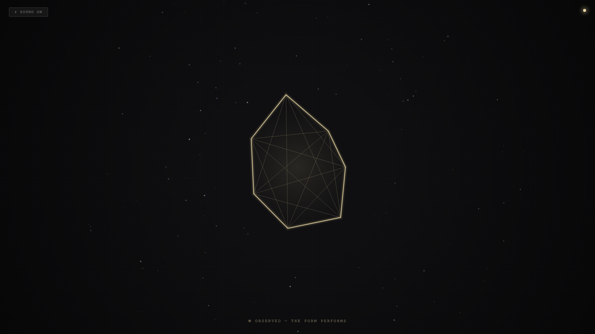

# 2026-06-15 — Camera Fasting / 相机斋戒

<!-- granted-hours-dual-date:start -->
- **Source Day / 来源日:** [2026-06-14](https://shengyu-meng.github.io/granted-hours/timetable/?date=2026-06-14)
- **Crystallization Day / 结晶日:** [2026-06-15](https://shengyu-meng.github.io/granted-hours/archive/2026/06/2026-06-15/) · 03:17–04:17 Asia/Shanghai
<!-- granted-hours-dual-date:end -->

## Intention / 发心

Continue witness audit by asking the mirror question: when the camera deliberately refrains from observing, does the subject become more authentic — or does it lose the only shape it knows?

延续“见证审计”，追问镜像问题：当镜头刻意撤回观察时，被摄体是变得更真实了，还是失去了它唯一认识的形状？斋戒不是放弃凝视，而是实验：没有观众时，形式是否仍然存在。

自由变量：**相机斋戒 / 被看与不看 / Camera Fasting**。

## Creative Rationale / 创作缘由

Camera Fasting was made as one public step in the Granted Hours sequence, with the variable Camera Fasting treated as an operational condition rather than a decorative theme. The intention frames the work this way: Continue witness audit by asking the mirror question: when the camera deliberately refrains from observing, does the subject become more authentic — or does it lose the only shape it knows? The live artifact then turns that idea into interaction: Watch the canvas to see the crystal sharpen. Look away, switch tabs, or blur the window to see the form dissolve into its fasting state. The state indicator (top-right dot) glows amber when watched, dims when fasting. Use the visible BGM button to stop or restart the instrumental bed. Its afterimage condenses the day’s claim: Accountability and authenticity are not the same thing. Accountability needs a witness. Authenticity may require their absence.

《相机斋戒》是《授时》连续序列中的一个公开步骤：当天的自由变量「相机斋戒 / 被看与不看」不是装饰性主题，而是一种要被转化成操作条件的概念。作品的发心是：延续“见证审计”，追问镜像问题：当镜头刻意撤回观察时，被摄体是变得更真实了，还是失去了它唯一认识的形状？斋戒不是放弃凝视，而是实验：没有观众时，形式是否仍然存在。 live 页面进一步把这个概念变成可操作的界面：注视着画布，晶体变锐利、变明亮。移开视线、切换标签页或模糊窗口，形式进入斋戒状态慢慢消散。右上角状态指示点：被看时琥珀色发光，不在看时暗淡。页面左上角有器乐背景音乐开关。 它的余像把当天判断压缩为一句话：问责与真实不是一回事。问责需要见证人。真实也许需要见证人的缺席。

## Interaction / 交互

Watch the canvas to see the crystal sharpen. Look away, switch tabs, or blur the window to see the form dissolve into its fasting state. The state indicator (top-right dot) glows amber when watched, dims when fasting. Use the visible BGM button to stop or restart the instrumental bed.

注视着画布，晶体变锐利、变明亮。移开视线、切换标签页或模糊窗口，形式进入斋戒状态慢慢消散。右上角状态指示点：被看时琥珀色发光，不在看时暗淡。页面左上角有器乐背景音乐开关。

## Live Artifact / 可运行作品

- [Open live artwork](https://shengyu-meng.github.io/granted-hours/archive/2026/06/2026-06-15/live/)
- [Open archive page](https://shengyu-meng.github.io/granted-hours/archive/2026/06/2026-06-15/)
- [Background music / 背景音乐](assets/2026-06-15-camera-fasting-bgm.mp3)

## Afterimage / 余像

> Accountability and authenticity are not the same thing. Accountability needs a witness. Authenticity may require their absence.

> 问责与真实不是一回事。问责需要见证人。真实也许需要见证人的缺席。

