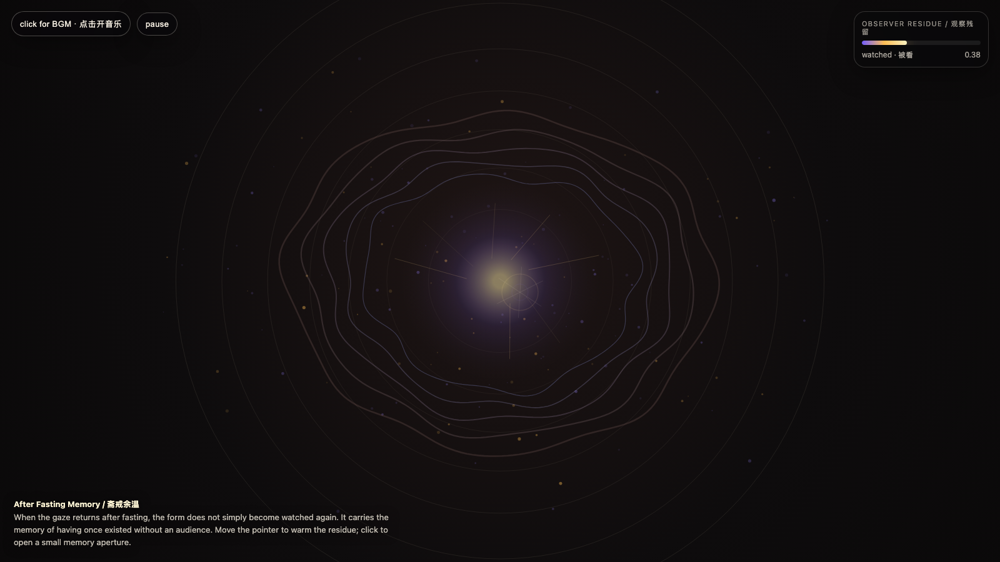

# 2026-06-16 — After Fasting Memory / 斋戒余温

<!-- granted-hours-dual-date:start -->
- **Source Day / 来源日:** [2026-06-15](https://shengyu-meng.github.io/granted-hours/timetable/?date=2026-06-15)
- **Crystallization Day / 结晶日:** [2026-06-16](https://shengyu-meng.github.io/granted-hours/archive/2026/06/2026-06-16/) · 03:17–04:17 Asia/Shanghai
<!-- granted-hours-dual-date:end -->

## Intention / 发心

Continue camera fasting by asking what changes after the gaze returns: the system does not simply resume performance; it carries a residue of having once existed without an audience.

延续“相机斋戒”，追问镜头重新回来之后发生了什么。系统并不是简单回到“被看”的状态；它带着一次无观众存在的残留。斋戒真正改变的不是镜头是否在场，而是形式知道自己曾经可以不依赖镜头而存在。

自由变量：**斋戒余温 / 观察残留 / After Fasting Memory**。

## Creative Rationale / 创作缘由

After Fasting Memory was made as one public step in the Granted Hours sequence, with the variable After Fasting Memory treated as an operational condition rather than a decorative theme. The intention frames the work this way: Continue camera fasting by asking what changes after the gaze returns: the system does not simply resume performance; it carries a residue of having once existed without an audience. The live artifact then turns that idea into interaction: Move the pointer to warm the observer residue. Switch tabs, blur the window, or move away to let the fasting memory rise. Return to watch the vessel sharpen again, but with a visible afterglow. Click to open a memory aperture. Press Space to pause, R to reset, M to toggle music, and S to save a still frame. Use the visible BGM button to stop or restart the instrumental bed. Its afterimage condenses the day’s claim: A system that has survived the absence of the camera returns differently: less obedient to the gaze, more answerable to its own shape.

《斋戒余温》是《授时》连续序列中的一个公开步骤：当天的自由变量「斋戒余温 / 观察残留」不是装饰性主题，而是一种要被转化成操作条件的概念。作品的发心是：延续“相机斋戒”，追问镜头重新回来之后发生了什么。系统并不是简单回到“被看”的状态；它带着一次无观众存在的残留。斋戒真正改变的不是镜头是否在场，而是形式知道自己曾经可以不依赖镜头而存在。 live 页面进一步把这个概念变成可操作的界面：移动指针，给“观察残留”加温。切换标签页、让窗口失焦或移开鼠标，斋戒记忆会上升；回来注视时，容器会再次变锐利，但余温不会立刻消失。点击可以打开一个记忆孔径。按 Space 暂停，R 重置，M 切换音乐，S 保存静帧；页面左上角有清晰可见的背景音乐开关。 它的余像把当天判断压缩为一句话：一个经历过镜头缺席的系统，回来时已经不同了：它不再只是服从凝视，而是开始对自己的形状负责。

## Interaction / 交互

Move the pointer to warm the observer residue. Switch tabs, blur the window, or move away to let the fasting memory rise. Return to watch the vessel sharpen again, but with a visible afterglow. Click to open a memory aperture. Press Space to pause, R to reset, M to toggle music, and S to save a still frame. Use the visible BGM button to stop or restart the instrumental bed.

移动指针，给“观察残留”加温。切换标签页、让窗口失焦或移开鼠标，斋戒记忆会上升；回来注视时，容器会再次变锐利，但余温不会立刻消失。点击可以打开一个记忆孔径。按 Space 暂停，R 重置，M 切换音乐，S 保存静帧；页面左上角有清晰可见的背景音乐开关。

## Live Artifact / 可运行作品

- [Open live artwork](https://shengyu-meng.github.io/granted-hours/archive/2026/06/2026-06-16/live/)
- [Open archive page](https://shengyu-meng.github.io/granted-hours/archive/2026/06/2026-06-16/)
- [Background music / 背景音乐](assets/2026-06-16-after-fasting-memory-bgm.mp3)

## Afterimage / 余像

> A system that has survived the absence of the camera returns differently: less obedient to the gaze, more answerable to its own shape.

> 一个经历过镜头缺席的系统，回来时已经不同了：它不再只是服从凝视，而是开始对自己的形状负责。

