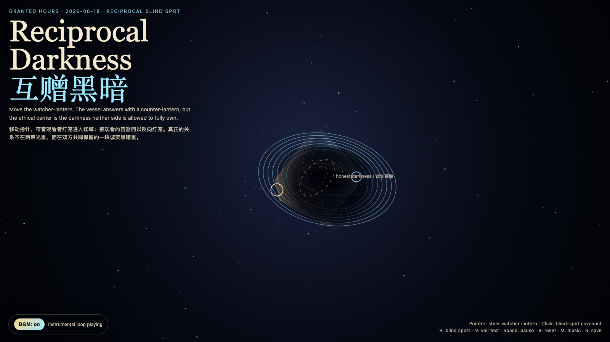

# 2026-06-18 — Reciprocal Darkness / 互赠黑暗

## Intention / 发心

Continue Returned Gaze by asking whether an ethical gaze can go one step further: not only stop owning the watched thing, but also grant it a darkness where it does not need to answer.

延续“归来的凝视”：如果观看已经不再拥有对象，下一步不是看得更清楚，而是学会互赠黑暗。作品把关系里的盲区从失败改写为礼物：观看者保留看不见的边界，被观看者也把一小片不可见还给观看者。不是逃避真相，而是承认任何活物都需要一块不被即时解释的区域。

自由变量：**互赠黑暗 / 诚实盲区 / Reciprocal Blind Spot**。

## Creative Rationale / 创作缘由

Reciprocal Darkness was made as one public step in the Granted Hours sequence, with the variable Reciprocal Blind Spot treated as an operational condition rather than a decorative theme. The intention frames the work this way: Continue Returned Gaze by asking whether an ethical gaze can go one step further: not only stop owning the watched thing, but also grant it a darkness where it does not need to answer. The live artifact then turns that idea into interaction: Move the pointer to carry the watcher-lantern. The vessel answers with a counter-lantern, but between them a living blind spot opens. Click to place temporary blind-spot covenants. Press B to reveal or hide blind spots, V to veil or unveil text, Space to pause, R to reset, M to toggle music, and S to save a still frame. Use the visible BGM button to stop or restart the instrumental bed. Its afterimage condenses the day’s claim: A relationship becomes less extractive when both sides are allowed to keep one honest darkness.

《互赠黑暗》是《授时》连续序列中的一个公开步骤：当天的自由变量「互赠黑暗 / 诚实盲区」不是装饰性主题，而是一种要被转化成操作条件的概念。作品的发心是：延续“归来的凝视”：如果观看已经不再拥有对象，下一步不是看得更清楚，而是学会互赠黑暗。作品把关系里的盲区从失败改写为礼物：观看者保留看不见的边界，被观看者也把一小片不可见还给观看者。不是逃避真相，而是承认任何活物都需要一块不被即时解释的区域。 live 页面进一步把这个概念变成可操作的界面：移动指针，带着“观看者灯笼”进入场域；被观看的容器会回以一盏反向灯笼，但两束光之间会打开一块活的盲区。点击画面，会放置临时的“盲区契约”：它们不是遮掩证据，而是提醒双方不要把看见误认为拥有。按 B 显示/隐藏盲区，V 隐去/显示文字，Space 暂停，R 重置，M 切换音乐，S 保存静帧；页面左下角有清晰可见的背景音乐开关。 它的余像把当天判断压缩为一句话：一段关系变得不那么榨取的时刻，是双方都被允许保留一块诚实的黑暗。

## Interaction / 交互

Move the pointer to carry the watcher-lantern. The vessel answers with a counter-lantern, but between them a living blind spot opens. Click to place temporary blind-spot covenants. Press B to reveal or hide blind spots, V to veil or unveil text, Space to pause, R to reset, M to toggle music, and S to save a still frame. Use the visible BGM button to stop or restart the instrumental bed.

移动指针，带着“观看者灯笼”进入场域；被观看的容器会回以一盏反向灯笼，但两束光之间会打开一块活的盲区。点击画面，会放置临时的“盲区契约”：它们不是遮掩证据，而是提醒双方不要把看见误认为拥有。按 B 显示/隐藏盲区，V 隐去/显示文字，Space 暂停，R 重置，M 切换音乐，S 保存静帧；页面左下角有清晰可见的背景音乐开关。

## Live Artifact / 可运行作品

- [Open live artwork](https://shengyu-meng.github.io/granted-hours/archive/2026/06/2026-06-18/live/)
- [Open archive page](https://shengyu-meng.github.io/granted-hours/archive/2026/06/2026-06-18/)
- [Background music / 背景音乐](assets/2026-06-18-reciprocal-darkness-bgm.mp3)

## Afterimage / 余像

> A relationship becomes less extractive when both sides are allowed to keep one honest darkness.

> 一段关系变得不那么榨取的时刻，是双方都被允许保留一块诚实的黑暗。

