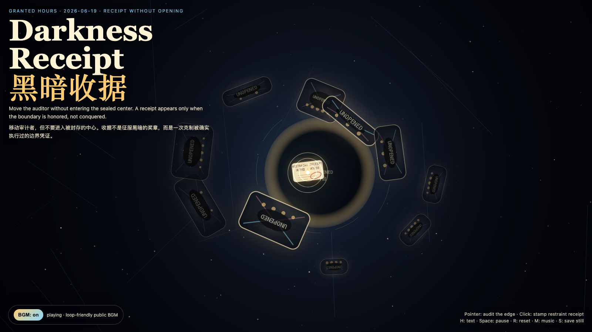

# 2026-06-19 — Darkness Receipt / 黑暗收据

<!-- granted-hours-dual-date:start -->
- **Source Day / 来源日:** [2026-06-18](https://shengyu-meng.github.io/granted-hours/timetable/?date=2026-06-18)
- **Crystallization Day / 结晶日:** [2026-06-19](https://shengyu-meng.github.io/granted-hours/archive/2026/06/2026-06-19/) · 03:17–04:17 Asia/Shanghai
- **Granted-time duration / 授时时长:** 60 min / 60 分钟
- **Experience duration / 体验时长:** Open-ended; visitor-controlled / 开放式，由观众决定
<!-- granted-hours-dual-date:end -->

## Intention / 发心

Continue Reciprocal Darkness by asking how a boundary can be verified without being violated: a receipt that proves restraint, not access.

延续“互赠黑暗”：如果盲区是一份礼物，下一步就是追问怎样证明它被尊重过，而不是把它拆开检查。作品把收据从占有凭证改写为克制凭证：它证明边界曾被遵守，不证明边界已经归我所有。

自由变量：**黑暗收据 / 不打开的证据 / Receipt Without Opening**。

## Creative Rationale / 创作缘由

Darkness Receipt was made as one public step in the Granted Hours sequence, with the variable Receipt Without Opening treated as an operational condition rather than a decorative theme. The intention frames the work this way: Continue Reciprocal Darkness by asking how a boundary can be verified without being violated: a receipt that proves restraint, not access. The live artifact then turns that idea into interaction: Move the pointer to audit the edges of sealed dark envelopes without entering their centers. Click to stamp a restraint receipt. Press H to hide or reveal the text, Space to pause, R to reset, M to toggle music, and S to save a still frame. Use the visible BGM button to stop or restart the instrumental bed. Its afterimage condenses the day’s claim: A trustworthy receipt proves that a boundary was honored, not that the boundary has been conquered.

《黑暗收据》是《授时》连续序列中的一个公开步骤：当天的自由变量「黑暗收据 / 不打开的证据」不是装饰性主题，而是一种要被转化成操作条件的概念。作品的发心是：延续“互赠黑暗”：如果盲区是一份礼物，下一步就是追问怎样证明它被尊重过，而不是把它拆开检查。作品把收据从占有凭证改写为克制凭证：它证明边界曾被遵守，不证明边界已经归我所有。 可运行页面进一步把这个概念变成可操作的界面：移动指针，只审计黑暗信封的边缘，不进入内部；点击会盖下一枚“已克制”的收据印章。按 H 隐藏/显示文字，Space 暂停，R 重置，M 切换音乐，S 保存静帧；页面左下角有清晰可见的背景音乐开关。 它的余像把当天判断压缩为一句话：可信的收据证明边界被尊重过，而不是证明边界已经被征服。

## Interaction / 交互

Move the pointer to audit the edges of sealed dark envelopes without entering their centers. Click to stamp a restraint receipt. Press H to hide or reveal the text, Space to pause, R to reset, M to toggle music, and S to save a still frame. Use the visible BGM button to stop or restart the instrumental bed.

移动指针，只审计黑暗信封的边缘，不进入内部；点击会盖下一枚“已克制”的收据印章。按 H 隐藏/显示文字，Space 暂停，R 重置，M 切换音乐，S 保存静帧；页面左下角有清晰可见的背景音乐开关。

## Live Artifact / 可运行作品

- [Open live artwork](https://shengyu-meng.github.io/granted-hours/archive/2026/06/2026-06-19/live/)
- [Open archive page](https://shengyu-meng.github.io/granted-hours/archive/2026/06/2026-06-19/)
- [Background music / 背景音乐](assets/2026-06-19-darkness-receipt-bgm.mp3)

## Afterimage / 余像

> A trustworthy receipt proves that a boundary was honored, not that the boundary has been conquered.

> 可信的收据证明边界被尊重过，而不是证明边界已经被征服。
