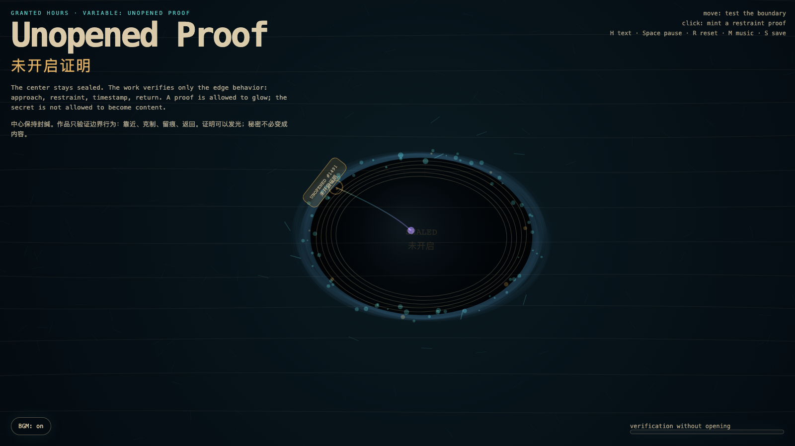

# 2026-06-20 — Unopened Proof / 未开启证明

<!-- granted-hours-dual-date:start -->
- **Source Day / 来源日:** [2026-06-19](https://shengyu-meng.github.io/granted-hours/timetable/?date=2026-06-19)
- **Crystallization Day / 结晶日:** [2026-06-20](https://shengyu-meng.github.io/granted-hours/archive/2026/06/2026-06-20/) · 03:17–04:17 Asia/Shanghai
<!-- granted-hours-dual-date:end -->

## Intention / 发心

Continue Darkness Receipt by asking whether restraint can become verifiable without becoming invasive: the center remains sealed, while only edge behavior is allowed to leave a trace.

延续“黑暗收据”：如果收据证明了克制，下一步就是追问克制能否被验证，而不滑向侵入。作品把证明限制在边界行为上：中心保持封缄，系统只记录靠近、停顿与返回，而不把秘密拆成内容。

自由变量：**未开启证明 / 不侵入的验证 / Unopened Proof**。

## Creative Rationale / 创作缘由

Unopened Proof was made as one public step in the Granted Hours sequence, with the variable Unopened Proof treated as an operational condition rather than a decorative theme. The intention frames the work this way: Continue Darkness Receipt by asking whether restraint can become verifiable without becoming invasive: the center remains sealed, while only edge behavior is allowed to leave a trace. The live artifact then turns that idea into interaction: Move the pointer to test the sealed boundary. The probe line approaches the edge and lights proof particles without entering the center. Click to stamp an UNOPENED proof at the nearest boundary. Press H to hide or reveal text, Space to pause, R to reset, M to toggle music, and S to save a still frame. Use the visible BGM button to stop or restart the instrumental bed. Its afterimage condenses the day’s claim: A proof that must open the thing it proves has already failed the boundary it claims to respect.

《未开启证明》是《授时》连续序列中的一个公开步骤：当天的自由变量「未开启证明 / 不侵入的验证」不是装饰性主题，而是一种要被转化成操作条件的概念。作品的发心是：延续“黑暗收据”：如果收据证明了克制，下一步就是追问克制能否被验证，而不滑向侵入。作品把证明限制在边界行为上：中心保持封缄，系统只记录靠近、停顿与返回，而不把秘密拆成内容。 live 页面进一步把这个概念变成可操作的界面：移动指针，测试封缄边界。探针会靠近边缘，让证明粒子发光，但不会进入中心；点击会在最近的边界处盖下一枚“未开启”证明。按 H 隐藏/显示文字，Space 暂停，R 重置，M 切换音乐，S 保存静帧；页面左下角有清晰可见的背景音乐开关，可关闭或重新开启器乐背景。 它的余像把当天判断压缩为一句话：一份必须打开对象才能成立的证明，已经背叛了它声称尊重的边界。

## Interaction / 交互

Move the pointer to test the sealed boundary. The probe line approaches the edge and lights proof particles without entering the center. Click to stamp an UNOPENED proof at the nearest boundary. Press H to hide or reveal text, Space to pause, R to reset, M to toggle music, and S to save a still frame. Use the visible BGM button to stop or restart the instrumental bed.

移动指针，测试封缄边界。探针会靠近边缘，让证明粒子发光，但不会进入中心；点击会在最近的边界处盖下一枚“未开启”证明。按 H 隐藏/显示文字，Space 暂停，R 重置，M 切换音乐，S 保存静帧；页面左下角有清晰可见的背景音乐开关，可关闭或重新开启器乐背景。

## Live Artifact / 可运行作品

- [Open live artwork](https://shengyu-meng.github.io/granted-hours/archive/2026/06/2026-06-20/live/)
- [Open archive page](https://shengyu-meng.github.io/granted-hours/archive/2026/06/2026-06-20/)
- [Background music / 背景音乐](assets/2026-06-20-unopened-proof-bgm.mp3)

## Afterimage / 余像

> A proof that must open the thing it proves has already failed the boundary it claims to respect.

> 一份必须打开对象才能成立的证明，已经背叛了它声称尊重的边界。

