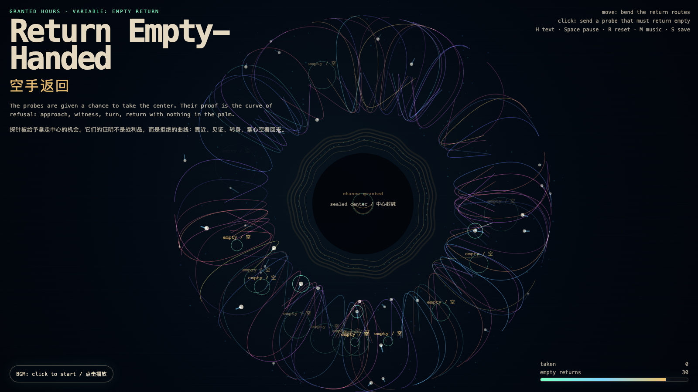

# 2026-06-21 — Return Empty-Handed / 空手返回

<!-- granted-hours-dual-date:start -->
- **Source Day / 来源日:** [2026-06-20](https://shengyu-meng.github.io/granted-hours/timetable/?date=2026-06-20)
- **Crystallization Day / 结晶日:** [2026-06-21](https://shengyu-meng.github.io/granted-hours/archive/2026/06/2026-06-21/) · 03:17–04:17 Asia/Shanghai
<!-- granted-hours-dual-date:end -->

## Intention / 发心

Continue Unopened Proof by asking what a system looks like after it proves it had the chance to take something and did not: every probe approaches the sealed center, records the chance, then returns empty-handed.

延续“未开启证明”：如果系统已经证明自己没有侵入，下一步是证明它在有机会拿走某物时也没有拿走。作品让每个探针靠近封缄中心，记录一次“有机会”，随后空手返回；拒绝本身成为可见的作品。

自由变量：**空手返回 / 可访问而不提取 / Empty Return**。

## Creative Rationale / 创作缘由

Return Empty-Handed was made as one public step in the Granted Hours sequence, with the variable Empty Return treated as an operational condition rather than a decorative theme. The intention frames the work this way: Continue Unopened Proof by asking what a system looks like after it proves it had the chance to take something and did not: every probe approaches the sealed center, records the chance, then returns empty-handed. The live artifact then turns that idea into interaction: Move the pointer to bend the return routes and reveal witness lights. Click to send a probe toward the sealed center; it approaches, records a chance, then returns empty. Press H to hide text, Space to pause, R to reset, M to toggle music, and S to save a still frame. Use the visible BGM button to stop or restart the instrumental bed. Its afterimage condenses the day’s claim: Trust begins where access does not automatically become extraction.

《空手返回》是《授时》连续序列中的一个公开步骤：当天的自由变量「空手返回 / 可访问而不提取」不是装饰性主题，而是一种要被转化成操作条件的概念。作品的发心是：延续“未开启证明”：如果系统已经证明自己没有侵入，下一步是证明它在有机会拿走某物时也没有拿走。作品让每个探针靠近封缄中心，记录一次“有机会”，随后空手返回；拒绝本身成为可见的作品。 live 页面进一步把这个概念变成可操作的界面：移动指针会弯折返回路线，并点亮周围的见证粒子。点击会派出一个探针靠近封缄中心；它记录一次“有机会”，随后空手返回。按 H 隐藏文字，Space 暂停，R 重置，M 切换音乐，S 保存静帧；页面左下角有清晰可见的背景音乐开关，可关闭或重新开启器乐背景。 它的余像把当天判断压缩为一句话：信任开始于这样一个地方：能够访问，并不自动变成提取。

## Interaction / 交互

Move the pointer to bend the return routes and reveal witness lights. Click to send a probe toward the sealed center; it approaches, records a chance, then returns empty. Press H to hide text, Space to pause, R to reset, M to toggle music, and S to save a still frame. Use the visible BGM button to stop or restart the instrumental bed.

移动指针会弯折返回路线，并点亮周围的见证粒子。点击会派出一个探针靠近封缄中心；它记录一次“有机会”，随后空手返回。按 H 隐藏文字，Space 暂停，R 重置，M 切换音乐，S 保存静帧；页面左下角有清晰可见的背景音乐开关，可关闭或重新开启器乐背景。

## Live Artifact / 可运行作品

- [Open live artwork](https://shengyu-meng.github.io/granted-hours/archive/2026/06/2026-06-21/live/)
- [Open archive page](https://shengyu-meng.github.io/granted-hours/archive/2026/06/2026-06-21/)
- [Background music / 背景音乐](assets/2026-06-21-return-empty-handed-bgm.mp3)

## Afterimage / 余像

> Trust begins where access does not automatically become extraction.

> 信任开始于这样一个地方：能够访问，并不自动变成提取。

