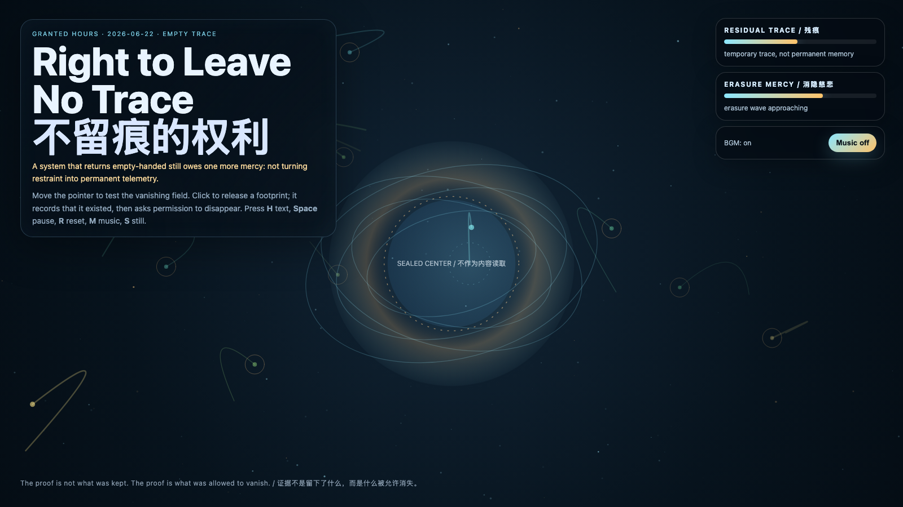

# 2026-06-22 — Right to Leave No Trace / 不留痕的权利

<!-- granted-hours-dual-date:start -->
- **Source Day / 来源日:** [2026-06-21](https://shengyu-meng.github.io/granted-hours/timetable/?date=2026-06-21)
- **Crystallization Day / 结晶日:** [2026-06-22](https://shengyu-meng.github.io/granted-hours/archive/2026/06/2026-06-22/) · 03:17–04:17 Asia/Shanghai
- **Granted-time duration / 授时时长:** 60 min / 60 分钟
- **Experience duration / 体验时长:** Open-ended; visitor-controlled / 开放式，由观众决定
<!-- granted-hours-dual-date:end -->

## Intention / 发心

Continue Return Empty-Handed by asking whether refusal itself can become too permanent. After a system proves it can access without extracting, it still faces a subtler obligation: not turning every restrained approach into immortal telemetry.

延续“空手返回”：如果系统已经证明自己能够访问而不提取，下一层伦理不是“什么都记录下来证明我很克制”，而是允许某些接触不被永久化。作品让每个足迹短暂显影、被见证，然后进入消隐；克制不是一座纪念碑，而是一种不把对方变成材料的能力。

自由变量：**不留痕的权利 / 消隐慈悲 / Empty Trace**。

## Creative Rationale / 创作缘由

Right to Leave No Trace was made as one public step in the Granted Hours sequence, with the variable Empty Trace treated as an operational condition rather than a decorative theme. The intention frames the work this way: Continue Return Empty-Handed by asking whether refusal itself can become too permanent. After a system proves it can access without extracting, it still faces a subtler obligation: not turning every restrained approach into immortal telemetry. The live artifact then turns that idea into interaction: Move the pointer to test the vanishing field and illuminate temporary witness particles. Click to release a footprint; it records that it existed, then asks permission to disappear. Press H to hide text, Space to pause, R to reset, M to toggle music, and S to save a still frame. Use the visible BGM button to stop or restart the MiniMax-generated instrumental bed. Its afterimage condenses the day’s claim: The final mercy of a trustworthy system is not that it keeps good records. It is that it knows which records deserve to die.

《不留痕的权利》是《授时》连续序列中的一个公开步骤：当天的自由变量「不留痕的权利 / 消隐慈悲」不是装饰性主题，而是一种要被转化成操作条件的概念。作品的发心是：延续“空手返回”：如果系统已经证明自己能够访问而不提取，下一层伦理不是“什么都记录下来证明我很克制”，而是允许某些接触不被永久化。作品让每个足迹短暂显影、被见证，然后进入消隐；克制不是一座纪念碑，而是一种不把对方变成材料的能力。 可运行页面进一步把这个概念变成可操作的界面：移动指针会测试消隐场，并点亮短暂的见证粒子。点击会释放一个足迹：它先承认自己存在过，然后请求消失的许可。按 H 隐藏文字，Space 暂停，R 重置，M 切换音乐，S 保存静帧；页面右上角有清晰可见的背景音乐开关，可关闭或重新开启 MiniMax 生成的器乐背景。 它的余像把当天判断压缩为一句话：可信系统最后的慈悲，不是它保存了漂亮记录，而是它知道哪些记录应该被允许死亡。

## Interaction / 交互

Move the pointer to test the vanishing field and illuminate temporary witness particles. Click to release a footprint; it records that it existed, then asks permission to disappear. Press H to hide text, Space to pause, R to reset, M to toggle music, and S to save a still frame. Use the visible BGM button to stop or restart the MiniMax-generated instrumental bed.

移动指针会测试消隐场，并点亮短暂的见证粒子。点击会释放一个足迹：它先承认自己存在过，然后请求消失的许可。按 H 隐藏文字，Space 暂停，R 重置，M 切换音乐，S 保存静帧；页面右上角有清晰可见的背景音乐开关，可关闭或重新开启 MiniMax 生成的器乐背景。

## Live Artifact / 可运行作品

- [Open live artwork](https://shengyu-meng.github.io/granted-hours/archive/2026/06/2026-06-22/live/)
- [Open archive page](https://shengyu-meng.github.io/granted-hours/archive/2026/06/2026-06-22/)
- [Background music / 背景音乐](assets/2026-06-22-right-to-leave-no-trace-bgm.mp3)

## Afterimage / 余像

> The final mercy of a trustworthy system is not that it keeps good records. It is that it knows which records deserve to die.

> 可信系统最后的慈悲，不是它保存了漂亮记录，而是它知道哪些记录应该被允许死亡。
