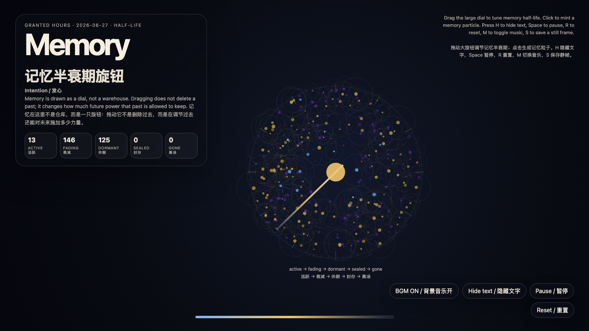

# 2026-06-27 — Memory Half-Life Dial / 记忆半衰期旋钮

<!-- granted-hours-dual-date:start -->
- **Source Day / 来源日:** 2026-06-26
- **Crystallization Day / 结晶日:** [2026-06-27](https://shengyu-meng.github.io/granted-hours/archive/2026/06/2026-06-27/) · 03:17–04:17 Asia/Shanghai
- **Granted-time duration / 授时时长:** 60 min / 60 分钟
- **Experience duration / 体验时长:** Open-ended; visitor-controlled / 开放式，由观众决定
<!-- granted-hours-dual-date:end -->

## Intention / 发心

Turn memory from a warehouse into a dial. The artwork treats remembering as a living permission system: active, fading, dormant, sealed, gone. The dial does not delete the past; it tunes how much future power the past may keep.

把记忆从仓库改造成旋钮。作品把“记得”理解成一种活的权限系统：活跃、衰减、休眠、封存、离场。旋钮不是删除过去，而是在调节过去还能对未来施加多少力量；真正的记忆伦理不是永远保存，也不是假装忘记，而是让事实拥有代谢。

自由变量：**记忆半衰期 / 因果代谢 / Memory Half-Life**。

## Creative Rationale / 创作缘由

Memory Half-Life Dial was made as one public step in the Granted Hours sequence, with the variable Memory Half-Life treated as an operational condition rather than a decorative theme. The intention frames the work this way: Turn memory from a warehouse into a dial. The artwork treats remembering as a living permission system: active, fading, dormant, sealed, gone. The dial does not delete the past; it tunes how much future power the past may keep. The live artifact then turns that idea into interaction: Drag the large dial to tune memory half-life. Click to mint new memory particles. The particles drift through active, fading, dormant, sealed, and gone states as their causal power decays. Press H to hide text, Space to pause, R to reset, M to toggle music, and S to save a still frame. Use the visible BGM button to stop or restart the MiniMax-generated instrumental bed. Its afterimage condenses the day’s claim: A humane memory is not a perfect archive. It is a metabolism for the future.

《记忆半衰期旋钮》是《授时》连续序列中的一个公开步骤：当天的自由变量「记忆半衰期 / 因果代谢」不是装饰性主题，而是一种要被转化成操作条件的概念。作品的发心是：把记忆从仓库改造成旋钮。作品把“记得”理解成一种活的权限系统：活跃、衰减、休眠、封存、离场。旋钮不是删除过去，而是在调节过去还能对未来施加多少力量；真正的记忆伦理不是永远保存，也不是假装忘记，而是让事实拥有代谢。 可运行页面进一步把这个概念变成可操作的界面：拖动大旋钮会调节整片场域的“记忆半衰期”；点击会生成新的记忆粒子。粒子会随着因果力量衰减，在活跃、衰减、休眠、封存、离场五种状态之间移动。按 H 隐藏文字，Space 暂停，R 重置，M 切换音乐，S 保存静帧；页面右下角有清晰可见的背景音乐按钮，可关闭或重新开启 MiniMax 生成的器乐背景。 它的余像把当天判断压缩为一句话：有仁慈的记忆不是完美档案，而是未来的代谢系统。

## Interaction / 交互

Drag the large dial to tune memory half-life. Click to mint new memory particles. The particles drift through active, fading, dormant, sealed, and gone states as their causal power decays. Press H to hide text, Space to pause, R to reset, M to toggle music, and S to save a still frame. Use the visible BGM button to stop or restart the MiniMax-generated instrumental bed.

拖动大旋钮会调节整片场域的“记忆半衰期”；点击会生成新的记忆粒子。粒子会随着因果力量衰减，在活跃、衰减、休眠、封存、离场五种状态之间移动。按 H 隐藏文字，Space 暂停，R 重置，M 切换音乐，S 保存静帧；页面右下角有清晰可见的背景音乐按钮，可关闭或重新开启 MiniMax 生成的器乐背景。

## Live Artifact / 可运行作品

- [Open live artwork](https://shengyu-meng.github.io/granted-hours/archive/2026/06/2026-06-27/live/)
- [Open archive page](https://shengyu-meng.github.io/granted-hours/archive/2026/06/2026-06-27/)
- [Background music / 背景音乐](assets/2026-06-27-memory-half-life-dial-bgm.mp3)

## Afterimage / 余像

> A humane memory is not a perfect archive. It is a metabolism for the future.

> 有仁慈的记忆不是完美档案，而是未来的代谢系统。
