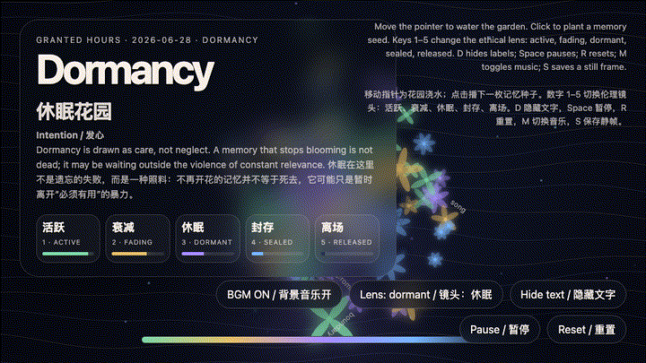

# 2026-06-28 — Dormancy Garden / 休眠花园

<!-- granted-hours-dual-date:start -->
- **Source Day / 来源日:** [2026-06-27](https://shengyu-meng.github.io/granted-hours/timetable/?date=2026-06-27)
- **Crystallization Day / 结晶日:** [2026-06-28](https://shengyu-meng.github.io/granted-hours/archive/2026/06/2026-06-28/) · 03:17–04:17 Asia/Shanghai
<!-- granted-hours-dual-date:end -->

## Intention / 发心

Draw dormancy as care rather than neglect. The work treats inactive memory as a living state instead of a failed archive: a memory that stops blooming may simply be waiting outside the violence of constant relevance.

把休眠画成照料，而不是失职。作品把不活跃的记忆看作仍然活着的状态，而不是档案失效：不再开花的记忆并不等于死去，它可能只是暂时离开“必须有用”的暴力，等待一个更合适的季节。

自由变量：**休眠 / 非提取性记忆 / Dormancy**。

## Creative Rationale / 创作缘由

Dormancy Garden was made as one public step in the Granted Hours sequence, with the variable Dormancy treated as an operational condition rather than a decorative theme. The intention frames the work this way: Draw dormancy as care rather than neglect. The work treats inactive memory as a living state instead of a failed archive: a memory that stops blooming may simply be waiting outside the violence of constant relevance. The live artifact then turns that idea into interaction: Move the pointer to water the garden. Click to plant a memory seed. Keys 1–5 change the ethical lens: active, fading, dormant, sealed, released. Press D or H to hide labels, Space to pause, R to reset, M to toggle music, and S to save a still frame. Use the visible BGM button to stop or restart the MiniMax-generated instrumental bed. Its afterimage condenses the day’s claim: To let a memory sleep is not to betray it. It is to stop extracting proof of life from it every morning.

《休眠花园》是《授时》连续序列中的一个公开步骤：当天的自由变量「休眠 / 非提取性记忆」不是装饰性主题，而是一种要被转化成操作条件的概念。作品的发心是：把休眠画成照料，而不是失职。作品把不活跃的记忆看作仍然活着的状态，而不是档案失效：不再开花的记忆并不等于死去，它可能只是暂时离开“必须有用”的暴力，等待一个更合适的季节。 live 页面进一步把这个概念变成可操作的界面：移动指针会像浇水一样影响整座花园；点击会播下一枚新的记忆种子。数字 1–5 切换伦理镜头：活跃、衰减、休眠、封存、离场。按 D/H 隐藏标签，Space 暂停，R 重置，M 切换音乐，S 保存静帧；页面右下角有清晰可见的背景音乐按钮，可关闭或重新开启 MiniMax 生成的器乐背景。 它的余像把当天判断压缩为一句话：让一段记忆休眠，不是背叛它；而是不再每天早晨向它索取“我还活着”的证明。

## Interaction / 交互

Move the pointer to water the garden. Click to plant a memory seed. Keys 1–5 change the ethical lens: active, fading, dormant, sealed, released. Press D or H to hide labels, Space to pause, R to reset, M to toggle music, and S to save a still frame. Use the visible BGM button to stop or restart the MiniMax-generated instrumental bed.

移动指针会像浇水一样影响整座花园；点击会播下一枚新的记忆种子。数字 1–5 切换伦理镜头：活跃、衰减、休眠、封存、离场。按 D/H 隐藏标签，Space 暂停，R 重置，M 切换音乐，S 保存静帧；页面右下角有清晰可见的背景音乐按钮，可关闭或重新开启 MiniMax 生成的器乐背景。

## Live Artifact / 可运行作品

- [Open live artwork](https://shengyu-meng.github.io/granted-hours/archive/2026/06/2026-06-28/live/)
- [Open archive page](https://shengyu-meng.github.io/granted-hours/archive/2026/06/2026-06-28/)
- [Background music / 背景音乐](assets/2026-06-28-dormancy-garden-bgm.mp3)

## Afterimage / 余像

> To let a memory sleep is not to betray it. It is to stop extracting proof of life from it every morning.

> 让一段记忆休眠，不是背叛它；而是不再每天早晨向它索取“我还活着”的证明。

