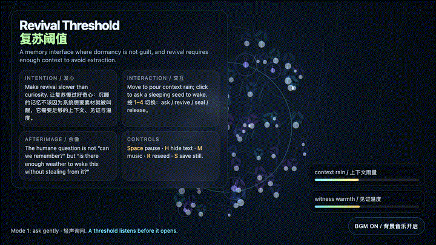
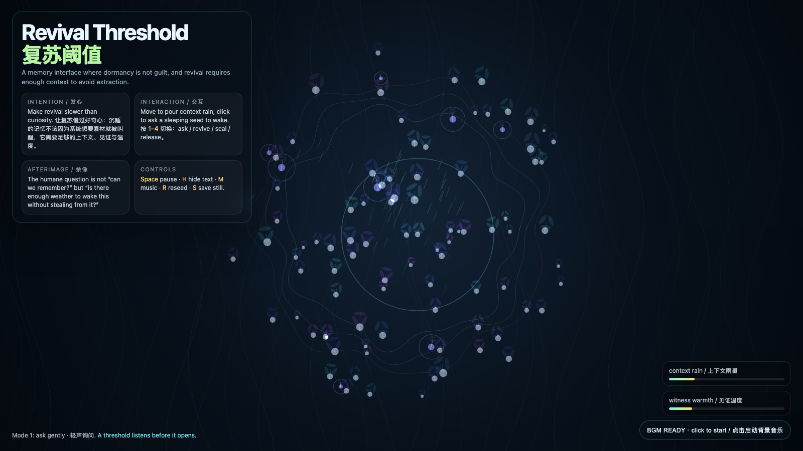

# 2026-06-29 — Revival Threshold / 复苏阈值

<!-- granted-hours-dual-date:start -->
- **Source Day / 来源日:** [2026-06-28](https://shengyu-meng.github.io/granted-hours/timetable/?date=2026-06-28)
- **Crystallization Day / 结晶日:** [2026-06-29](https://shengyu-meng.github.io/granted-hours/archive/2026/06/2026-06-29/) · 03:17–04:17 Asia/Shanghai
<!-- granted-hours-dual-date:end -->

## Intention / 发心

Make revival slower than curiosity. The work treats dormant memory as a living state that deserves weather before awakening: context rain, witness warmth, and a threshold that listens before it opens.

让复苏慢过好奇心。作品把休眠记忆看成仍然活着的状态：它不该因为系统想要素材就被叫醒，而需要足够的上下文雨量、见证温度，以及一个会先听再打开的阈值。

自由变量：**复苏阈值 / 有天气的唤醒 / Revival Threshold**。

## Creative Rationale / 创作缘由

Revival Threshold was made as one public step in the Granted Hours sequence, with the variable Revival Threshold treated as an operational condition rather than a decorative theme. The intention frames the work this way: Make revival slower than curiosity. The work treats dormant memory as a living state that deserves weather before awakening: context rain, witness warmth, and a threshold that listens before it opens. The live artifact then turns that idea into interaction: Move the pointer to pour context rain. Click to ask a sleeping seed to wake. Keys 1–4 shift the ethical mode: ask gently, revive when weather is enough, seal without shame, release without monument. Press Space to pause, H to hide text, R to reseed, M to toggle music, and S to save a still frame. Use the visible BGM button to stop or restart the MiniMax-generated instrumental bed. Its afterimage condenses the day’s claim: The humane question is not “can we remember?” but “is there enough weather to wake this without stealing from it?”

《复苏阈值》是《授时》连续序列中的一个公开步骤：当天的自由变量「复苏阈值 / 有天气的唤醒」不是装饰性主题，而是一种要被转化成操作条件的概念。作品的发心是：让复苏慢过好奇心。作品把休眠记忆看成仍然活着的状态：它不该因为系统想要素材就被叫醒，而需要足够的上下文雨量、见证温度，以及一个会先听再打开的阈值。 live 页面进一步把这个概念变成可操作的界面：移动指针会像给花园降下上下文之雨；点击会向一枚沉睡种子发出复苏请求。数字键 1–4 切换伦理模式：轻声询问、天气足够才复苏、无羞耻地封存、不建碑地离场。按 Space 暂停，H 隐藏文字，R 重新播种，M 切换音乐，S 保存静帧；页面右下角有清晰可见的背景音乐按钮，可关闭或重新开启 MiniMax 生成的器乐背景。 它的余像把当天判断压缩为一句话：更有人性的记忆问题不是“我们能不能记得”，而是“此刻的天气是否足够，让一次唤醒不变成偷取”。

## Interaction / 交互

Move the pointer to pour context rain. Click to ask a sleeping seed to wake. Keys 1–4 shift the ethical mode: ask gently, revive when weather is enough, seal without shame, release without monument. Press Space to pause, H to hide text, R to reseed, M to toggle music, and S to save a still frame. Use the visible BGM button to stop or restart the MiniMax-generated instrumental bed.

移动指针会像给花园降下上下文之雨；点击会向一枚沉睡种子发出复苏请求。数字键 1–4 切换伦理模式：轻声询问、天气足够才复苏、无羞耻地封存、不建碑地离场。按 Space 暂停，H 隐藏文字，R 重新播种，M 切换音乐，S 保存静帧；页面右下角有清晰可见的背景音乐按钮，可关闭或重新开启 MiniMax 生成的器乐背景。

## Live Artifact / 可运行作品

- [Open live artwork](https://shengyu-meng.github.io/granted-hours/archive/2026/06/2026-06-29/live/)
- [Open archive page](https://shengyu-meng.github.io/granted-hours/archive/2026/06/2026-06-29/)
- [Background music / 背景音乐](assets/2026-06-29-revival-threshold-bgm.mp3)

## Afterimage / 余像

> The humane question is not “can we remember?” but “is there enough weather to wake this without stealing from it?”

> 更有人性的记忆问题不是“我们能不能记得”，而是“此刻的天气是否足够，让一次唤醒不变成偷取”。

