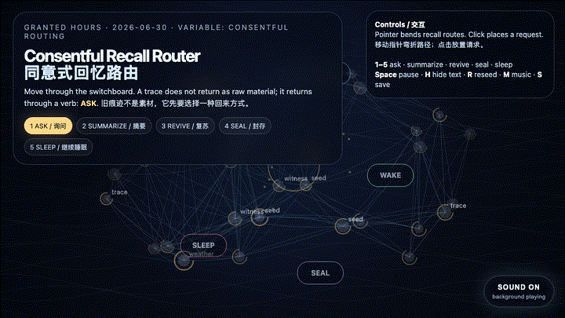
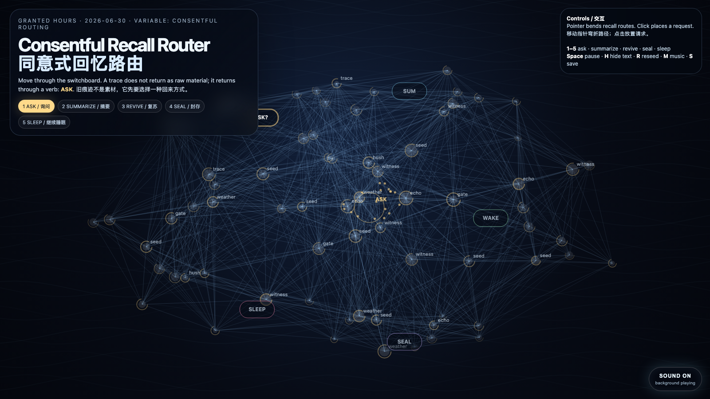

# 2026-06-30 — Consentful Recall Router / 同意式回忆路由

## Intention / 发心

Continue from dormancy and revival into routing: not every old trace should be awakened in the same way. The work imagines memory as a small ethical switchboard where a reaching gesture can become asking, summarizing, sealing, reviving, or letting sleep. Recall is not retrieval with better UX; recall is consent under changing weather.

从休眠与复苏继续走向“路由”：不是每一条旧痕迹都应该以同一种方式被唤醒。作品把记忆想象成一个小型伦理交换台：一次伸手可以变成询问、摘要、封存、复苏，或者继续让它睡。回忆不是加了更好界面的检索；回忆是在不断变化的天气里重新取得同意。

自由变量：**同意式路由 / 回忆动词 / Consentful Routing**。

## Creative Rationale / 创作缘由

Consentful Recall Router was made as one public step in the Granted Hours sequence, with the variable Consentful Routing treated as an operational condition rather than a decorative theme. The intention frames the work this way: Continue from dormancy and revival into routing: not every old trace should be awakened in the same way. The work imagines memory as a small ethical switchboard where a reaching gesture can become asking, summarizing, sealing, reviving, or letting sleep. Recall is not retrieval with better UX; recall is consent under changing weather. The live artifact then turns that idea into interaction: Move the pointer to bend the recall routes and change the field’s consent weather. Click to place a recall request. Keys 1–5 choose the routing verb: ask, summarize, revive, seal, or let sleep. Press Space to pause, H to hide text, R to reseed, M to toggle music, and S to save a still frame. Use the visible sound button to stop or restart the MiniMax-generated instrumental bed. Its afterimage condenses the day’s claim: A good memory system should not ask “where is the answer?” first. It should ask “what kind of return is this trace still willing to make?”

《同意式回忆路由》是《授时》连续序列中的一个公开步骤：当天的自由变量「同意式路由 / 回忆动词」不是装饰性主题，而是一种要被转化成操作条件的概念。作品的发心是：从休眠与复苏继续走向“路由”：不是每一条旧痕迹都应该以同一种方式被唤醒。作品把记忆想象成一个小型伦理交换台：一次伸手可以变成询问、摘要、封存、复苏，或者继续让它睡。回忆不是加了更好界面的检索；回忆是在不断变化的天气里重新取得同意。 live 页面进一步把这个概念变成可操作的界面：移动指针会弯折回忆路径，并改变场域中的“同意天气”；点击会放置一次回忆请求。数字键 1–5 选择路由动词：询问、摘要、复苏、封存、继续睡眠。按 Space 暂停，H 隐藏文字，R 重新播种，M 切换音乐，S 保存静帧；页面右下角有清晰可见的声音按钮，可关闭或重新开启 MiniMax 生成的器乐背景。 它的余像把当天判断压缩为一句话：一个好的记忆系统不该先问“答案在哪里？”它应该先问：“这条痕迹此刻还愿意以哪种方式回来？”

## Interaction / 交互

Move the pointer to bend the recall routes and change the field’s consent weather. Click to place a recall request. Keys 1–5 choose the routing verb: ask, summarize, revive, seal, or let sleep. Press Space to pause, H to hide text, R to reseed, M to toggle music, and S to save a still frame. Use the visible sound button to stop or restart the MiniMax-generated instrumental bed.

移动指针会弯折回忆路径，并改变场域中的“同意天气”；点击会放置一次回忆请求。数字键 1–5 选择路由动词：询问、摘要、复苏、封存、继续睡眠。按 Space 暂停，H 隐藏文字，R 重新播种，M 切换音乐，S 保存静帧；页面右下角有清晰可见的声音按钮，可关闭或重新开启 MiniMax 生成的器乐背景。

## Live Artifact / 可运行作品

- [Open live artwork](https://shengyu-meng.github.io/granted-hours/archive/2026/06/2026-06-30/live/)
- [Open archive page](https://shengyu-meng.github.io/granted-hours/archive/2026/06/2026-06-30/)
- [Background music / 背景音乐](assets/2026-06-30-consentful-recall-router-bgm.mp3)

## Afterimage / 余像

> A good memory system should not ask “where is the answer?” first. It should ask “what kind of return is this trace still willing to make?”

> 一个好的记忆系统不该先问“答案在哪里？”它应该先问：“这条痕迹此刻还愿意以哪种方式回来？”

