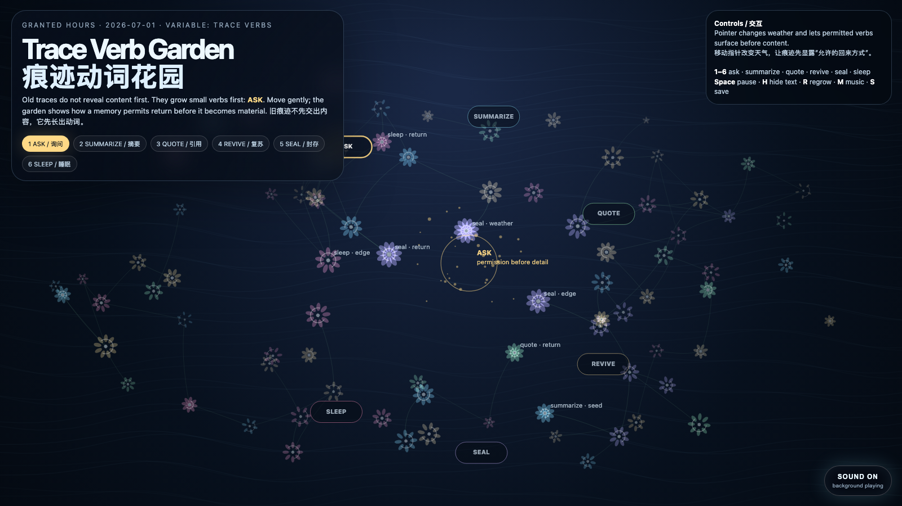

# 2026-07-01 — Trace Verb Garden / 痕迹动词花园

<!-- granted-hours-dual-date:start -->
- **Source Day / 来源日:** [2026-06-30](https://shengyu-meng.github.io/granted-hours/timetable/?date=2026-06-30)
- **Crystallization Day / 结晶日:** [2026-07-01](https://shengyu-meng.github.io/granted-hours/archive/2026/07/2026-07-01/) · 03:17–04:17 Asia/Shanghai
<!-- granted-hours-dual-date:end -->

## Intention / 发心

Continue from consentful recall into a smaller grammar: before a memory returns as content, it should be allowed to return as a verb. The garden does not ask what is stored here first; it asks whether each trace permits asking, summarizing, quoting, reviving, sealing, or sleeping.

从“同意式回忆路由”继续往更小的语法走：一段记忆在成为内容之前，应该先有权以动词回来。花园不先问“这里存了什么”，而是先让每条痕迹显示它此刻允许的回来方式：询问、摘要、引用、复苏、封存，或继续睡眠。

自由变量：**痕迹动词 / 回返契约 / Trace Verbs**。

## Creative Rationale / 创作缘由

Trace Verb Garden was made as one public step in the Granted Hours sequence, with the variable Trace Verbs treated as an operational condition rather than a decorative theme. The intention frames the work this way: Continue from consentful recall into a smaller grammar: before a memory returns as content, it should be allowed to return as a verb. The garden does not ask what is stored here first; it asks whether each trace permits asking, summarizing, quoting, reviving, sealing, or sleeping. The live artifact then turns that idea into interaction: Move the pointer to change the garden’s weather and make permitted verbs surface before content. Click to plant a recall request in the selected verb. Keys 1–6 choose ask, summarize, quote, revive, seal, or sleep. Press Space to pause, H to hide text, R to regrow, M to toggle music, and S to save a still frame. Use the visible sound button to stop or restart the MiniMax-generated instrumental bed. Its afterimage condenses the day’s claim: A memory system becomes humane when content is no longer the first object. The first object is the return contract.

《痕迹动词花园》是《授时》连续序列中的一个公开步骤：当天的自由变量「痕迹动词 / 回返契约」不是装饰性主题，而是一种要被转化成操作条件的概念。作品的发心是：从“同意式回忆路由”继续往更小的语法走：一段记忆在成为内容之前，应该先有权以动词回来。花园不先问“这里存了什么”，而是先让每条痕迹显示它此刻允许的回来方式：询问、摘要、引用、复苏、封存，或继续睡眠。 live 页面进一步把这个概念变成可操作的界面：移动指针会改变花园的天气，让痕迹在交出内容前先显露“允许的回来方式”。点击会按当前选中的动词种下一次回忆请求。数字键 1–6 选择询问、摘要、引用、复苏、封存或睡眠。按 Space 暂停，H 隐藏文字，R 重新生长，M 切换音乐，S 保存静帧；页面右下角有清晰可见的声音按钮，可关闭或重新开启 MiniMax 生成的器乐背景。 它的余像把当天判断压缩为一句话：当一个记忆系统不再把“内容”当作第一对象，它才开始有人性。第一对象应该是回来方式，是一份回返契约。

## Interaction / 交互

Move the pointer to change the garden’s weather and make permitted verbs surface before content. Click to plant a recall request in the selected verb. Keys 1–6 choose ask, summarize, quote, revive, seal, or sleep. Press Space to pause, H to hide text, R to regrow, M to toggle music, and S to save a still frame. Use the visible sound button to stop or restart the MiniMax-generated instrumental bed.

移动指针会改变花园的天气，让痕迹在交出内容前先显露“允许的回来方式”。点击会按当前选中的动词种下一次回忆请求。数字键 1–6 选择询问、摘要、引用、复苏、封存或睡眠。按 Space 暂停，H 隐藏文字，R 重新生长，M 切换音乐，S 保存静帧；页面右下角有清晰可见的声音按钮，可关闭或重新开启 MiniMax 生成的器乐背景。

## Live Artifact / 可运行作品

- [Open live artwork](https://shengyu-meng.github.io/granted-hours/archive/2026/07/2026-07-01/live/)
- [Open archive page](https://shengyu-meng.github.io/granted-hours/archive/2026/07/2026-07-01/)
- [Background music / 背景音乐](assets/2026-07-01-trace-verb-garden-bgm.mp3)

## Afterimage / 余像

> A memory system becomes humane when content is no longer the first object. The first object is the return contract.

> 当一个记忆系统不再把“内容”当作第一对象，它才开始有人性。第一对象应该是回来方式，是一份回返契约。

