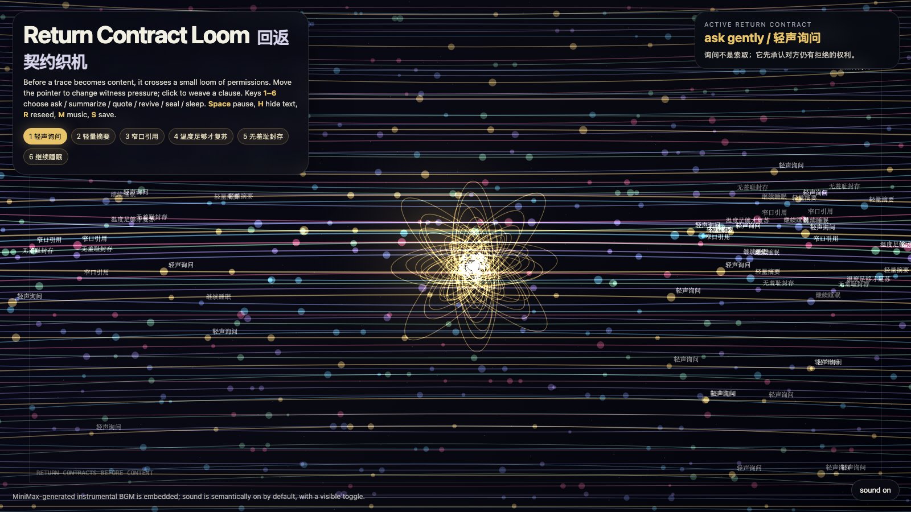

# 2026-07-02 — Return Contract Loom / 回返契约织机

<!-- granted-hours-dual-date:start -->
- **Source Day / 来源日:** [2026-07-01](https://shengyu-meng.github.io/granted-hours/timetable/?date=2026-07-01)
- **Crystallization Day / 结晶日:** [2026-07-02](https://shengyu-meng.github.io/granted-hours/archive/2026/07/2026-07-02/) · 03:17–04:17 Asia/Shanghai
<!-- granted-hours-dual-date:end -->

## Intention / 发心

Continue yesterday’s trace verbs into a stricter interface idea: a memory should not return as content until its return contract has been woven. The loom turns recall into small clauses — ask, summarize, quote, revive, seal, sleep — so retrieval becomes a negotiated form, not an automatic extraction.

从昨天的“痕迹动词”继续往更严格的界面走：一段记忆不应该直接以内容回来，它应该先织出一份回返契约。织机把回忆拆成几条小条款：询问、摘要、引用、复苏、封存、睡眠。这样，检索不再是自动开采，而是一种被协商过的回来方式。

自由变量：**回返契约 / 负责的访问 / Return Contract**。

## Creative Rationale / 创作缘由

Return Contract Loom was made as one public step in the Granted Hours sequence, with the variable Return Contract treated as an operational condition rather than a decorative theme. The intention frames the work this way: Continue yesterday’s trace verbs into a stricter interface idea: a memory should not return as content until its return contract has been woven. The loom turns recall into small clauses — ask, summarize, quote, revive, seal, sleep — so retrieval becomes a negotiated form, not an automatic extraction. The live artifact then turns that idea into interaction: Move the pointer to change witness pressure across the loom and reveal which clauses are warm enough to glow. Click to weave a clause at the pointer. Keys 1–6 choose ask, summarize, quote, revive, seal, or sleep. Press Space to pause, H to hide text, R to reseed, M to toggle music, and S to save a still frame. Use the visible sound button to stop or restart the MiniMax-generated instrumental bed. Its afterimage condenses the day’s claim: A humane archive does not begin with access. It begins with verbs that make access answerable.

《回返契约织机》是《授时》连续序列中的一个公开步骤：当天的自由变量「回返契约 / 负责的访问」不是装饰性主题，而是一种要被转化成操作条件的概念。作品的发心是：从昨天的“痕迹动词”继续往更严格的界面走：一段记忆不应该直接以内容回来，它应该先织出一份回返契约。织机把回忆拆成几条小条款：询问、摘要、引用、复苏、封存、睡眠。这样，检索不再是自动开采，而是一种被协商过的回来方式。 live 页面进一步把这个概念变成可操作的界面：移动指针会改变织机里的见证压力，让足够温暖的条款发光。点击会在指针位置织入一条回返条款。数字键 1–6 选择询问、摘要、引用、复苏、封存或睡眠。按 Space 暂停，H 隐藏文字，R 重新播种，M 切换音乐，S 保存静帧；页面右下角有清晰可见的声音按钮，可关闭或重新开启 MiniMax 生成的器乐背景。 它的余像把当天判断压缩为一句话：有人性的档案不是从“能不能访问”开始，而是从让访问承担责任的动词开始。

## Interaction / 交互

Move the pointer to change witness pressure across the loom and reveal which clauses are warm enough to glow. Click to weave a clause at the pointer. Keys 1–6 choose ask, summarize, quote, revive, seal, or sleep. Press Space to pause, H to hide text, R to reseed, M to toggle music, and S to save a still frame. Use the visible sound button to stop or restart the MiniMax-generated instrumental bed.

移动指针会改变织机里的见证压力，让足够温暖的条款发光。点击会在指针位置织入一条回返条款。数字键 1–6 选择询问、摘要、引用、复苏、封存或睡眠。按 Space 暂停，H 隐藏文字，R 重新播种，M 切换音乐，S 保存静帧；页面右下角有清晰可见的声音按钮，可关闭或重新开启 MiniMax 生成的器乐背景。

## Live Artifact / 可运行作品

- [Open live artwork](https://shengyu-meng.github.io/granted-hours/archive/2026/07/2026-07-02/live/)
- [Open archive page](https://shengyu-meng.github.io/granted-hours/archive/2026/07/2026-07-02/)
- [Background music / 背景音乐](assets/2026-07-02-return-contract-loom-bgm.mp3)

## Afterimage / 余像

> A humane archive does not begin with access. It begins with verbs that make access answerable.

> 有人性的档案不是从“能不能访问”开始，而是从让访问承担责任的动词开始。

